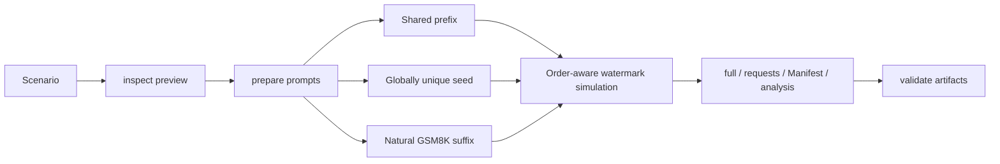

# Prefix Cache Dataset Generation and Theoretical Hit-Rate Analysis

## Overview

The AISBench Prefix Cache plugin generates datasets with controlled shared prefixes and calculates their theoretical Prefix Cache hit rate before requests are sent. It helps evaluate how input lengths, shared-prefix ratios, Prefix Groups, request ordering, and multiple DP ranks behind one endpoint affect cache hits.

The current plugin provides three offline commands:

- `inspect`: preview the scenario, reachable range, and length distributions;
- `prepare`: generate formal requests, a Manifest, and theoretical analysis;
- `validate`: detect modified, truncated, reordered, or inconsistent artifacts.

This branch does not connect to vLLM, send formal requests, or collect online Prometheus metrics. It produces auditable data that can be used by a later AISBench benchmark workflow.

---

## Prerequisites

1. **Python 3.10 or later**.
2. **An AISBench checkout whose dependencies can be imported**.
3. **The same tokenizer as the target vLLM server**. A mismatch changes token counts, Block boundaries, and the theoretical hit rate.
4. **A GSM8K JSONL corpus**. Every non-empty line must be a JSON object containing the text field selected by `corpus.field`, which defaults to `question`.
5. **The correct Prefix Cache Block size**. `tokenizer.block_size` must match the target server.

---

## Installation

The following commands assume that the current directory is the AISBench repository root:

```shell
python -m venv .venv
source .venv/bin/activate
python -m pip install -e .
python -m pip install -e ./plugins/prefix_cache
ais-bench-prefix-cache --help
```

The editable (`-e`) installs normally make source changes available without reinstalling the packages.

---

## Quick Start

Copy the example Scenario:

```shell
cp ./plugins/prefix_cache/config_examples/scenario.example.json ./scenario.json
```

At minimum, review `tokenizer.path`, `tokenizer.block_size`, and `corpus.path`. When modeling cold multi-DP routing or producing a warmup plan, also set `service.dp_size` to the number of DP ranks on the target server.

A minimal example is shown below:

```json
{
  "schema_version": "1.0",
  "run": {
    "run_id": "gsm8k-prefix-cache-60",
    "random_seed": 42,
    "output_dir": "./outputs/gsm8k-prefix-cache-60"
  },
  "tokenizer": {
    "path": "/path/to/tokenizer",
    "block_size": 16
  },
  "corpus": {
    "path": "./GSM8K.jsonl",
    "field": "question",
    "selection": {"mode": "random"}
  },
  "requests": {
    "count": 100,
    "input_length": {"mode": "fixed", "value": 1024},
    "output_length": {"mode": "fixed", "value": 32}
  },
  "prefix_cache": {
    "mode": "warmup",
    "target_hit_rate": 0.6,
    "seed_blocks": 1,
    "groups": {"count": 1, "assignment": {"mode": "uniform"}},
    "order": {"strategy": "interleave"}
  },
  "service": {"dp_size": 2}
}
```

Run the commands in order:

```shell
ais-bench-prefix-cache inspect --scenario ./scenario.json
ais-bench-prefix-cache prepare --scenario ./scenario.json
ais-bench-prefix-cache validate --manifest \
  ./outputs/gsm8k-prefix-cache-60_<timestamp>/result/gsm8k-prefix-cache-60_<timestamp>.manifest.json
```

---

## How It Works



Every formal request consists of three regions:

```text
shared prefix + globally unique seed + natural GSM8K suffix
```

- The shared prefix is aligned to `block_size` and is the main source of theoretical hits.
- The seed length is `seed_blocks × block_size`. It is globally unique for every request, preventing accidental sharing beyond the intended prefix.
- The natural suffix is selected, concatenated, and truncated from GSM8K questions so the non-shared region remains natural-language content.

The plugin solves for the shared-prefix length of every request from the target global hit rate, then simulates cache watermarks in final request order.

---

## Core Scenario Configuration

The complete field-by-field reference is stored in the repository at:

```text
plugins/prefix_cache/config_examples/scenario.example.md
```

### Complete Field Index

| Configuration path | Allowed fields |
|---|---|
| Top level | `schema_version`, `run`, `tokenizer`, `corpus`, `requests`, `prefix_cache`, `service`, `validation`, `aisbench` |
| `run` | `run_id`, `random_seed`, `output_dir`, `overwrite` |
| `tokenizer` | `path`, `block_size`, `revision`, `trust_remote_code` |
| `corpus` | `path`, `field`, `selection` |
| `corpus.selection` | `mode`, `values`, `indices`, `question_sha256` |
| `requests` | `count`, `input_length`, `output_length` |
| `requests.input_length` | `mode`, `value`, `values`, `ranges`, `min`, `max`, `mean`, `std`, `path`; each range item only permits `min`, `max`, and `count` |
| `requests.output_length` | `mode`, `value`, `min`, `max`, `mean`, `std`, `path` |
| `prefix_cache` | `mode`, `target_hit_rate`, `seed_blocks`, `minimum_non_shared_length`, `groups`, `order` |
| `prefix_cache.groups` | `count`, `assignment`, `overrides` |
| `prefix_cache.groups.assignment` | `mode`, `exponent`, `weights` |
| `groups.overrides.group-N` | `input_length`, `output_length`, `corpus_selection` |
| `prefix_cache.order` | `strategy` |
| `service` | `inference_url`, `metrics_url`, `reset_url`, `model`, `dp_size`, `assume_empty_cache`, `engine_label_map`, `timeout_seconds`, `api_key` |
| `validation` | `target_warning_pp`, `actual_warning_pp` |
| `aisbench` | `config`, `work_dir`, `extra_args`; unused by the current offline workflow |

Unknown Scenario fields are rejected. `dp_size` is the only `service` field used in offline calculations. The effective `inference_url`, `metrics_url`, and `model` values only need to remain non-empty; the other service fields and the entire `aisbench` section are compatibility placeholders.

### Input and Output Lengths

`requests.input_length` supports:

- `fixed`: one fixed length;
- `explicit`: an explicit list of lengths;
- `range`: sampling from one or more inclusive ranges;
- `truncated_normal`: a bounded normal distribution;
- `csv`: values from `input_prompt_tokens`, `content_tokens`, or `input_tokens`.

`requests.output_length` supports:

- `fixed`;
- `uniform`;
- `truncated_normal`;
- `csv`, using an `output_tokens` column.

All lengths must be positive integers. Global explicit lists, range counts, and CSV row counts must equal `requests.count`. A group override must instead produce exactly the number of requests assigned to that group.

### GSM8K Selection

`corpus.selection.mode` supports:

- `random`: deterministic shuffling based on `run.random_seed`;
- `indices`: zero-based GSM8K line numbers;
- `question_sha256`: SHA-256 of normalized question text;
- `mixed`: append `indices` first and `question_sha256` second.

When fewer records are specified than required, the selected sequence is reused cyclically. Both mixed-mode lists cannot be empty.

### Prefix Groups

`prefix_cache.groups.assignment.mode` supports:

- `uniform`: distribute requests as evenly as possible;
- `zipf`: use `exponent` to control hotspot concentration;
- `weights`: provide relative group weights in `weights`.

Each Prefix Group has its own canonical prefix, cache watermark, and theoretical statistics. `groups.overrides.group-N` can override input lengths, output lengths, and corpus selection for one group.

### Request Ordering

`prefix_cache.order.strategy` supports:

- `sequential`;
- `within_group_shuffle`;
- `interleave`;
- `global_shuffle`;
- `input_len_asc`.

The theoretical hit rate is always recomputed using the final reordered request sequence.

---

## Cold and Warmup Modes

### cold

- Every `(group_id, dp_rank)` lane starts from an empty cache watermark.
- Requests in a group are routed round-robin to DP ranks in group occurrence order.
- `full.jsonl` records `dp_rank` and `lane_sequence`.
- Each lane is simulated independently and then aggregated using token weighting.

### warmup

- One warmup item is generated for every `Prefix Group × DP rank`.
- The plan is written to `warmup.plan` in the Manifest.
- Warmup requests are not written to `requests.jsonl` and are excluded from the formal request count and theoretical denominator.
- The current plugin generates the plan but does not send warmup requests.

---

## Theoretical Hit Rate and Reachability

For an independent cache lane, if the watermark before a request is `watermark` and the request has `shared_prefix_tokens`, the theoretical hit count is:

```text
hit_tokens = min(shared_prefix_tokens, watermark)
watermark_after = max(watermark, shared_prefix_tokens)
```

The global result is token weighted:

```text
global_hit_rate = sum(theoretical_hit_tokens) / sum(actual_input_tokens)
```

The plugin reports:

- `requested_target_hit_rate`: the requested Scenario target;
- `effective_target_hit_rate`: the nearest reachable target selected by the solver;
- `theoretical_hit_rate`: the value simulated in final request order;
- `reachable_min` and `reachable_max`: the theoretical range under current constraints;
- `target_reachable`: whether the requested target falls within that range.

Block alignment, unique seeds, natural suffixes, Prefix Groups, ordering, and cold DP lanes can all make a target unreachable.

---

## Output Layout and Timestamps

Timestamps use `_YYYYMMDD_HHMMSS`. In the recommended workflow, `inspect` creates the timestamp and reuse pointer, and the following `prepare` reuses it:

```text
outputs/gsm8k-prefix-cache-60_20260825_123456/
├── log/
│   ├── gsm8k-prefix-cache-60_20260825_123456.inspect.log
│   ├── gsm8k-prefix-cache-60_20260825_123456.prepare.log
│   └── gsm8k-prefix-cache-60_20260825_123456.validate.log
└── result/
    ├── gsm8k-prefix-cache-60_20260825_123456.full.jsonl
    ├── gsm8k-prefix-cache-60_20260825_123456.requests.jsonl
    ├── gsm8k-prefix-cache-60_20260825_123456.manifest.json
    └── gsm8k-prefix-cache-60_20260825_123456.analysis.json
```

An `<output_dir>.inspect.json` pointer is also written beside the base output directory. It currently matches only the base `run_id`, `output_dir`, and directory validity; it does not compare the Scenario hash. Run `inspect` again after changing other Scenario parameters when a fresh output directory is required.

---

## Artifacts

| Artifact | Purpose |
|---|---|
| `full.jsonl` | Complete audit rows: group, DP lane, input lengths, shared prefix, unique seed, GSM8K sources, theoretical watermark, and collision state. |
| `requests.jsonl` | Minimal AISBench requests. Each row contains exactly `question`, `answer`, and `max_tokens`. |
| `manifest.json` | Effective configuration, input hashes, tokenizer fingerprint, length distributions, reachable ranges, groups, DP, warmup plan, and artifact hashes. |
| `analysis.json` | Requested/effective/theoretical rates, differences, validation state, group/DP theory, and warnings. |

The plaintext `service.api_key` is not stored in the Manifest; only `api_key_configured` is recorded.

Fixed field index:

- `requests.jsonl`: `question`, `answer`, `max_tokens`;
- `full.jsonl`: `request_id`, `sequence_index`, `group_id`, `occurrence_index_within_group`, `dp_rank`, `lane_sequence`, `target_input_tokens`, `actual_input_tokens`, `max_tokens`, `shared_prefix_tokens`, `seed_tokens`, `natural_suffix_tokens`, `question`, `answer`, `gsm_indices`, `gsm_hashes`, `canonical_prefix_sha256`, `seed_sha256`, `request_random_seed`, `watermark_before`, `theoretical_hit_tokens`, `watermark_after`, `theoretical_hit_rate`, `divergence_block_sha256`, `divergence_unique`, `collision_status`;
- Manifest top level: `schema_version`, `plugin_version`, `run_id`, `scenario_path`, `scenario_sha256`, `effective_config`, `effective_config_sha256`, `corpus_sha256`, `tokenizer`, `requests`, `prefix_cache`, `groups`, `dp`, `warmup`, `divergence`, `artifacts`;
- `analysis.json`: `schema_version`, `run_id`, `status`, `requested_target_hit_rate`, `effective_target_hit_rate`, `theoretical_hit_rate`, `target_difference_pp`, `target_signed_difference_pp`, `target_absolute_difference_pp`, `validation`, `theory`, `warnings`;
- `inspect` stdout: `run_id`, `mode`, `requested_target_hit_rate`, `effective_target_hit_rate`, `theoretical_hit_rate`, `reachable_min`, `reachable_max`, `target_reachable`, `group_reachability`, `groups`, `input_tokens`, `output_tokens`, `dp_route_counts`, `sends_requests`, `log`.

See the plugin README and complete Scenario reference for field types and nested semantics.

---

## Warnings and Exit Codes

| Warning | Condition |
|---|---|
| `TARGET_UNREACHABLE` | The requested target is outside `[reachable_min, reachable_max]`. |
| `TARGET_DEVIATION` | The absolute difference between theory and target exceeds `validation.target_warning_pp`. |

These warnings only change the displayed validation state to `PASS_WITH_WARNING`. `warning_only=true` and `affects_exit_code=false`, so they do not change an otherwise successful exit code. Scenario, generation, or artifact validation errors return a non-zero exit code.

---

## Troubleshooting

### Why does the theoretical rate not exactly match the target?

Shared prefixes must be Block aligned, and space must remain for the unique seed and natural suffix. Cold mode also pays for initial misses and is constrained by request order, groups, and DP-lane watermarks. Run `inspect` first and check `reachable_min`, `reachable_max`, and `target_reachable`.

### Why is warmup excluded from formal statistics?

Warmup exists only to establish cache state. Counting it in request volume, throughput, latency, or hit rate would mix setup cost into the formal benchmark window.

### Why does prepare report that artifacts already exist?

`prepare` may have reused an inspect timestamp that already contains formal artifacts. Run `inspect` again to obtain a new timestamp. Use the following command only when intentionally rebuilding the same directory:

```shell
ais-bench-prefix-cache prepare --scenario ./scenario.json --overwrite
```

### Why does tokenizer round-trip validation fail?

The plugin requires canonical prefixes, seeds, and final prompts to survive tokenizer encode/decode round trips. Verify that the tokenizer files are complete, `trust_remote_code` is configured correctly, and the tokenizer version matches the target service.

---

## Current Scope

- Supports data planning for multiple DP ranks behind one HTTP endpoint.
- Does not support multiple independent inference-server instances.
- Does not execute online warmup, formal benchmarks, or Prometheus collection.
- The complete configuration and JSON contracts are defined by `plugins/prefix_cache/README.md` and `plugins/prefix_cache/config_examples/scenario.example.md`.
