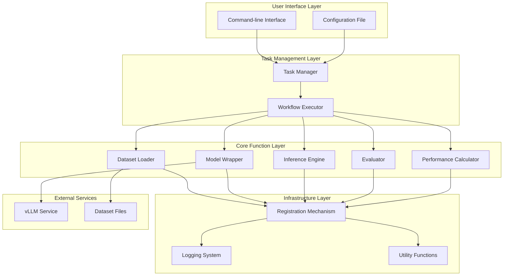
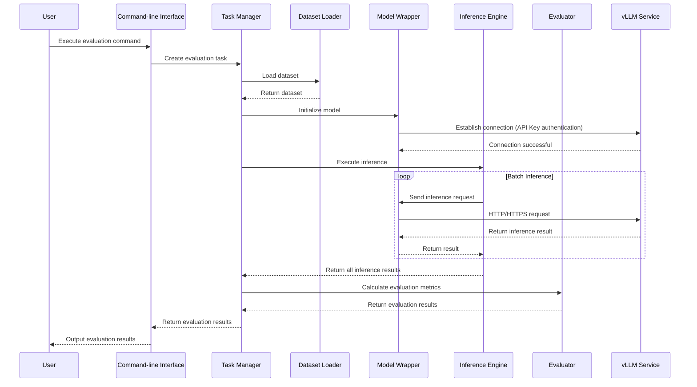
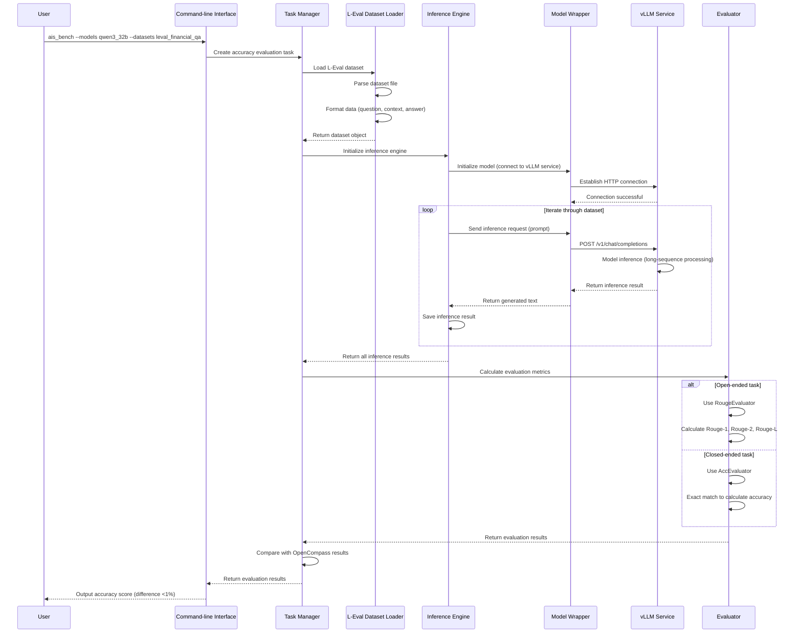
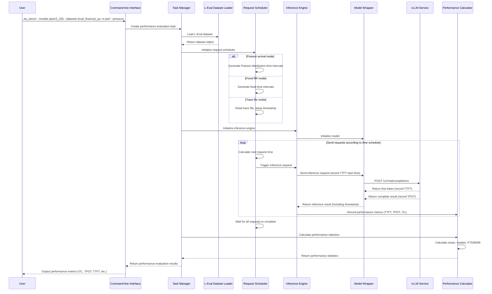
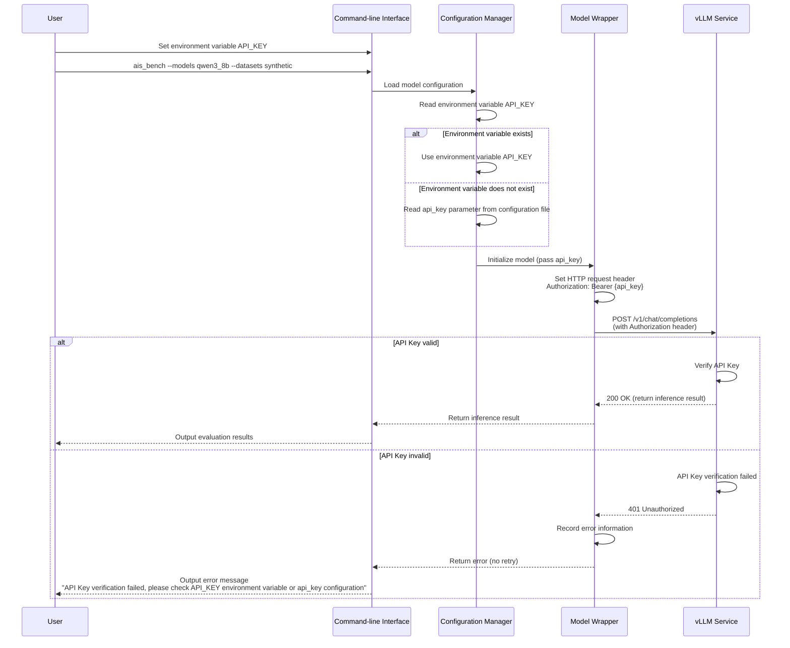
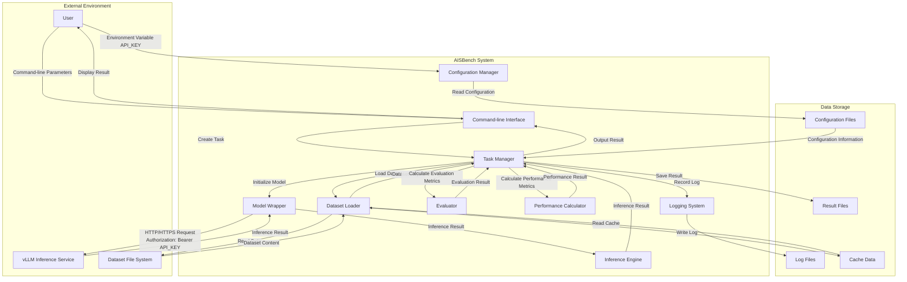

**AISBench Benchmark Tool Feature Analysis and Design Specification**

**Table of Contents**

1. Feature Overview

1.1 Scope

1.2 Feature Requirements List

2. Requirement Scenario Analysis

2.1 Feature Requirement Sources and Value Overview

2.2 Feature Scenario Analysis

2.3 Feature Impact Analysis

2.3.1 Hardware Limitations

2.3.2 Technical Limitations

2.3.3 License Impact Analysis

2.3.4 System Performance Specification Impact Analysis

2.3.5 System Reliability Specification Impact Analysis

2.3.6 System Compatibility Impact Analysis

2.3.7 Interaction and Conflict Analysis with Other Major Features

3. Feature/Function Implementation Principles (Can be decomposed into multiple Use Cases)

3.1 Objectives

3.2 Overall Solution

4. Use Case One Implementation

4.1 Design Approach

4.2 Constraints

4.3 Detailed Implementation (Message sequence diagram from user entry at module or process level)

4.4 Inter-subsystem Interfaces (Mainly covering module interface definitions)

4.5 Subsystem Detailed Design

4.6 DFX Attribute Design

4.6.1 Performance Design

4.6.2 Upgrade and Expansion Design

4.6.3 Exception Handling Design

4.6.4 Resource Management Design

4.6.5 Miniaturization Design

4.6.6 Testability Design

4.6.7 Security Design

4.7 System External Interfaces

4.8 Self-test Case Design

5. Use Case Two Implementation

6. Reliability & Availability Design

6.1 Redundancy Design

6.2 Fault Management

6.3 Overload Control Design

6.4 Upgrade Without Service Interruption

6.5 Human Error Design

6.6 Fault Prediction and Prevention Design

7. Security & Privacy & Resilience Design

7.1 Low Level Threat Analysis and Design

7.1.1 2-Layer Data Flow Diagram

7.1.2 Business Scenario and Trust Boundary Description

7.1.3 External Interaction Party Analysis

7.1.4 Data Flow Analysis

7.1.5 Process Analysis

7.1.6 Data Storage Analysis

7.1.7 Defect List

7.2 Privacy Risk Analysis and Design

7.2.1 Privacy Risk Pre-analysis Questionnaire

7.2.2 Privacy Risk Pre-analysis Summary

7.2.3 Personal Data List

7.2.4 Privacy Protection Requirement Design

7.2.5 Privacy Protection Measures

8. Feature Non-functional Quality Attributes Design

8.1 Testability

8.2 Serviceability

8.3 Evolvability

8.4 Openness

8.5 Compatibility

8.6 Scalability/Extensibility

8.7 Maintainability

8.8 Documentation

9. Data Structure Design (Optional)

10. Reference Materials

**Table of Contents**

Table 1: Feature Requirements List

Table 2: Documentation Modification List

Table 3: External Interaction Party Threat Analysis Table (User)

Table 4: External Interaction Party Threat Analysis Table (vLLM Inference Service)

Table 5: Data Flow Threat Analysis Table

Table 6: Process Threat Analysis Table

Table 7: Data Storage Threat Analysis Table

Table 8: Defect List

Table 9: Privacy Risk Pre-analysis Questionnaire

**Figure Directory**

Figure 1: AISBench System Architecture Diagram

Figure 2: AISBench Data Flow Sequence Diagram

Figure 3: L-Eval Dataset Accuracy Evaluation Sequence Diagram

Figure 4: L-Eval Dataset Performance Evaluation Sequence Diagram

Figure 5: API Key Authentication Sequence Diagram

Figure 6: AISBench Security Data Flow Diagram (2-layer)

**List of abbreviations**:

<table>
    <tr>
        <th>Abbreviations</th>
        <th>Full spelling</th>
        <th>Chinese explanation</th>
    </tr>
    <tr>
        <td>xxx</td>
        <td>xxx</td>
        <td>xxx</td>
    </tr>
    <tr>
        <td>xxx</td>
        <td>xxx</td>
        <td>xxx</td>
    </tr>
</table>

# 1. Feature Overview

AISBench is an AI model benchmark tool in MindStudio version 26.0.0, designed to provide comprehensive accuracy and performance evaluation capabilities for AI models. This version adds support for long-sequence reasoning scenarios, multimodal dataset coverage, API Key authentication, PPL evaluation capabilities, tool usability optimization, and enhanced cluster evaluation capabilities, further improving the completeness, usability, and professionalism of the benchmark tool.

The main value of this version includes:

1. **Long-sequence Reasoning Capability Assessment**: By supporting the L-Eval dataset, it provides comprehensive evaluation of model long-text understanding capabilities, supports Mooncake paper verification methods, and meets the evaluation needs of long-sequence reasoning scenarios.
2. **Comprehensive Multimodal Model Coverage**: Added support for multiple multimodal datasets including MMStar, VideoMME, OCRBench, MMMU, OmniDocBench, VQA, covering multiple dimensions such as visual question answering, video understanding, text understanding, and university-level questions.
3. **Security Enhancement**: Supports API Key authentication, enhancing the security of service-based inference.
4. **Evaluation Capability Expansion**: Added PPL (Perplexity) evaluation capability, supporting pre-trained model evaluation; added DAPO-math dataset support, covering reinforcement learning scenarios.
5. **Usability Improvement**: Through command-line parameter optimization and configuration parameter optimization, the tool's usability and flexibility are improved.
6. **Cluster Evaluation Capability**: Supports advanced features such as EPD-separated encoding phase time statistics and timestamp-based traffic load replay.

This document describes in detail the requirement analysis, architecture design, implementation solutions, and other content of the above features, and is suitable for R&D, testing, and usage personnel of the AISBench benchmark tool.

## 1.1 Scope

This version's features mainly include the following functional points:

1. **L-Eval Dataset Support**: Supports accuracy and performance evaluation of the L-Eval dataset, including open-ended tasks (Rouge evaluation) and closed-ended tasks (accuracy evaluation), supporting request modes such as Poisson arrival and fixed RR.
2. **API Key Authentication**: Supports reading API Key from environment variables and forwarding it to inference services, covering vLLM series API interfaces.
3. **Multimodal Dataset Support**:
   - MMStar dataset: Visual question answering capability evaluation
   - VideoMME dataset: Video understanding capability evaluation
   - OCRBench_v2 dataset: OCR text understanding capability evaluation
   - MMMU/MMMU Pro dataset: University-level question evaluation
   - OmniDocBench dataset: Document understanding capability evaluation
   - DocVQA/InfoVQA dataset: Document visual question answering capability evaluation
4. **DAPO-math Dataset Support**: Supports mathematical reasoning evaluation in reinforcement learning scenarios.
5. **PPL Evaluation Capability**: Supports evaluation mode based on perplexity, covering multiple general datasets.
6. **Tool Usability Optimization**:
   - Command-line parameter optimization: --merge-ds, --num-prompts, --max-num-workers, --pressure-time, --num-warmups, etc.
   - Configuration parameter optimization: stream, url, LOG_LEVEL, etc.
7. **Cluster Evaluation Capability Enhancement**:
   - EPD-separated encoding phase time statistics
   - Timestamp-based traffic load replay
8. **GEdit Dataset Support**: Supports evaluation of image editing capabilities, including dimensions such as semantic consistency and perceptual quality.

## 1.2 Feature Requirements List

Table 1: Feature Requirements List

<table>
    <tr>
        <th>Requirement ID</th>
        <th>Requirement Name</th>
        <th>Feature Description</th>
        <th>Remarks</th>
    </tr>
    <tr>
        <td>REQ-001</td>
        <td>L-Eval Dataset Accuracy Evaluation (Open-ended Tasks)</td>
        <td>Supports accuracy evaluation of open-ended tasks for 15 sub-datasets in the L-Eval dataset, using Rouge metrics, with accuracy difference from OpenCompass &lt;1%</td>
        <td>Sub-datasets include: financial_qa, gov_report_summ, legal_contract_qa, meeting_summ, multidoc_qa, narrative_qa, natural_question, news_summ, paper_assistant, patent_summ, review_summ, scientific_qa, tv_show_summ, code_u, sci_fi</td>
    </tr>
    <tr>
        <td>REQ-002</td>
        <td>L-Eval Dataset Accuracy Evaluation (Closed-ended Tasks)</td>
        <td>Supports accuracy evaluation of closed-ended tasks for 5 sub-datasets in the L-Eval dataset, using AccEvaluator, with accuracy difference from OpenCompass &lt;1%</td>
        <td>Sub-datasets include: coursera, gsm100, quality, tpo, topic_retrieval</td>
    </tr>
    <tr>
        <td>REQ-003</td>
        <td>L-Eval Dataset Performance Evaluation</td>
        <td>Supports performance evaluation of the L-Eval dataset, supporting request modes such as Poisson arrival and fixed RR, outputting performance metrics such as ITL, TPOT, TTFT</td>
        <td>Supports Mooncake paper verification method</td>
    </tr>
    <tr>
        <td>REQ-004</td>
        <td>API Key Authentication (Performance Evaluation)</td>
        <td>vLLM-related interfaces support API Key inference, completing performance evaluation, supporting reading API_KEY from environment variables and forwarding to inference services</td>
        <td>Covers vLLM series APIs</td>
    </tr>
    <tr>
        <td>REQ-005</td>
        <td>API Key Authentication (Accuracy Evaluation)</td>
        <td>vLLM-related interfaces support API Key inference, completing accuracy evaluation, supporting reading API_KEY from environment variables and forwarding to inference services</td>
        <td>Covers vLLM series APIs</td>
    </tr>
    <tr>
        <td>REQ-006</td>
        <td>MMStar Dataset Support</td>
        <td>Supports accuracy evaluation of the MMStar dataset, outputting scores for different subject sub-datasets and average values, supporting GPU/NPU hardware</td>
        <td>Evaluation method: Exact match</td>
    </tr>
    <tr>
        <td>REQ-007</td>
        <td>VideoMME Dataset Support</td>
        <td>Supports accuracy evaluation of the VideoMME dataset, completing answer extraction based on regular expressions and exact matching with standard answers</td>
        <td>Supports GPU/NPU hardware</td>
    </tr>
    <tr>
        <td>REQ-008</td>
        <td>OCRBench_v2 Dataset Support</td>
        <td>Supports accuracy evaluation of the OCRBench_v2 dataset, outputting accuracy scores</td>
        <td>Supports GPU/NPU hardware</td>
    </tr>
    <tr>
        <td>REQ-009</td>
        <td>MMMU Dataset Support</td>
        <td>Supports accuracy evaluation of the MMMU dataset, evaluating model's deep visual understanding capabilities, combining university subject knowledge for reasoning</td>
        <td>Includes multiple-choice questions and open-ended questions</td>
    </tr>
    <tr>
        <td>REQ-010</td>
        <td>MMMU Pro Dataset Support</td>
        <td>Supports accuracy evaluation of the MMMU Pro dataset, an enhanced version of the MMMU dataset</td>
        <td>Increases the number of multiple-choice options, introduces pure visual input settings</td>
    </tr>
    <tr>
        <td>REQ-011</td>
        <td>OmniDocBench Dataset Support</td>
        <td>Supports accuracy evaluation of the OmniDocBench dataset, adapted for Deepseek-ocr model inference evaluation</td>
        <td>Supports transformer offline inference, vllm-ascend offline inference, vllm online inference</td>
    </tr>
    <tr>
        <td>REQ-012</td>
        <td>DocVQA Dataset Support</td>
        <td>Supports accuracy evaluation of the DocVQA dataset, using ANLS evaluation method, outputting accuracy scores</td>
        <td>Evaluates model's document visual question answering capability</td>
    </tr>
    <tr>
        <td>REQ-013</td>
        <td>InfoVQA Dataset Support</td>
        <td>Supports accuracy evaluation of the InfoVQA dataset, using ANLS evaluation method, outputting accuracy scores</td>
        <td>Evaluates model's ability to perform associative reasoning on multimodal elements such as layout, text, graphics, and visualizations</td>
    </tr>
    <tr>
        <td>REQ-014</td>
        <td>DAPO-math Dataset Support</td>
        <td>Supports RL reasoning evaluation using the DAPO-math-17k dataset, evaluated based on acc method, outputting pass/avg/cons@k metrics</td>
        <td>Supports mathematical reasoning evaluation in RL scenarios</td>
    </tr>
    <tr>
        <td>REQ-015</td>
        <td>PPL Inference Mode Support</td>
        <td>Supports service-based accuracy evaluation in PPL inference mode, extending ppl inferencer to support PPL inference method</td>
        <td>Accuracy difference from OpenCompass &lt;1%</td>
    </tr>
    <tr>
        <td>REQ-016</td>
        <td>PPL General Dataset Support</td>
        <td>Extends datasets supported by PPL evaluation, including mmlu, ceval, cmmlu, piqa, race, siqa, hellaswag, gpqa and other datasets</td>
        <td>Supports service-based PPL accuracy evaluation</td>
    </tr>
    <tr>
        <td>REQ-017</td>
        <td>Command-line Specification of Inference Case Count</td>
        <td>In accuracy mode, supports specifying the first n data points of all datasets for accuracy evaluation through --num-prompts n</td>
        <td>Compatible with accuracy and performance scenarios</td>
    </tr>
    <tr>
        <td>REQ-018</td>
        <td>Merged Dataset Inference Mode Outputs Sub-dataset Accuracy</td>
        <td>Supports merging datasets of the same type through --merge-ds to execute inference tasks, outputting sub-dataset accuracy and weighted accuracy</td>
        <td>Supports multi-sub-datasets such as ceval, mmlu</td>
    </tr>
    <tr>
        <td>REQ-019</td>
        <td>Support Specifying Maximum Worker Count for Multi-task Performance Evaluation</td>
        <td>Supports specifying the number of parallel workers through --max-num-workers to achieve parallel multi-performance tasks</td>
        <td>Supports performance scenarios, not effective in debug mode</td>
    </tr>
    <tr>
        <td>REQ-020</td>
        <td>Control Concurrency Growth Rate via request_rate in Pressure Test Mode</td>
        <td>In pressure test mode, request_rate is defined as the rate of creating concurrency per second, unified as requestrate control</td>
        <td>Compatible with old version CONNECTION_ADD_RATE configuration method</td>
    </tr>
    <tr>
        <td>REQ-021</td>
        <td>Support Configuring Pressure Test Time via Command-line Parameters</td>
        <td>Supports specifying pressure test duration through --pressure-time, compatible with old version global_consts.py configuration method</td>
        <td>After time expires, no more requests are sent, waiting for sent requests to complete</td>
    </tr>
    <tr>
        <td>REQ-022</td>
        <td>Support Specifying Warm-up Count for Preheating</td>
        <td>Supports specifying the number of warm-up cases through --num-warmups, selecting data from the current task's dataset for warm up</td>
        <td>If warm fails, subsequent tasks will not continue</td>
    </tr>
    <tr>
        <td>REQ-023</td>
        <td>Support Specifying Log Level</td>
        <td>Supports configuring global log level through global_consts.py, supporting DEBUG, INFO, WARNING, ERROR, CRITICAL levels</td>
        <td>Log level takes effect after configuration</td>
    </tr>
    <tr>
        <td>REQ-024</td>
        <td>New Configuration Parameter to Specify Server URL</td>
        <td>Supports specifying IP and port through the url parameter in model configuration file, url priority is higher than host_ip and host_port</td>
        <td>Supports custom URL</td>
    </tr>
    <tr>
        <td>REQ-025</td>
        <td>Support Specifying Model Backend via stream Parameter</td>
        <td>Supports specifying streaming and non-streaming interfaces of the same endpoint on the server through model configuration parameter stream</td>
        <td>Compatible with old version model type configuration method</td>
    </tr>
    <tr>
        <td>REQ-026</td>
        <td>Support EPD-separated Encoding Phase Time Statistics</td>
        <td>Based on vLLM service interface return values, statistics on encoding phase time consumption, supporting steady-state and full-volume statistical methods</td>
        <td>Outputs mean, minimum, maximum, median, P75/90/99 and other metrics</td>
    </tr>
    <tr>
        <td>REQ-027</td>
        <td>Support Request-based Timestamp Traffic Load Replay</td>
        <td>Supports identifying trace_example.jsonl files, sending requests precisely according to timestamp, supporting specified window range</td>
        <td>Supports FAST25 generation environment trace dataset from Mooncake paper</td>
    </tr>
    <tr>
        <td>REQ-028</td>
        <td>GEdit Dataset Support</td>
        <td>Supports accuracy evaluation of the GEdit dataset, supports configuring judge model URL, outputting evaluation results in dimensions such as semantic consistency and perceptual quality</td>
        <td>Accuracy aligned with Step1X-Edit benchmark script</td>
    </tr>
</table>

# 2. Requirement Scenario Analysis

## 2.1 Feature Requirement Sources and Value Overview

### 2.1.1 Requirement Sources

The requirements for this version's features mainly come from the following aspects:

1. **Long-sequence Reasoning Scenario Requirements**: With the development of large language models, the ability of models to process long texts has become an important evaluation metric. The L-Eval dataset is specifically designed to evaluate long-text understanding capabilities. Supporting this dataset can meet the evaluation needs of long-sequence reasoning scenarios. At the same time, the traffic load replay method proposed in the Mooncake paper provides a more realistic evaluation method for performance evaluation.

2. **Multimodal Model Evaluation Requirements**: The rapid development of multimodal models such as Qwen-VL and Deepseek-ocr requires comprehensive multimodal evaluation capabilities. Datasets such as MMStar, VideoMME, OCRBench, MMMU, OmniDocBench, and VQA cover multiple dimensions including visual question answering, video understanding, text understanding, and university-level questions, enabling comprehensive evaluation of multimodal model capabilities.

3. **Security Requirements**: In production environments, API Key authentication is an important means to ensure service security. Supporting API Key authentication can meet the security requirements of enterprise-level deployment.

4. **Evaluation Capability Expansion Requirements**: PPL (Perplexity) evaluation is an important method for pre-trained model evaluation. Supporting PPL evaluation can expand the tool's scope of application. The DAPO-math dataset supports evaluation in reinforcement learning scenarios, meeting the evaluation needs of RL scenarios.

5. **Usability Improvement Requirements**: User feedback indicates some inconveniences during tool usage, such as inability to specify the number of inference data points and inability to view sub-dataset accuracy when merging datasets. Parameter optimization is needed to improve usability.

6. **Cluster Evaluation Capability Requirements**: In actual production environments, more granular performance analysis capabilities are needed, such as EPD-separated encoding phase time statistics and timestamp-based traffic load replay, to meet cluster evaluation needs.

### 2.1.2 Value Overview

The specific value this version's features bring to users includes:

1. **Comprehensive Evaluation Capability**: By supporting L-Eval, multimodal datasets, PPL evaluation, etc., it provides more comprehensive model evaluation capabilities that can meet evaluation needs in different scenarios.

2. **Security Enhancement**: Through API Key authentication, it enhances the security of service-based inference and meets the security requirements of enterprise-level deployment.

3. **Usability Improvement**: Through command-line parameter and configuration parameter optimization, it improves the tool's usability and flexibility and lowers the usage threshold.

4. **Professional Enhancement**: By supporting advanced features such as Mooncake paper verification methods, EPD-separated statistics, and traffic load replay, it enhances the tool's professionalism and practicality.

Without these features, users would face the following problems:

- Unable to evaluate model's long-sequence reasoning capabilities, unable to meet long-text scenario evaluation needs
- Unable to comprehensively evaluate multimodal model capabilities, incomplete evaluation dimensions
- Service-based inference lacks security authentication mechanisms, posing security risks
- Tool usage is not flexible enough, unable to meet personalized needs
- Lack of professional cluster evaluation capabilities, unable to conduct in-depth performance analysis

## 2.2 Feature Scenario Analysis

### 2.2.1 Scenario Trigger Conditions and Objects

**Scenario Trigger Conditions**:

- Users need to perform accuracy or performance evaluation on AI models
- Users need to evaluate model's long-sequence reasoning capabilities
- Users need to evaluate multimodal model capabilities
- Users need to perform security authentication in production environments
- Users need to perform cluster performance analysis

**User Objects**:

- AI model R&D personnel: Need to evaluate model performance and optimize model effectiveness
- Test personnel: Need to verify model functionality and ensure model quality
- Operations personnel: Need to perform performance analysis and optimize deployment solutions
- Researchers: Need to reproduce paper results and conduct academic research

**User Skill Requirements**:

- Basic understanding of AI model evaluation concepts
- Familiar with command-line operations
- Understand basic configuration file formats
- For advanced features (such as traffic load replay), need to understand related papers and concepts

### 2.2.2 Main Application Scenarios

#### Scenario 1: Long-sequence Reasoning Capability Assessment

**Scenario Description**: Users need to evaluate the model's understanding capability when processing long texts.

**Sub-scenarios**:

1. **Open-ended Task Evaluation**: Use open-ended tasks from the L-Eval dataset (such as financial_qa, gov_report_summ, etc.) to evaluate model generation quality through Rouge metrics.
2. **Closed-ended Task Evaluation**: Use closed-ended tasks from the L-Eval dataset (such as coursera, gsm100, etc.) to evaluate model selection capability through accuracy.
3. **Performance Evaluation**: Use the L-Eval dataset for performance evaluation, supporting request modes such as Poisson arrival and fixed RR, evaluating model performance in long-sequence scenarios.

**Key Task Operations**:

1. Prepare L-Eval dataset
2. Configure model and dataset parameters
3. Execute accuracy or performance evaluation
4. View evaluation results and compare with OpenCompass results

#### Scenario 2: Comprehensive Multimodal Model Evaluation

**Scenario Description**: Users need to comprehensively evaluate multimodal model capabilities across different dimensions.

**Sub-scenarios**:

1. **Visual Question Answering Evaluation**: Use MMStar dataset to evaluate model's visual question answering capability
2. **Video Understanding Evaluation**: Use VideoMME dataset to evaluate model's video understanding capability
3. **OCR Capability Evaluation**: Use OCRBench_v2 dataset to evaluate model's OCR text understanding capability
4. **University-level Question Evaluation**: Use MMMU/MMMU Pro dataset to evaluate model's deep visual understanding capability
5. **Document Understanding Evaluation**: Use OmniDocBench, DocVQA, InfoVQA datasets to evaluate model's document understanding capability

**Key Task Operations**:

1. Prepare corresponding multimodal datasets (images, videos, etc.)
2. Configure multimodal model parameters
3. Execute accuracy evaluation
4. View evaluation results for each sub-dataset

#### Scenario 3: Security Authentication Scenario

**Scenario Description**: Users need security authentication mechanisms in production environments.

**Sub-scenarios**:

1. **API Key Configuration**: Configure API Key through environment variables
2. **Accuracy Evaluation**: Use API Key for accuracy evaluation
3. **Performance Evaluation**: Use API Key for performance evaluation
4. **Exception Handling**: Handle API Key error situations

**Key Task Operations**:

1. Set environment variable API_KEY
2. Configure model parameters (api_key parameter)
3. Execute evaluation task
4. View logs to confirm authentication status

#### Scenario 4: PPL Evaluation Scenario

**Scenario Description**: Users need to evaluate pre-trained model perplexity.

**Sub-scenarios**:

1. **Single Dataset PPL Evaluation**: Use datasets such as arc_c_ppl for PPL evaluation
2. **Multi-dataset PPL Evaluation**: Use multiple datasets such as mmlu, ceval, cmmlu for PPL evaluation

**Key Task Operations**:

1. Configure PPL inferencer
2. Select datasets that support PPL evaluation
3. Execute PPL evaluation
4. View perplexity results

#### Scenario 5: Tool Usability Optimization Scenario

**Scenario Description**: Users need to use the tool more flexibly for evaluation.

**Sub-scenarios**:

1. **Specify Inference Data Count**: Use --num-prompts parameter to specify inference data count
2. **Merged Dataset Inference**: Use --merge-ds parameter to merge datasets of the same type and view sub-dataset accuracy
3. **Parallel Task Execution**: Use --max-num-workers parameter to specify parallel task count
4. **Pressure Test Configuration**: Use --pressure-time parameter to configure pressure test time
5. **Warm-up Configuration**: Use --num-warmups parameter to configure warm-up count
6. **Log Level Configuration**: Configure log level through global_consts.py
7. **URL Configuration**: Configure custom URL through model configuration file
8. **Streaming Inference Configuration**: Configure streaming/non-streaming inference through stream parameter

**Key Task Operations**:

1. Select appropriate command-line parameters according to needs
2. Configure corresponding parameter values
3. Execute evaluation task
4. View results and verify parameter effectiveness

#### Scenario 6: Cluster Evaluation Scenario

**Scenario Description**: Users need to perform in-depth cluster performance analysis.

**Sub-scenarios**:

1. **EPD-separated Statistics**: Statistics on encoding phase time consumption, analyzing encoding performance
2. **Traffic Load Replay**: Replay real traffic load based on timestamp, evaluating performance benefits

**Key Task Operations**:

1. Prepare trace file (containing timestamp and other information)
2. Configure performance evaluation parameters
3. Execute performance evaluation
4. View encoding phase time statistics or traffic load replay results

## 2.3 Feature Impact Analysis

### 2.3.1 System Location and Peripheral Interfaces

This version's features mainly involve the following system modules:

1. **Dataset Loading Module** (`ais_bench/benchmark/datasets/`): Added loaders for L-Eval, MMStar, VideoMME, OCRBench, MMMU, OmniDocBench, VQA, DAPO-math, GEdit and other datasets.

2. **Model Interface Module** (`ais_bench/benchmark/models/api_models/`): Extended vLLM series API interfaces, supporting API Key authentication, stream parameter configuration, url parameter configuration, etc.

3. **Inference Engine Module** (`ais_bench/benchmark/openicl/icl_inferencer/`): Added PPLInferencer, supporting PPL inference mode.

4. **Evaluator Module** (`ais_bench/benchmark/openicl/icl_evaluator/`): Added or extended evaluators, supporting Rouge, ANLS, exact match and other evaluation methods.

5. **Command-line Interface Module** (`ais_bench/benchmark/cli/`): Extended command-line parameters, supporting --num-prompts, --merge-ds, --max-num-workers, --pressure-time, --num-warmups and other parameters.

6. **Configuration Management Module** (`ais_bench/benchmark/global_consts.py`): Added LOG_LEVEL configuration, removed PRESSURE_TIME, CONNECTION_ADD_RATE and other configurations.

7. **Performance Calculation Module** (`ais_bench/benchmark/calculators/`): Extended performance calculators, supporting EPD-separated encoding phase time statistics, timestamp-based traffic load replay, etc.

**Peripheral Interfaces**:

- HTTP/HTTPS interface interaction with vLLM inference services
- File system interface interaction with dataset files
- System interface interaction with environment variables
- Interface interaction with logging systems

### 2.3.2 Key Constraints and Feature Conflicts

1. **PPL Inference Mode Limitations**:
   - PPL inference mode does not support streaming inference (stream=True)
   - PPL inference mode does not support performance evaluation mode
   - Only supports API models, does not support local models

2. **Multimodal Dataset Limitations**:
   - Requires models that support multimodal input (such as Qwen2.5-VL-7B)
   - Requires preparation of corresponding media files such as images and videos
   - Different datasets may have different requirements for model backends

3. **API Key Authentication Limitations**:
   - Requires inference services to support API Key authentication
   - API Key errors will affect the execution of evaluation tasks

4. **Command-line Parameter Compatibility**:
   - Some parameters do not take effect in debug mode (such as --max-num-workers)
   - Some parameters require specific mode support (such as --pressure-time requires --pressure mode)

### 2.3.3 Interaction Analysis with Other Requirements and Features

1. **Interaction with Existing Dataset Support**: New datasets share the same data loading framework and evaluation framework with existing datasets, and will not cause conflicts.

2. **Interaction with Existing Model Interfaces**: Extensions of parameters such as API Key, stream, url are compatible with existing model interfaces, avoiding conflicts through parameter priority mechanisms.

3. **Interaction with Performance Evaluation**: Features such as EPD-separated statistics and traffic load replay extend the capabilities of performance evaluation and are compatible with existing performance evaluation functions.

4. **Interaction with Usability Optimization**: Optimization of command-line parameters and configuration parameters improves tool usability and is compatible with existing functions.

### 2.3.4 Platform Difference Analysis

**Hardware Platform**:

- **NPU (Ascend)**: Supports vLLM-ascend offline inference and vLLM online inference, supports multimodal dataset evaluation
- **GPU**: Supports transformer offline inference, vLLM online inference, supports multimodal dataset evaluation
- **CPU**: Mainly used for development and testing environments, limited performance evaluation capabilities

**Operating System**:

- **Linux**: Main supported platform, all functions are supported
- **Windows/macOS**: Some functions may be limited, mainly depends on Python environment and related library support

### 2.3.5 Compatibility Analysis

1. **Backward Compatibility**:
   - Retains old version configuration methods (such as PRESSURE_TIME, CONNECTION_ADD_RATE in global_consts.py), supported through compatibility mechanisms
   - Retains old version model type configuration method, unified through stream parameter
   - All new parameters are optional and do not affect existing functions

2. **Forward Compatibility**:
   - New version dataset format is compatible with old versions
   - New version configuration file format is compatible with old versions
   - New version evaluation result format is compatible with old versions

3. **Cross-version Compatibility**:
   - Supports different versions of vLLM services
   - Supports different versions of dataset formats
   - Ensures compatibility through version detection and adaptation mechanisms

### 2.3.6 Constraints and Limitations

1. **Dataset Preparation Constraints**:
   - Users need to prepare dataset files themselves
   - Multimodal datasets require preparation of corresponding media files
   - Dataset paths need to be correctly configured

2. **Model Service Constraints**:
   - Model services need to run normally
   - Model services need to support corresponding interfaces
   - Network connections need to be normal

3. **Resource Constraints**:
   - Long-sequence reasoning requires large memory and computing resources
   - Multimodal datasets require large storage space
   - Parallel task count is limited by CPU core count

### 2.3.1 Hardware Limitations

**Hardware Constraints**:

1. **Memory Requirements**:
   - Long-sequence reasoning scenarios require large memory (recommended ≥32GB)
   - Multimodal dataset processing requires large memory (recommended ≥16GB)
   - Parallel task execution requires memory allocation based on task count

2. **Storage Requirements**:
   - Dataset files require sufficient storage space (recommended ≥100GB)
   - Multimodal datasets (images, videos) require larger storage space
   - Evaluation result files require certain storage space

3. **Computing Resource Requirements**:
   - NPU/GPU needs to support corresponding computing capabilities
   - Parallel task count is limited by CPU core count (recommended not exceeding 80% of CPU core count)
   - Performance evaluation requires sufficient network bandwidth

4. **Network Requirements**:
   - Service-based inference requires stable network connections
   - API Key authentication requires normal network connections
   - Traffic load replay requires precise time synchronization

**Mitigation Solutions**:

- For insufficient memory: Can reduce memory requirements by reducing parallel task count, reducing dataset size, etc.
- For insufficient storage: Can be solved by using external storage, data compression, etc.
- For insufficient computing resources: Can be optimized by reducing concurrency, using more efficient inference backends, etc.
- For unstable networks: Can improve fault tolerance through retry mechanisms, timeout settings, etc.

### 2.3.2 Technical Limitations

**Operating System**:

- **Main Support**: Linux (Ubuntu 18.04+, CentOS 7+, etc.)
- **Partial Support**: Windows 10+, macOS 10.14+ (some functions may be limited)
- **Limitations**: Some system calls and file system features may behave differently on different operating systems

**Programming Language**:

- **Main Language**: Python 3.8+
- **Dependencies**: Need to install corresponding Python libraries (such as aiohttp, datasets, transformers, etc.)
- **Limitations**: Python versions that are too low may cause some functions to be unavailable

**Third-party Dependencies**:

- **vLLM**: Requires vLLM service to run normally, version compatibility needs to be verified
- **Dataset Libraries**: Requires support from libraries such as huggingface datasets
- **Evaluation Libraries**: Requires support from evaluation libraries such as rouge-score, nltk

**Mitigation Solutions**:

- Provide detailed installation documentation and environment requirements
- Provide Docker images to unify runtime environment
- Provide version detection and compatibility checking mechanisms
- For incompatible situations, provide clear error messages and solutions

### 2.3.3 License Impact Analysis

Third-party open-source software and their licenses involved in this version's features are as follows:

1. **L-Eval Dataset**:
   - Source: OpenLMLab/LEval (<https://github.com/OpenLMLab/LEval>)
   - License: Need to check specific License, usually Apache 2.0 or MIT
   - Impact: Dataset usage needs to follow corresponding License requirements

2. **Multimodal Datasets**:
   - MMStar, VideoMME, OCRBench, MMMU, OmniDocBench, VQA and other datasets
   - Each dataset may have different License requirements
   - Impact: Using datasets needs to follow corresponding License requirements

3. **vLLM**:
   - Source: vllm-project/vllm (<https://github.com/vllm-project/vllm>)
   - License: Apache 2.0
   - Impact: Using vLLM needs to follow Apache 2.0 License

4. **OpenCompass**:
   - Source: open-compass/opencompass (<https://github.com/open-compass/opencompass>)
   - License: Apache 2.0
   - Impact: As a comparison reference, does not affect License compliance

5. **Python Dependency Libraries**:
   - aiohttp, datasets, transformers, rouge-score, etc.
   - Each library has different licenses (Apache 2.0, MIT, BSD, etc.)
   - Impact: Need to ensure all dependency library licenses are compatible

**Compliance Analysis**:

- All third-party open-source software used are open-source licenses, allowing commercial use
- Need to clearly mark third-party software and their licenses in usage documentation
- Need to follow requirements of each license (such as retaining copyright notices, etc.)

### 2.3.4 System Performance Specification Impact Analysis

**Memory Requirements**:

- **Basic Requirements**: Recommended ≥16GB memory
- **Long-sequence Reasoning Scenarios**: Recommended ≥32GB memory (processing long texts requires large memory)
- **Multimodal Dataset Scenarios**: Recommended ≥16GB memory (image and video processing requires memory)
- **Parallel Task Scenarios**: Dynamically allocated based on parallel task count, recommended ≥4GB memory per task

**Storage Requirements**:

- **Dataset Storage**: Recommended ≥100GB available space
- **Multimodal Datasets**: Depending on dataset size, may require hundreds of GB of space
- **Result Storage**: Depending on evaluation scale, recommended to reserve ≥10GB space

**CPU Requirements**:

- **Basic Requirements**: Recommended ≥4-core CPU
- **Parallel Task Scenarios**: Recommended CPU core count ≥ parallel task count
- **Performance Evaluation Scenarios**: Recommended ≥8-core CPU (high concurrency scenarios)

**Network Requirements**:

- **Service-based Inference**: Recommended network bandwidth ≥100Mbps
- **API Key Authentication**: Requires stable network connection
- **Traffic Load Replay**: Requires precise time synchronization (NTP synchronization)

**GPU/NPU Requirements**:

- **Inference Acceleration**: Requires supporting corresponding GPU/NPU hardware
- **Multimodal Processing**: Requires GPU/NPU that supports multimodal models

### 2.3.5 System Reliability Specification Impact Analysis

**Reliability Assumptions**:

- Model service availability: Assumes model service availability ≥99%
- Network connection stability: Assumes network connection stability ≥99%
- Dataset integrity: Assumes dataset file integrity is 100%

**Reliability Constraints**:

- **Retry Mechanism**: For network request failures, supports automatic retry (default 2 times)
- **Timeout Control**: For requests with no response for a long time, supports timeout control
- **Error Handling**: For abnormal situations such as API Key errors and dataset loading failures, provides clear error messages
- **Data Consistency**: Ensures data consistency of evaluation results, avoiding data inconsistency caused by network fluctuations, etc.

**Reliability Goals**:

- Under normal network and service conditions, evaluation task success rate ≥99%
- For single request failures, ensures final success rate through retry mechanism
- For critical data (evaluation results), ensures data is not lost or corrupted

### 2.3.6 System Compatibility Impact Analysis

**Forward Compatibility**:

- New version supports old version configuration file formats
- New version supports old version dataset formats
- New version supports old version evaluation result formats
- Old version users can smoothly upgrade to new version

**Backward Compatibility**:

- Retains old version configuration methods (such as configurations in global_consts.py)
- Retains old version command-line parameters (such as non-conflicting parameters)
- Retains old version model interfaces (through compatibility mechanisms)

**Cross-version Compatibility**:

- Supports different versions of vLLM services (through version detection and adaptation)
- Supports different versions of dataset formats (through format conversion)
- Supports different versions of Python (3.8+)

**Compatibility Guarantee Measures**:

- Provides version detection mechanism to automatically identify and adapt to different versions
- Provides configuration migration tools to help users migrate old version configurations
- Provides detailed upgrade documentation to guide users in smooth upgrades

### 2.3.7 Interaction and Conflict Analysis with Other Major Features

**Interaction with Existing Dataset Support**:

- New datasets share the same data loading framework with existing datasets
- Will not cause conflicts, managed uniformly through registration mechanism

**Interaction with Existing Model Interfaces**:

- Extensions of parameters such as API Key, stream, url are compatible with existing model interfaces
- Avoids conflicts through parameter priority mechanism (url > host_ip+host_port)

**Interaction with Performance Evaluation**:

- Features such as EPD-separated statistics and traffic load replay extend performance evaluation capabilities
- Compatible with existing performance evaluation functions, can be used simultaneously

**Interaction with Usability Optimization**:

- Optimization of command-line parameters and configuration parameters improves tool usability
- Compatible with existing functions, will not cause conflicts

**Potential Conflicts and Solutions**:

- **Conflict 1**: Old version model type configuration may conflict with new version stream parameter configuration
  - **Solution**: Through compatibility mechanism, prioritize new version configuration while supporting old version configuration
- **Conflict 2**: Old version global_consts.py configuration may conflict with new version command-line parameters
  - **Solution**: Command-line parameter priority is higher than configuration file, while retaining configuration file support
- **Conflict 3**: Parallel task count may conflict with system resources
  - **Solution**: Provides resource detection mechanism to automatically adjust parallel task count and avoid resource exhaustion

## 2.4 Community/Commercial Software Implementation Analysis

### 2.4.1 OpenCompass Comparison Analysis

**OpenCompass** (<https://github.com/open-compass/opencompass>) is an open-source LLM evaluation platform by OpenXLab, with some functional overlap with this tool.

**Feature Comparison**:

| Feature | AISBench | OpenCompass | Comparison |
|---------|---------|-------------|---------|
| L-Eval Dataset Support | ✅ Supported | ✅ Supported | Comparable functionality, AISBench supports Mooncake paper verification method |
| Multimodal Dataset Support | ✅ Comprehensive Support | ✅ Partial Support | AISBench supports more multimodal datasets |
| API Key Authentication | ✅ Supported | ❌ Not Supported | AISBench is superior in security |
| PPL Evaluation | ✅ Supported | ✅ Supported | Comparable functionality |
| Performance Evaluation | ✅ Supported, Feature Rich | ⚠️ Partial Support | AISBench has more comprehensive performance evaluation features |
| Usability | ✅ Rich Command-line Parameters | ⚠️ Relatively Complex Configuration | AISBench is superior in usability |
| Cluster Evaluation | ✅ Supports EPD Separation, Traffic Replay | ❌ Not Supported | AISBench has unique advantages in cluster evaluation |

**Technical Implementation Comparison**:

1. **Architecture Design**:
   - **AISBench**: Uses registration mechanism (Registry), modular design, easy to extend
   - **OpenCompass**: Uses configuration file-driven approach, functionally centralized, but relatively weaker extensibility

2. **Dataset Support**:
   - **AISBench**: Supports more multimodal datasets, supports custom datasets
   - **OpenCompass**: Relatively fewer dataset support, but covers mainstream datasets

3. **Performance Evaluation**:
   - **AISBench**: Supports advanced features such as EPD-separated statistics and traffic load replay
   - **OpenCompass**: Performance evaluation functions are relatively basic

**Advantage Analysis**:

- AISBench has advantages in performance evaluation, cluster evaluation, usability, etc.
- AISBench supports more multimodal datasets with more comprehensive evaluation dimensions
- AISBench supports API Key authentication with higher security
- AISBench supports Mooncake paper verification method, closer to actual application scenarios

# 3. Feature/Function Implementation Principles (Can be decomposed into multiple Use Cases)

## 3.1 Objectives

### 3.1.1 Functional Objectives

The objectives that need to be achieved for this version's features in the following scenarios:

1. **Long-sequence Reasoning Scenarios**:
   - Support accuracy and performance evaluation of L-Eval dataset
   - Accuracy evaluation results differ from OpenCompass by <1%
   - Support request modes such as Poisson arrival and fixed RR
   - Support Mooncake paper verification method

2. **Multimodal Evaluation Scenarios**:
   - Support multiple multimodal datasets including MMStar, VideoMME, OCRBench, MMMU, OmniDocBench, VQA
   - Accuracy evaluation results differ from OpenCompass or official scripts by <1%
   - Support GPU/NPU hardware platforms
   - Support transformer offline inference, vllm-ascend offline inference, vllm online inference

3. **Security Authentication Scenarios**:
   - Support API Key authentication
   - Support reading API Key from environment variables
   - Support exception handling when API Key is incorrect

4. **PPL Evaluation Scenarios**:
   - Support service-based accuracy evaluation in PPL inference mode
   - Support PPL evaluation of multiple general datasets
   - Accuracy evaluation results differ from OpenCompass by <1%

5. **Usability Optimization Scenarios**:
   - Support rich command-line parameter configuration
   - Support flexible configuration parameter settings
   - Improve tool usability and flexibility

6. **Cluster Evaluation Scenarios**:
   - Support EPD-separated encoding phase time statistics
   - Support timestamp-based traffic load replay
   - Support precise performance analysis

### 3.1.2 Performance Objectives

1. **Accuracy Objectives**:
   - All dataset accuracy evaluation results differ from OpenCompass or official scripts by <1%
   - Evaluation metric calculations are accurate, results are reproducible

2. **Performance Objectives**:
   - Support high concurrency performance evaluation (recommended concurrency ≤ CPU core count)
   - Performance evaluation overhead <5% (relative to actual inference time)
   - Support large-scale dataset evaluation (recommended dataset size ≤100GB)

3. **Reliability Objectives**:
   - Evaluation task success rate ≥99%
   - Network request failures automatically retry (default 2 times)
   - Exception situations provide clear error messages

### 3.1.3 Compatibility Objectives

1. **Backward Compatibility**: Support old version configuration files and command-line parameters
2. **Forward Compatibility**: New version features and configuration methods are forward compatible
3. **Cross-platform Compatibility**: Support Linux, Windows, macOS and other operating systems
4. **Cross-version Compatibility**: Support different versions of vLLM services and dataset formats

## 3.2 Overall Solution

### 3.2.1 Architecture Design Principles

1. **Modular Design**: Uses registration mechanism (Registry), modules are independent, easy to extend and maintain
2. **Unified Interface**: Unified dataset interfaces, model interfaces, evaluator interfaces, ensuring consistency
3. **Configuration-driven**: Driven by configuration files and command-line parameters, flexible and configurable
4. **Extensibility**: Supports plugin mechanism, easy to add new features
5. **Testability**: Modules are independent, convenient for unit testing and integration testing

### 3.2.2 System Architecture

AISBench adopts a layered architecture design, mainly divided into the following layers:

Figure 1: AISBench System Architecture Diagram

### 3.2.3 Module Division

#### 3.2.3.1 Dataset Module (datasets/)

**Responsibilities**: Responsible for dataset loading, preprocessing, and formatting.

**Main Components**:

- `BaseDataset`: Dataset base class, defines unified dataset interface
- `LEvalDataset`: L-Eval dataset loader, supports open-ended and closed-ended tasks
- `MMStarDataset`: MMStar dataset loader
- `VideoMMEDataset`: VideoMME dataset loader
- `OCRBenchDataset`: OCRBench dataset loader
- `MMMUDataset`: MMMU dataset loader
- `OmniDocBenchDataset`: OmniDocBench dataset loader
- `VQADataset`: VQA dataset loader (DocVQA, InfoVQA)
- `DAPOMathDataset`: DAPO-math dataset loader
- `GEditDataset`: GEdit dataset loader

**Design Points**:

- All datasets inherit from `BaseDataset`, implementing unified `load()` interface
- Managed uniformly through registration mechanism (`LOAD_DATASET`)
- Supports local dataset and remote dataset loading
- Supports dataset preprocessing and formatting

#### 3.2.3.2 Model Module (models/)

**Responsibilities**: Responsible for model interface encapsulation and invocation.

**Main Components**:

- `BaseModel`: Model base class, defines unified model interface
- `BaseAPIModel`: API model base class, supports API Key, url, stream and other parameters
- `VLLMCustomAPI`: vLLM general API interface
- `VLLMCustomAPIChat`: vLLM Chat API interface
- `VLLMFunctionCallAPIChat`: vLLM Function Call API interface

**Design Points**:

- Supports API Key authentication (through environment variables or configuration parameters)
- Supports stream parameter to unify streaming/non-streaming interfaces
- Supports url parameter for custom server address
- Supports retry mechanism and timeout control

#### 3.2.3.3 Inference Engine Module (openicl/icl_inferencer/)

**Responsibilities**: Responsible for execution and management of inference tasks.

**Main Components**:

- `BaseInferencer`: Inference engine base class
- `GenInferencer`: Generative inference engine
- `PPLInferencer`: PPL inference engine
- `MultiTurnGenInferencer`: Multi-turn dialogue inference engine

**Design Points**:

- Supports different inference modes (generative, PPL, multi-turn dialogue, etc.)
- Supports batch inference and concurrency control
- Supports streaming inference and non-streaming inference
- PPL inference engine does not support streaming and performance evaluation modes

#### 3.2.3.4 Evaluator Module (openicl/icl_evaluator/)

**Responsibilities**: Responsible for evaluation metric calculation and result output.

**Main Components**:

- `BaseEvaluator`: Evaluator base class
- `RougeEvaluator`: Rouge metric evaluator
- `AccEvaluator`: Accuracy evaluator
- `ANLSEvaluator`: ANLS metric evaluator
- `CodeUEvaluator`: Code U dataset-specific evaluator
- `SciFiEvaluator`: Sci-Fi dataset-specific evaluator

**Design Points**:

- Supports multiple evaluation metrics (Rouge, accuracy, ANLS, etc.)
- Supports custom evaluators
- Supports sub-dataset accuracy statistics and weighted average

#### 3.2.3.5 Performance Calculation Module (calculators/)

**Responsibilities**: Responsible for performance metric calculation and statistics.

**Main Components**:

- `PerfMetricCalculator`: Performance metric calculator base class
- `EncodingTimeCalculator`: Encoding phase time calculator
- `TraceReplayCalculator`: Traffic load replay calculator

**Design Points**:

- Supports EPD-separated encoding phase time statistics
- Supports timestamp-based traffic load replay
- Supports steady-state and full-volume statistical methods
- Supports multiple performance metrics (TTFT, TPOT, ITL, etc.)

#### 3.2.3.6 Command-line Interface Module (cli/)

**Responsibilities**: Responsible for command-line parameter parsing and management.

**Main Components**:

- `ArgumentParser`: Command-line argument parser
- `TaskManager`: Task manager
- `ConfigManager`: Configuration manager

**Design Points**:

- Supports rich command-line parameters (--num-prompts, --merge-ds, --max-num-workers, etc.)
- Supports parameter validation and default value settings
- Supports debug mode and dry-run mode
- Supports parameter priority mechanism

### 3.2.4 Data Flow Design

Figure 2: AISBench Data Flow Sequence Diagram

### 3.2.5 Use Case Decomposition

Based on scenario analysis and system decomposition, feature implementation is divided into the following key scenarios (Use Cases):

1. **Use Case 1: L-Eval Dataset Accuracy and Performance Evaluation**
   - Supports accuracy evaluation of open-ended and closed-ended tasks in L-Eval dataset
   - Supports performance evaluation of L-Eval dataset
   - Supports Mooncake paper verification method

2. **Use Case 2: API Key Authentication**
   - Supports API Key environment variable reading and forwarding
   - Supports exception handling when API Key is incorrect

3. **Use Case 3: Multimodal Dataset Support**
   - Supports loading and evaluation of multiple multimodal datasets
   - Supports multimodal model inference interfaces

4. **Use Case 4: PPL Evaluation Capability**
   - Supports PPL inference mode
   - Supports PPL evaluation of multiple general datasets

5. **Use Case 5: Tool Usability Optimization**
   - Supports rich command-line parameters
   - Supports flexible configuration parameters

6. **Use Case 6: Cluster Evaluation Capability Enhancement**
   - Supports EPD-separated encoding phase time statistics
   - Supports timestamp-based traffic load replay

### 3.2.6 Integration Principles

1. **Unified Interface Principle**: All datasets, models, and evaluators follow unified interface specifications
2. **Configuration Priority Principle**: Command-line parameter priority is higher than configuration file, new configuration priority is higher than old configuration
3. **Backward Compatibility Principle**: New version supports old version configurations and interfaces
4. **Error Handling Principle**: All exception situations provide clear error messages and handling suggestions
5. **Performance Optimization Principle**: Optimize performance and reduce overhead while ensuring functional correctness

# 4. Use Case One Implementation: L-Eval Dataset Accuracy and Performance Evaluation

## 4.1 Design Approach

The L-Eval dataset is a benchmark dataset specifically designed to evaluate the long-text understanding capabilities of large language models. The design approach for this Use Case is as follows:

1. **Dataset Classification Processing**:
   - Open-ended tasks: Use Rouge metrics for evaluation, supporting 15 sub-datasets
   - Closed-ended tasks: Use accuracy (AccEvaluator) for evaluation, supporting 5 sub-datasets
   - Load different sub-datasets through unified interface, select corresponding evaluators based on task type

2. **Evaluator Extension**:
   - For open-ended tasks, use RougeEvaluator to calculate Rouge-1, Rouge-2, Rouge-L and other metrics
   - For closed-ended tasks, use AccEvaluator for exact matching
   - For special datasets (such as Code U, Sci-Fi), implement custom evaluators

3. **Performance Evaluation Support**:
   - Support Poisson Arrival request mode
   - Support fixed RR (Round Robin) request mode
   - Support trace file format from Mooncake paper, implementing traffic load replay

4. **Accuracy Alignment Guarantee**:
   - Use the same evaluation metrics and calculation methods as OpenCompass
   - Ensure consistency of evaluation results, accuracy difference <1%

## 4.2 Constraints

1. **Dataset Preparation**:
   - Users need to prepare L-Eval dataset files themselves
   - Dataset files need to conform to L-Eval data format requirements
   - Dataset paths need to be correctly configured

2. **Model Service Requirements**:
   - Requires vLLM service to run normally
   - Model needs to support long-sequence reasoning (recommended support ≥32K tokens)
   - Network connection needs to be stable

3. **Hardware Resource Requirements**:
   - Memory: Recommended ≥32GB (long-sequence reasoning requires large memory)
   - Storage: Depending on dataset size, recommended ≥50GB available space
   - Network: Recommended network bandwidth ≥100Mbps

4. **Performance Evaluation Limitations**:
   - Poisson arrival mode requires specifying lambda parameter (arrival rate)
   - Fixed RR mode requires specifying request interval
   - Trace files need to contain fields such as timestamp, input_length, output_length

## 4.3 Detailed Implementation (Message sequence diagram from user entry at module or process level)

### 4.3.1 Accuracy Evaluation Flow

Figure 3: L-Eval Dataset Accuracy Evaluation Sequence Diagram

### 4.3.2 Performance Evaluation Flow

Figure 4: L-Eval Dataset Performance Evaluation Sequence Diagram

### 4.3.3 Module Responsibility Description

**Command-line Interface (CLI)**:

- Parse user-input command-line parameters
- Create evaluation tasks and pass to task manager

**Task Manager (TaskManager)**:

- Coordinate execution of various modules
- Manage the entire lifecycle of evaluation tasks
- Handle task-level exceptions and errors

**L-Eval Dataset Loader (LEvalDataset)**:

- Load L-Eval dataset files
- Parse dataset format (JSON format)
- Format data into unified interface format
- Distinguish between open-ended and closed-ended tasks

**Inference Engine (Inferencer)**:

- Manage execution of inference tasks
- Support batch inference and concurrency control
- Record inference results and timestamps

**Model Wrapper (ModelWrapper)**:

- Encapsulate vLLM service interface
- Handle HTTP requests and responses
- Support API Key authentication
- Handle retries and timeouts

**Evaluator (Evaluator)**:

- Select corresponding evaluator based on task type
- Calculate evaluation metrics (Rouge or accuracy)
- Compare with OpenCompass results

**Performance Calculator (PerfCalculator)**:

- Statistics on performance metrics (TTFT, TPOT, ITL, etc.)
- Calculate statistical values (mean, median, percentiles, etc.)
- Support steady-state and full-volume statistics

## 4.4 Inter-subsystem Interfaces (Mainly covering module interface definitions)

### 4.4.1 Dataset Interface

**File Location**: `ais_bench/benchmark/datasets/leval/`

**Main Interfaces**:

- `LEvalDataset.load(**kwargs)`: Load L-Eval dataset
  - Input: Dataset path, split and other parameters
  - Output: Dataset object, containing question, context, answer and other fields

**Modification Content**:

- Added loader classes for L-Eval sub-datasets
- Implemented unified data format conversion
- Support distinction between open-ended and closed-ended tasks

### 4.4.2 Evaluator Interface

**File Location**: `ais_bench/benchmark/openicl/icl_evaluator/`

**Main Interfaces**:

- `RougeEvaluator.score(predictions, references)`: Calculate Rouge metrics
- `AccEvaluator.score(predictions, references)`: Calculate accuracy
- `CodeUEvaluator.score(predictions, references)`: Code U dataset-specific evaluation
- `SciFiEvaluator.score(predictions, references)`: Sci-Fi dataset-specific evaluation

**Modification Content**:

- Extended RougeEvaluator to support L-Eval open-ended tasks
- Extended AccEvaluator to support L-Eval closed-ended tasks
- Added CodeUEvaluator and SciFiEvaluator

### 4.4.3 Performance Calculation Interface

**File Location**: `ais_bench/benchmark/calculators/`

**Main Interfaces**:

- `TraceReplayCalculator.calculate(trace_file, model, dataset)`: Traffic load replay based on trace file
- `RequestScheduler.schedule(mode, params)`: Request scheduling, supporting Poisson arrival, fixed RR and other modes

**Modification Content**:

- Added TraceReplayCalculator to support Mooncake paper verification method
- Extended RequestScheduler to support multiple request modes

## 4.5 Subsystem Detailed Design

### 4.5.1 Dataset Loader Design

**LEvalDataset Base Class**:

- Provides unified data loading interface
- Handles dataset file parsing and formatting
- Supports automatic identification of sub-datasets

**Sub-dataset Loaders**:

- `LEvalFinancialQADataset`: Financial domain Q&A dataset
- `LEvalGovReportSummDataset`: Government report summarization dataset
- `LEvalCourseraDataset`: Online course exam dataset
- etc...

**Design Points**:

- All sub-datasets inherit from `LEvalDataset` base class
- Managed uniformly through registration mechanism
- Supports dataset caching to avoid repeated loading

### 4.5.2 Evaluator Design

**RougeEvaluator Extension**:

- Supports Rouge-1, Rouge-2, Rouge-L metric calculation
- Uses the same Rouge calculation library as OpenCompass
- Supports N-Gram evaluation method

**AccEvaluator Extension**:

- Supports exact match evaluation
- Supports multiple-choice question evaluation (extract option letters)
- Uses the same matching logic as OpenCompass

**Custom Evaluators**:

- `CodeUEvaluator`: Dedicated evaluator for code understanding and output inference
- `SciFiEvaluator`: Dedicated evaluator for science fiction fact judgment

### 4.5.3 Performance Evaluation Design

**Request Scheduler Design**:

- Support Poisson arrival mode: Generate Poisson distribution time intervals based on lambda parameter
- Support fixed RR mode: Send requests based on fixed intervals
- Support Trace file mode: Send requests precisely based on timestamp in trace file

**Performance Metric Statistics**:

- TTFT (Time To First Token): Time from request sending to receiving first token
- TPOT (Time Per Output Token): Average time per output token
- ITL (Inter-Token Latency): Delay between tokens
- Support steady-state statistics (removing warmup phase) and full-volume statistics

## 4.6 DFX Attribute Design

### 4.6.1 Performance Design

**Performance Impact Analysis**:

- Long-sequence reasoning will increase single request processing time
- Batch inference can optimize performance through concurrency control
- Performance evaluation request scheduling overhead <5%

**Performance Optimization Measures**:

- Support batch inference to reduce network overhead
- Support concurrency control to avoid resource exhaustion
- Support dataset caching to avoid repeated loading
- Support result caching to avoid repeated calculation

**Performance Goals**:

- Accuracy evaluation: Single data inference time <10s (depends on model and sequence length)
- Performance evaluation: Request scheduling overhead <5%
- Evaluation calculation: Evaluation metric calculation time <1s (1000 data points)

### 4.6.2 Upgrade and Expansion Design

**Upgrade Design**:

- New version supports old version L-Eval dataset format
- New version supports old version evaluation result format
- Provide dataset format migration tools (if needed)

**Expansion Design**:

- Support large-scale dataset evaluation (through batch processing)
- Support distributed evaluation (through multi-process/multi-thread)
- Support result aggregation (merging results from multiple evaluation tasks)

### 4.6.3 Exception Handling Design

**Exception Scenarios**:

1. Dataset file does not exist or format error
2. Model service connection failure
3. Network request timeout
4. Evaluation metric calculation error
5. Insufficient memory

**Mitigation Solutions**:

- Dataset file check: Check if file exists and format is correct before loading
- Connection retry: Automatically retry when model service connection fails (default 2 times)
- Timeout control: Set timeout for network requests (default 30s)
- Error messages: All exception situations provide clear error messages and handling suggestions
- Resource monitoring: Monitor memory usage to avoid memory overflow

### 4.6.4 Resource Management Design

**Memory Usage**:

- Dataset loading: Depending on dataset size, recommended to reserve ≥ dataset size × 2 memory
- Inference result caching: Depending on dataset size and result size, recommended to reserve ≥ dataset size × 3 memory
- Total memory requirement: Recommended ≥32GB (long-sequence reasoning scenarios)

**Disk I/O**:

- Dataset file reading: Load once, use memory cache subsequently
- Result file writing: Batch write to reduce I/O times
- Recommended to use SSD storage to improve I/O performance

**Network I/O**:

- Inference requests: Depending on concurrency and request size, recommended network bandwidth ≥100Mbps
- Support HTTP/HTTPS protocol
- Support connection pool to reduce connection overhead

**Resource Exhaustion Handling**:

- Insufficient memory: Prompt users to reduce concurrency or dataset size
- Insufficient disk space: Prompt users to clean up disk space
- Unstable network: Automatically retry, record failed requests

### 4.6.5 Miniaturization Design

**Impact Analysis**:

- New dataset loaders will increase code size (approximately 10KB)
- New evaluators will increase code size (approximately 5KB)
- Small impact on installation package size (<1MB)

**Optimization Measures**:

- Dataset loaders use lazy loading, load on demand
- Evaluators use plugin mechanism, load on demand
- Does not affect miniaturization version specifications

### 4.6.6 Testability Design

**Functional Testing**:

- Unit testing: Test core functions such as dataset loading and evaluator calculation
- Integration testing: Test complete accuracy evaluation flow
- Performance testing: Test accuracy and overhead of performance evaluation

**Boundary Value Testing**:

- Empty dataset testing
- Single data point testing
- Large-scale dataset testing (10000+ data points)
- Ultra-long sequence testing (32K+ tokens)

**Exception Scenario Testing**:

- Dataset file does not exist
- Model service connection failure
- Network request timeout
- Evaluation metric calculation error

**Accuracy Alignment Testing**:

- Compare with OpenCompass results to ensure accuracy difference <1%
- Use the same dataset and model configuration
- Run multiple times to verify result consistency

### 4.6.7 Security Design

**Security Considerations**:

- Dataset file access: Only read user-specified dataset files, do not access other files
- Network requests: Support HTTPS protocol to protect data transmission security
- API Key management: API Key passed through environment variables, not printed in logs
- Result files: Evaluation result files only contain evaluation metrics, do not contain sensitive information

**Security Measures**:

- File path validation: Validate dataset file paths to prevent path traversal attacks
- Network request validation: Validate server URL to prevent SSRF attacks
- Log desensitization: Do not print API Key and other sensitive information in logs
- Permission control: Set appropriate file permissions for result files

## 4.7 System External Interfaces

### 4.7.1 Command-line Interface

**New Parameters**:

- No new parameters (use existing parameters)

**Parameter Usage**:

- `--models`: Specify model configuration
- `--datasets`: Specify L-Eval dataset (such as leval_financial_qa)
- `--mode`: Specify evaluation mode (accuracy or perf)
- `--pressure`: Enable pressure test mode (performance evaluation)
- `--num-prompts`: Specify inference data count

### 4.7.2 Configuration File Interface

**Dataset Configuration**:

- Add configuration files for each sub-dataset in `configs/datasets/leval/` directory
- Configuration files specify dataset path, evaluator type, etc.

**Model Configuration**:

- Use existing model configuration format
- Support vLLM series API configuration

### 4.7.3 Network Protocol Interface

**HTTP/HTTPS Protocol**:

- Communicate with vLLM services through HTTP/HTTPS protocol
- Support RESTful API interfaces
- Support streaming and non-streaming interfaces

### 4.7.4 File System Interface

**Dataset Files**:

- Support local file system
- Support JSON format dataset files
- Support batch reading of dataset files

**Result Files**:

- Evaluation results saved in JSON format
- Support batch writing of result files
- Support append writing of result files

## 4.8 Self-test Case Design

### 4.8.1 Accuracy Evaluation Self-test Cases

**Case 1: L-Eval Open-ended Task Accuracy Evaluation**

- Dataset: leval_financial_qa (first 100 data points)
- Model: qwen3-32b + vLLM service
- Expected result: Rouge metrics differ from OpenCompass by <1%

**Case 2: L-Eval Closed-ended Task Accuracy Evaluation**

- Dataset: leval_coursera (first 100 data points)
- Model: qwen3-32b + vLLM service
- Expected result: Accuracy differs from OpenCompass by <1%

**Case 3: Special Dataset Evaluation**

- Dataset: leval_code_u, leval_sci_fi
- Model: qwen3-32b + vLLM service
- Expected result: Use custom evaluator, evaluation results are correct

### 4.8.2 Performance Evaluation Self-test Cases

**Case 4: Poisson Arrival Mode Performance Evaluation**

- Dataset: leval_financial_qa
- Model: qwen3-32b + vLLM service
- Request mode: Poisson arrival (lambda=1.0)
- Expected result: Output performance metrics such as TTFT, TPOT, ITL

**Case 5: Fixed RR Mode Performance Evaluation**

- Dataset: leval_financial_qa
- Model: qwen3-32b + vLLM service
- Request mode: Fixed RR (interval 1s)
- Expected result: Output performance metrics, request sending interval is accurate

**Case 6: Trace File Mode Performance Evaluation**

- Dataset: Mooncake paper trace file
- Model: qwen3-32b + vLLM service
- Request mode: Based on timestamp
- Expected result: Request sending time differs from timestamp by <100ms

### 4.8.3 Exception Scenario Self-test Cases

**Case 7: Dataset File Does Not Exist**

- Operation: Specify non-existent dataset file
- Expected result: Prompt clear error message, suggest checking file path

**Case 8: Model Service Connection Failure**

- Operation: Specify incorrect model service address
- Expected result: Automatically retry, finally prompt connection failure, suggest checking service address

**Case 9: Network Request Timeout**

- Operation: Simulate network delay causing request timeout
- Expected result: Record timeout requests, continue processing other requests, finally prompt timeout statistics

### 4.8.4 Boundary Value Self-test Cases

**Case 10: Empty Dataset**

- Operation: Use empty dataset file
- Expected result: Prompt dataset is empty, do not execute inference

**Case 11: Single Data Point**

- Operation: Use dataset containing only 1 data point
- Expected result: Execute normally, output evaluation results

**Case 12: Ultra-long Sequence**

- Operation: Use data containing 32K+ tokens long sequence
- Expected result: Execute normally, but processing time may be longer

# 5. Use Case Two Implementation: API Key Authentication

## 5.1 Design Approach

API Key authentication is an important means to ensure the security of service-based inference. The design approach for this Use Case is as follows:

1. **API Key Acquisition**:
   - Priority read from environment variable `API_KEY`
   - Support reading from `api_key` parameter in model configuration file
   - Environment variable priority is higher than configuration file

2. **API Key Forwarding**:
   - Add `Authorization: Bearer {api_key}` in HTTP request headers
   - Support all vLLM series API interfaces
   - Support both accuracy evaluation and performance evaluation modes

3. **Exception Handling**:
   - When API Key is incorrect, record error information and prompt user
   - Support retry mechanism, but API Key errors do not retry
   - Provide clear error messages and handling suggestions

## 5.2 Constraints

1. **Environment Requirements**:
   - Need to set environment variable `API_KEY` or configure `api_key` parameter
   - Need vLLM service to support API Key authentication

2. **Service Requirements**:
   - vLLM service needs to enable API Key authentication function
   - Server needs to verify API Key validity

3. **Security Requirements**:
   - API Key is not printed in logs
   - API Key passed through secure means (environment variables or configuration files)

## 5.3 Detailed Implementation

Figure 5: API Key Authentication Sequence Diagram

## 5.4 Inter-subsystem Interfaces

**File Location**: `ais_bench/benchmark/models/api_models/base_api.py`

**Main Interface Modifications**:

- `BaseAPIModel.__init__(api_key="")`: Support api_key parameter
- `BaseAPIModel._set_headers()`: Add Authorization field in HTTP request headers

## 5.5 Subsystem Detailed Design

**API Key Acquisition Logic**:

1. Priority read from environment variable `API_KEY`
2. If environment variable does not exist, read from `api_key` parameter in model configuration file
3. If neither exists, api_key is empty string (no authentication)

**HTTP Request Header Setting**:

- If api_key is not empty, add in HTTP request headers: `Authorization: Bearer {api_key}`
- Support all HTTP requests (inference requests, health checks, etc.)

**Exception Handling**:

- API Key error (401 Unauthorized): Do not retry, return error directly
- Other errors (network errors, etc.): Handle according to original retry mechanism

## 5.6 DFX Attribute Design

### 5.6.1 Performance Design

- API Key verification is performed on server side, no impact on client performance
- Adding Authorization field in HTTP request headers has negligible overhead

### 5.6.2 Exception Handling Design

- API Key error: Do not retry, return error directly, prompt user to check API Key
- Network errors: Handle according to original retry mechanism

### 5.6.3 Security Design

- API Key is not printed in logs
- API Key passed through environment variables or configuration files, not exposed in command-line parameters
- Support HTTPS protocol to protect API Key transmission security

## 5.7 System External Interfaces

**Environment Variable Interface**:

- `API_KEY`: API Key environment variable

**Configuration File Interface**:

- `api_key`: API Key parameter in model configuration file

**HTTP Protocol Interface**:

- `Authorization: Bearer {api_key}`: Authentication field in HTTP request headers

## 5.8 Self-test Case Design

**Case 1: Environment Variable API Key Authentication**

- Set environment variable `API_KEY=test_key`
- Execute accuracy evaluation
- Expected result: Execute normally, HTTP request headers contain Authorization field

**Case 2: Configuration File API Key Authentication**

- Set `api_key="test_key"` in model configuration file
- Execute accuracy evaluation
- Expected result: Execute normally, HTTP request headers contain Authorization field

**Case 3: API Key Error Handling**

- Set incorrect API Key
- Execute accuracy evaluation
- Expected result: Return 401 error, prompt API Key verification failed

**Case 4: API Key Priority**

- Set both environment variable and configuration file API Key
- Execute accuracy evaluation
- Expected result: Use environment variable API Key (higher priority)

# 6. Use Cases Three to Six Implementation

## 6.1 Use Case Three: Multimodal Dataset Support

**Design Approach**: Support loading and evaluation of multiple multimodal datasets including MMStar, VideoMME, OCRBench, MMMU, OmniDocBench, VQA, supporting multimodal inputs such as images and videos.

**Key Implementation**:

- Extend dataset loaders to support multimodal data (image, video paths, etc.)
- Extend model interfaces to support multimodal input formats
- Implement ANLS evaluator (DocVQA, InfoVQA) and exact match evaluator (MMStar, VideoMME, etc.)
- Support transformer offline inference, vllm-ascend offline inference, vllm online inference

**Main Interfaces**:

- `MMStarDataset.load()`: Load MMStar dataset
- `ANLSEvaluator.score()`: Calculate ANLS metrics
- `MultiModalModelWrapper.infer()`: Multimodal inference interface

## 6.2 Use Case Four: PPL Evaluation Capability

**Design Approach**: Support evaluation mode based on Perplexity, selecting answers by calculating perplexity of each option.

**Key Implementation**:

- Implement PPLInferencer to support PPL inference mode
- Extend BaseAPIModel to support PPL request interface
- Implement PPL evaluator, selecting option with lowest perplexity as answer
- Does not support streaming inference and performance evaluation modes

**Main Interfaces**:

- `PPLInferencer.infer()`: PPL inference interface
- `BaseAPIModel.get_ppl()`: Get perplexity interface

## 6.3 Use Case Five: Tool Usability Optimization

**Design Approach**: Improve tool usability and flexibility through command-line parameter and configuration parameter optimization.

**Key Implementation**:

- Extend ArgumentParser to support new parameters (--num-prompts, --merge-ds, --max-num-workers, etc.)
- Implement parameter validation and default value settings
- Support parameter priority mechanism (command-line parameters > configuration file)
- Implement sub-dataset accuracy output when merging datasets for inference

**Main Interfaces**:

- `ArgumentParser.add_argument()`: Add command-line parameters
- `TaskManager.merge_datasets()`: Merge datasets for inference
- `Evaluator.calculate_subset_scores()`: Calculate sub-dataset accuracy

## 6.4 Use Case Six: Cluster Evaluation Capability Enhancement

**Design Approach**: Support EPD-separated encoding phase time statistics and timestamp-based traffic load replay.

**Key Implementation**:

- Implement EncodingTimeCalculator to extract encoding time from vLLM responses
- Implement TraceReplayCalculator to perform traffic load replay based on trace files
- Support steady-state and full-volume statistical methods
- Support multiple performance metric statistics (mean, median, P75/90/99)

**Main Interfaces**:

- `EncodingTimeCalculator.calculate()`: Calculate encoding phase time
- `TraceReplayCalculator.replay()`: Traffic load replay

# 7. Reliability & Availability Design

## 7.1 Redundancy Design

**Configuration Parameter Backup**:

- Key configuration parameters (model configuration, dataset configuration, etc.) support configuration file backup
- Support configuration file version management for easy rollback

**Data Backup**:

- Evaluation results are automatically saved, support backup and recovery of result files
- Support version management of evaluation results for easy comparison and analysis

**Recovery Strategy**:

- When configuration files are corrupted, use default configuration or prompt user to repair
- When evaluation results are lost, support re-executing evaluation tasks
- Support recovery from checkpoints to avoid repeated calculation

## 7.2 Fault Management

**Fault Detection**:

- Network connection faults: Automatically detect vLLM service connection status, automatically retry when connection fails
- Dataset loading faults: Detect if dataset files exist and format is correct
- Evaluation calculation faults: Detect exceptions during evaluation metric calculation, record error information

**Fault Isolation**:

- Single data inference failure does not affect processing of other data
- Single dataset loading failure does not affect processing of other datasets
- Single evaluator calculation failure does not affect execution of other evaluators

**Fault Localization**:

- Detailed error log recording, including error type, error location, error cause
- Support debug mode, output more detailed debugging information
- Support error stack trace for easy problem localization

**Fault Recovery**:

- Network request failure: Automatically retry (default 2 times), record error after retry failure
- Dataset loading failure: Prompt user to check dataset files, do not continue execution
- Evaluation calculation failure: Record failed data, continue processing other data

**Alert Design**:

- Critical errors (such as service connection failure) record ERROR level logs
- General errors (such as single data inference failure) record WARNING level logs
- Support log level configuration to control log output

## 7.3 Overload Control Design

**Traffic Detection**:

- Monitor concurrent request count to avoid exceeding system capacity
- Monitor memory usage to avoid memory overflow
- Monitor CPU usage to avoid CPU overload

**Rate Limiting Mechanism**:

- Support limiting parallel task count through `--max-num-workers` parameter
- Support controlling request sending rate through `request_rate` parameter
- Support controlling batch size through `batch_size` parameter

**Overload Handling**:

- When concurrency is too high, automatically queue and wait
- When memory is insufficient, prompt user to reduce concurrency or dataset size
- When CPU is overloaded, automatically reduce concurrency

**Graceful Degradation**:

- Non-critical functions (such as detailed logs) can be degraded
- Core functions (such as inference and evaluation) are prioritized
- Support partial result output, can output processed results even if some data fails

## 7.4 Upgrade Without Service Interruption

**Version Compatibility**:

- New version supports old version configuration files and command-line parameters
- New version supports old version dataset formats
- New version supports old version evaluation result formats

**Upgrade Strategy**:

- Support smooth upgrade without stopping existing tasks
- Support configuration migration, automatically convert old version configuration to new version format
- Support rollback, can roll back to old version if upgrade fails

**Data Compatibility**:

- Evaluation result format is forward compatible, new version can read old version results
- Configuration file format is forward compatible, new version can read old version configuration
- Dataset format is forward compatible, new version can read old version datasets

## 7.5 Human Error Design

**Configuration Error Protection**:

- Parameter validation: All command-line parameters and configuration parameters are validated
- Default value settings: Provide reasonable default values to reduce configuration errors
- Error messages: Provide clear error messages and handling suggestions when configuration errors occur

**Operation Error Protection**:

- High-risk operation prompts: For operations that may affect data, provide confirmation prompts
- Operation logs: All operations are logged for easy traceability
- Quick rollback: Support operation rollback, can quickly recover when configuration errors occur

**Data Protection**:

- Evaluation results are automatically saved to avoid data loss
- Support result file backup to prevent accidental deletion
- Support result file version management for easy comparison and analysis

## 7.6 Fault Prediction and Prevention Design

**Resource Monitoring**:

- Monitor memory usage, early warning of insufficient memory
- Monitor disk space, early warning of insufficient disk space
- Monitor network connections, early warning of network problems

**Health Checks**:

- Regularly check vLLM service health status
- Regularly check dataset file integrity
- Regularly check configuration file validity

**Prevention Measures**:

- Support resource usage limits to prevent resource exhaustion
- Support automatic cleanup of temporary files to prevent insufficient disk space
- Support connection pool management to prevent connection leaks

# 7. Security & Privacy & Resilience Design

## 7.1 Low Level Threat Analysis and Design

### 7.1.1 2-Layer Data Flow Diagram

Low level data flow diagram (2-layer data flow diagram) mainly draws the data interaction process in specific business features. This layer data flow diagram needs to clearly describe the entire business interaction process. The data flow diagram of AISBench benchmark tool is as follows:

Figure 6: AISBench Security Data Flow Diagram (2-layer)

**Data Flow Diagram Description**:

1. **External Interaction Parties**:
   - **User**: Uses AISBench tool through command-line interface, provides command-line parameters and environment variables
   - **vLLM Inference Service**: Provides model inference service, receives HTTP/HTTPS requests and returns inference results
   - **Dataset File System**: Stores dataset files for dataset loader to read

2. **Processing Processes**:
   - **Command-line Interface (CLI)**: Parses user-input command-line parameters
   - **Task Manager (TaskManager)**: Coordinates execution of various modules, manages the entire lifecycle of evaluation tasks
   - **Configuration Manager (ConfigManager)**: Reads and manages configuration files and environment variables
   - **Dataset Loader (DatasetLoader)**: Loads and preprocesses datasets
   - **Model Wrapper (ModelWrapper)**: Encapsulates vLLM service interface, handles HTTP requests and responses
   - **Inference Engine (Inferencer)**: Manages execution of inference tasks
   - **Evaluator (Evaluator)**: Calculates evaluation metrics
   - **Performance Calculator (PerfCalculator)**: Calculates performance metrics
   - **Logging System (Logger)**: Records system logs

3. **Data Storage**:
   - **Configuration Files**: Store model configuration, dataset configuration, etc.
   - **Result Files**: Store evaluation results and performance results
   - **Log Files**: Store system logs
   - **Cache Data**: Cache datasets to avoid repeated loading

4. **Data Flow**:
   - Flow of data such as command-line parameters, environment variables, configuration files, dataset files in the system
   - Transmission of HTTP/HTTPS requests and responses in the network
   - Transfer of inference results, evaluation results, performance results between modules

5. **Trust Boundaries**:
   - **Between User and AISBench System**: User interacts with system through command-line interface, need to validate user input
   - **Between AISBench System and vLLM Service**: Communicate through network protocol, need API Key authentication and HTTPS encryption
   - **Between AISBench System and File System**: File access needs path validation to prevent path traversal attacks

### 7.1.2 Business Scenario and Trust Boundary Description

**Business Scenario Description**:

The main business scenario of AISBench benchmark tool is that users execute AI model accuracy or performance evaluation tasks through command-line interface. Business flow includes:

1. **User Input**: User provides evaluation parameters (model, dataset, evaluation mode, etc.) through command-line, provides API Key through environment variables (if needed)
2. **Configuration Loading**: System reads configuration files and environment variables, initializes evaluation tasks
3. **Dataset Loading**: System loads dataset files from file system, performs preprocessing and formatting
4. **Model Inference**: System sends inference requests (including API Key authentication) to vLLM service through HTTP/HTTPS protocol, obtains inference results
5. **Evaluation Calculation**: System calculates evaluation metrics (accuracy or performance) based on inference results and standard answers
6. **Result Output**: System saves evaluation results to files and outputs to users through command-line interface

**Role of Main Elements in Data Flow Diagram**:

- **User**: Business initiator, provides evaluation parameters and API Key
- **Command-line Interface (CLI)**: User-system interaction entry, parses and validates user input
- **Task Manager (TaskManager)**: Core coordinator of business flow, manages entire evaluation process
- **Model Wrapper (ModelWrapper)**: Interface for interaction with external vLLM service, responsible for API Key authentication and HTTP request processing
- **vLLM Inference Service**: External service, provides model inference capability
- **Dataset File System**: External storage, provides dataset files

**Trust Boundary Description**:

1. **Trust Boundary Between User and AISBench System**:
   - User interacts with system through command-line interface, system needs to validate user input validity
   - API Key provided by user is passed through environment variables, not exposed in command-line parameters
   - System validates user input to prevent malicious input

2. **Trust Boundary Between AISBench System and vLLM Service**:
   - Communicate through network protocol (HTTP/HTTPS), need API Key authentication
   - Use HTTPS protocol to encrypt data transmission, prevent data leakage
   - Validate server URL to prevent SSRF attacks

3. **Trust Boundary Between AISBench System and File System**:
   - File access needs path validation to prevent path traversal attacks
   - Limit file access scope, only access user-specified files
   - Validate file format to prevent malicious files

### 7.1.3 External Interaction Party Analysis

Threat analysis is performed on external interaction parties in the data flow diagram. External interaction parties need to analyze two threats: spoofing and repudiation.

Table 3: External Interaction Party Threat Analysis Table (User)

<table>
    <tr>
        <td>Element Name</td>
        <td colspan="3">User</td>
    </tr>
    <tr>
        <td>Element Overview</td>
        <td colspan="3">User uses AISBench tool through command-line interface, provides evaluation parameters, environment variables and other inputs. User is not controlled by system and is the business initiator.
             
            High-impact personal data: None
             
            Medium-impact personal data: None
             
            Low-impact personal data: None (this tool does not collect personal data)
        </td>
    </tr>
    <tr>
        <td rowspan="7">Spoofing (S)</td>
        <td>Risk Level</td>
        <td colspan="2">
            Low
        </td>
    </tr>
    <tr>
        <td>Impact Level</td>
        <td colspan="2">
            Impact Level: Low
             
            Impact Description:
             
            If user is spoofed, attackers can execute evaluation tasks, but cannot obtain sensitive information (such as API Key), because API Key is passed through environment variables and not exposed in command-line parameters. Attackers may consume system resources or send malicious requests to vLLM service.
        </td>
    </tr>
    <tr>
        <td>Existing Mitigation Measures</td>
        <td colspan="2">
            1. API Key is passed through environment variables, not exposed in command-line parameters, reducing leakage risk
             
            2. System validates user input to prevent malicious input
             
            3. Support HTTPS protocol to protect data transmission security
        </td>
    </tr>
    <tr>
        <td>Possibility (Exploitability)</td>
        <td colspan="2">
            Current design has no defects, risk is low. User spoofing mainly occurs in user's local environment, system cannot directly control. Through API Key authentication and input validation measures, risks can be effectively reduced.
        </td>
    </tr>
    <tr>
        <td rowspan="3">Recommended Mitigation Measures</td>
        <td>Measure</td>
        <td>Implementation Plan</td>
    </tr>
    <tr>
        <td>No additional measures needed, current design is sufficient</td>
        <td>Current version</td>
    </tr>
    <tr>
        <td>-</td>
        <td>-</td>
    </tr>
    <tr>
        <td rowspan="7">Repudiation (R)</td>
        <td>Risk Level</td>
        <td colspan="2">
            Low
        </td>
    </tr>
    <tr>
        <td>Impact Level</td>
        <td colspan="2">
            Impact Level: Low
             
            Impact Description:
             
            If user repudiates their operations, it may affect operation auditing and problem traceability. However, since the benchmark tool mainly runs in user's local environment, repudiation risk is low.
        </td>
    </tr>
    <tr>
        <td>Existing Mitigation Measures</td>
        <td colspan="2">
            1. System records detailed operation logs, including user input, operation time, operation results, etc.
             
            2. Evaluation result files contain timestamps and configuration information for easy traceability
        </td>
    </tr>
    <tr>
        <td>Possibility (Exploitability)</td>
        <td colspan="2">
            Current design has no defects, risk is low. Through log recording and result files, user operations can be effectively traced.
        </td>
    </tr>
    <tr>
        <td rowspan="3">Recommended Mitigation Measures</td>
        <td>Measure</td>
        <td>Implementation Plan</td>
    </tr>
    <tr>
        <td>No additional measures needed, current design is sufficient</td>
        <td>Current version</td>
    </tr>
    <tr>
        <td>-</td>
        <td>-</td>
    </tr>
</table>

Table 4: External Interaction Party Threat Analysis Table (vLLM Inference Service)

<table>
    <tr>
        <td>Element Name</td>
        <td colspan="3">vLLM Inference Service</td>
    </tr>
    <tr>
        <td>Element Overview</td>
        <td colspan="3">External vLLM inference service, provides model inference capability. Communicates with AISBench system through HTTP/HTTPS protocol.
             
            High-impact personal data: None
             
            Medium-impact personal data: None
             
            Low-impact personal data: None (this tool does not collect personal data)
        </td>
    </tr>
    <tr>
        <td rowspan="7">Spoofing (S)</td>
        <td>Risk Level</td>
        <td colspan="2">
            Medium
        </td>
    </tr>
    <tr>
        <td>Impact Level</td>
        <td colspan="2">
            Impact Level: Medium
             
            Impact Description:
             
            If vLLM service is spoofed, attackers can obtain API Key and data in inference requests, which may lead to unauthorized access and data leakage.
        </td>
    </tr>
    <tr>
        <td>Existing Mitigation Measures</td>
        <td colspan="2">
            1. Support HTTPS protocol to encrypt data transmission and prevent man-in-the-middle attacks
             
            2. Support SSL certificate verification to verify server identity
             
            3. Provide clear error messages when API Key is incorrect to help users discover anomalies
        </td>
    </tr>
    <tr>
        <td>Possibility (Exploitability)</td>
        <td colspan="2">
            Current design has no defects, risk is medium. Through HTTPS protocol and SSL certificate verification, server spoofing can be effectively prevented. Users need to ensure using correct server URL and valid SSL certificates.
        </td>
    </tr>
    <tr>
        <td rowspan="3">Recommended Mitigation Measures</td>
        <td>Measure</td>
        <td>Implementation Plan</td>
    </tr>
    <tr>
        <td>No additional measures needed, current design is sufficient</td>
        <td>Current version</td>
    </tr>
    <tr>
        <td>-</td>
        <td>-</td>
    </tr>
    <tr>
        <td rowspan="7">Repudiation (R)</td>
        <td>Risk Level</td>
        <td colspan="2">
            Low
        </td>
    </tr>
    <tr>
        <td>Impact Level</td>
        <td colspan="2">
            Impact Level: Low
             
            Impact Description:
             
            If vLLM service repudiates its responses, it may affect the accuracy of evaluation results, but will not cause security risks.
        </td>
    </tr>
    <tr>
        <td>Existing Mitigation Measures</td>
        <td colspan="2">
            1. System records all requests and responses for easy problem traceability
             
            2. Support retry mechanism to improve request success rate
        </td>
    </tr>
    <tr>
        <td>Possibility (Exploitability)</td>
        <td colspan="2">
            Current design has no defects, risk is low. Through log recording and retry mechanism, server exceptions can be effectively handled.
        </td>
    </tr>
    <tr>
        <td rowspan="3">Recommended Mitigation Measures</td>
        <td>Measure</td>
        <td>Implementation Plan</td>
    </tr>
    <tr>
        <td>No additional measures needed, current design is sufficient</td>
        <td>Current version</td>
    </tr>
    <tr>
        <td>-</td>
        <td>-</td>
    </tr>
</table>

### 7.1.4 Data Flow Analysis

Threat analysis is performed on data flow elements in the data flow diagram. Data flows need to analyze three threats: tampering, information disclosure, and denial of service.

Table 5: Data Flow Threat Analysis Table

<table>
    <tr>
        <td>Element Name</td>
        <td colspan="3">HTTP/HTTPS Request and Response Data Flow</td>
    </tr>
    <tr>
        <td>Element Overview</td>
        <td colspan="3">HTTP/HTTPS request and response data flow between AISBench system and vLLM service, containing inference requests, API Key, inference results and other data.
             
            High-impact personal data: None
             
            Medium-impact personal data: None
             
            Low-impact personal data: None (this tool does not collect personal data)
        </td>
    </tr>
    <tr>
        <td>Threat</td>
        <td colspan="3">
            TID (For tampering and information disclosure threats, need to analyze to algorithm level)
             
            Protocol: HTTPS (TLS 1.2+)
             
            Encryption Algorithm: AES-256-GCM (recommended)
             
            Key Exchange: ECDHE (recommended)
        </td>
    </tr>
    <tr>
        <td rowspan="7">Tampering (T)</td>
        <td>Risk Level</td>
        <td colspan="2">
            Medium
        </td>
    </tr>
    <tr>
        <td>Impact Level</td>
        <td colspan="2">
            Impact Level: Medium
             
            Impact Description:
             
            If HTTP/HTTPS requests or responses are tampered with, it may lead to incorrect inference results, API Key leakage, inaccurate evaluation results and other problems.
        </td>
    </tr>
    <tr>
        <td>Existing Mitigation Measures</td>
        <td colspan="2">
            1. Use HTTPS protocol, protect data transmission through TLS encryption to prevent data tampering
             
            2. Support SSL certificate verification to verify server identity and prevent man-in-the-middle attacks
             
            3. Use TLS 1.2+ protocol, adopt AES-256-GCM encryption algorithm and ECDHE key exchange
        </td>
    </tr>
    <tr>
        <td>Possibility (Exploitability)</td>
        <td colspan="2">
            Current design has no defects, risk is medium. Through HTTPS protocol and SSL certificate verification, data tampering can be effectively prevented. Users need to ensure using HTTPS protocol and valid SSL certificates.
        </td>
    </tr>
    <tr>
        <td rowspan="3">Recommended Mitigation Measures</td>
        <td>Measure</td>
        <td>Implementation Plan</td>
    </tr>
    <tr>
        <td>No additional measures needed, current design is sufficient</td>
        <td>Current version</td>
    </tr>
    <tr>
        <td>-</td>
        <td>-</td>
    </tr>
    <tr>
        <td rowspan="7">Information Disclosure (I)</td>
        <td>Risk Level</td>
        <td colspan="2">
            Medium
        </td>
    </tr>
    <tr>
        <td>Impact Level</td>
        <td colspan="2">
            Impact Level: Medium
             
            Impact Description:
             
            If HTTP/HTTPS requests or responses are eavesdropped, it may lead to API Key leakage, inference data leakage and other problems.
        </td>
    </tr>
    <tr>
        <td>Existing Mitigation Measures</td>
        <td colspan="2">
            1. Use HTTPS protocol, protect data transmission through TLS encryption to prevent data leakage
             
            2. API Key is not printed in logs to avoid leakage
             
            3. Support SSL certificate verification to prevent man-in-the-middle attacks
        </td>
    </tr>
    <tr>
        <td>Possibility (Exploitability)</td>
        <td colspan="2">
            Current design has no defects, risk is medium. Through HTTPS protocol and log desensitization, information disclosure can be effectively prevented. Users need to ensure using HTTPS protocol.
        </td>
    </tr>
    <tr>
        <td rowspan="3">Recommended Mitigation Measures</td>
        <td>Measure</td>
        <td>Implementation Plan</td>
    </tr>
    <tr>
        <td>No additional measures needed, current design is sufficient</td>
        <td>Current version</td>
    </tr>
    <tr>
        <td>-</td>
        <td>-</td>
    </tr>
    <tr>
        <td rowspan="7">Denial of Service (D)</td>
        <td>Risk Level</td>
        <td colspan="2">
            Low
        </td>
    </tr>
    <tr>
        <td>Impact Level</td>
        <td colspan="2">
            Impact Level: Low
             
            Impact Description:
             
            If vLLM service denies service, it may lead to evaluation task failure, but will not cause security risks.
        </td>
    </tr>
    <tr>
        <td>Existing Mitigation Measures</td>
        <td colspan="2">
            1. Support retry mechanism, automatically retry failed requests (default 2 times)
             
            2. Support timeout control to prevent long waits
             
            3. Single data inference failure does not affect processing of other data
        </td>
    </tr>
    <tr>
        <td>Possibility (Exploitability)</td>
        <td colspan="2">
            Current design has no defects, risk is low. Through retry mechanism and timeout control, service denial situations can be effectively handled.
        </td>
    </tr>
    <tr>
        <td rowspan="3">Recommended Mitigation Measures</td>
        <td>Measure</td>
        <td>Implementation Plan</td>
    </tr>
    <tr>
        <td>No additional measures needed, current design is sufficient</td>
        <td>Current version</td>
    </tr>
    <tr>
        <td>-</td>
        <td>-</td>
    </tr>
</table>

Based on threat analysis results, filter out unacceptable security risks. Mitigation measures corresponding to risks should be analyzed as requirements.

**Unacceptable Risks**: None. All identified risk levels are low or medium, existing mitigation measures are sufficient, current design has no defects.

### 7.1.5 Process Analysis

Threat analysis is performed on processing processes in the data flow diagram. Processing processes need to analyze six threats: spoofing, repudiation, tampering, information disclosure, denial of service, and elevation of privilege.

Table 6: Process Threat Analysis Table

<table>
    <tr>
        <td>Element Name</td>
        <td colspan="3">Model Wrapper (ModelWrapper)</td>
    </tr>
    <tr>
        <td>Element Overview</td>
        <td colspan="3">
            Model wrapper is responsible for encapsulating vLLM service interface, handling HTTP requests and responses, supporting API Key authentication. It is a key component for system interaction with external services.
        </td>
    </tr>
    <tr>
        <td>Threat</td>
        <td colspan="3">
            STRIDE
        </td>
    </tr>
    <tr>
        <td rowspan="7">Spoofing (S)</td>
        <td>Risk Level</td>
        <td colspan="2">
            Low
        </td>
    </tr>
    <tr>
        <td>Impact Level</td>
        <td colspan="2">
            Impact Level: Low
             
            Impact Description:
             
            If model wrapper is spoofed, requests may be redirected to malicious services, but since model wrapper is an internal system component, spoofing risk is low.
        </td>
    </tr>
    <tr>
        <td>Existing Mitigation Measures</td>
        <td colspan="2">
            1. Model wrapper is an internal system component, code is under version control
             
            2. Support URL validation to prevent SSRF attacks
             
            3. Support SSL certificate verification to verify server identity
        </td>
    </tr>
    <tr>
        <td>Possibility (Exploitability)</td>
        <td colspan="2">
            Current design has no defects, risk is low. Model wrapper is an internal system component, its security can be guaranteed through code review and version control.
        </td>
    </tr>
    <tr>
        <td rowspan="3">Recommended Mitigation Measures</td>
        <td>Measure</td>
        <td>Implementation Plan</td>
    </tr>
    <tr>
        <td>No additional measures needed, current design is sufficient</td>
        <td>Current version</td>
    </tr>
    <tr>
        <td>-</td>
        <td>-</td>
    </tr>
    <tr>
        <td rowspan="7">Tampering (T)</td>
        <td>Risk Level</td>
        <td colspan="2">
            Low
        </td>
    </tr>
    <tr>
        <td>Impact Level</td>
        <td colspan="2">
            Impact Level: Low
             
            Impact Description:
             
            If model wrapper's requests or responses are tampered with, it may lead to incorrect inference results, but will not cause security risks.
        </td>
    </tr>
    <tr>
        <td>Existing Mitigation Measures</td>
        <td colspan="2">
            1. Use HTTPS protocol, protect data transmission through TLS encryption
             
            2. Support SSL certificate verification to prevent man-in-the-middle attacks
             
            3. Support request and response validation to ensure data integrity
        </td>
    </tr>
    <tr>
        <td>Possibility (Exploitability)</td>
        <td colspan="2">
            Current design has no defects, risk is low. Through HTTPS protocol and SSL certificate verification, data tampering can be effectively prevented.
        </td>
    </tr>
    <tr>
        <td rowspan="3">Recommended Mitigation Measures</td>
        <td>Measure</td>
        <td>Implementation Plan</td>
    </tr>
    <tr>
        <td>No additional measures needed, current design is sufficient</td>
        <td>Current version</td>
    </tr>
    <tr>
        <td>-</td>
        <td>-</td>
    </tr>
    <tr>
        <td rowspan="7">Repudiation (R)</td>
        <td>Risk Level</td>
        <td colspan="2">
            Low
        </td>
    </tr>
    <tr>
        <td>Impact Level</td>
        <td colspan="2">
            Impact Level: Low
             
            Impact Description:
             
            If model wrapper repudiates its operations, it may affect problem traceability, but will not cause security risks.
        </td>
    </tr>
    <tr>
        <td>Existing Mitigation Measures</td>
        <td colspan="2">
            1. System records detailed operation logs, including request and response information
             
            2. Support log level configuration to control log detail level
        </td>
    </tr>
    <tr>
        <td>Possibility (Exploitability)</td>
        <td colspan="2">
            Current design has no defects, risk is low. Through log recording, operations can be effectively traced.
        </td>
    </tr>
    <tr>
        <td rowspan="3">Recommended Mitigation Measures</td>
        <td>Measure</td>
        <td>Implementation Plan</td>
    </tr>
    <tr>
        <td>No additional measures needed, current design is sufficient</td>
        <td>Current version</td>
    </tr>
    <tr>
        <td>-</td>
        <td>-</td>
    </tr>
    <tr>
        <td rowspan="7">Information Disclosure (I)</td>
        <td>Risk Level</td>
        <td colspan="2">
            Medium
        </td>
    </tr>
    <tr>
        <td>Impact Level</td>
        <td colspan="2">
            Impact Level: Medium
             
            Impact Description:
             
            If model wrapper's logs leak API Key or other sensitive information, it may lead to unauthorized access.
        </td>
    </tr>
    <tr>
        <td>Existing Mitigation Measures</td>
        <td colspan="2">
            1. API Key is not printed in logs to avoid leakage
             
            2. Support log level configuration to control log detail level
             
            3. Sensitive information (such as API Key) is passed through environment variables and not recorded in logs
        </td>
    </tr>
    <tr>
        <td>Possibility (Exploitability)</td>
        <td colspan="2">
            Current design has no defects, risk is medium. Through log desensitization and log level configuration, information disclosure can be effectively prevented.
        </td>
    </tr>
    <tr>
        <td rowspan="3">Recommended Mitigation Measures</td>
        <td>Measure</td>
        <td>Implementation Plan</td>
    </tr>
    <tr>
        <td>No additional measures needed, current design is sufficient</td>
        <td>Current version</td>
    </tr>
    <tr>
        <td>-</td>
        <td>-</td>
    </tr>
    <tr>
        <td rowspan="7">Denial of Service (D)</td>
        <td>Risk Level</td>
        <td colspan="2">
            Low
        </td>
    </tr>
    <tr>
        <td>Impact Level</td>
        <td colspan="2">
            Impact Level: Low
             
            Impact Description:
             
            If model wrapper denies service, it may lead to evaluation task failure, but will not cause security risks.
        </td>
    </tr>
    <tr>
        <td>Existing Mitigation Measures</td>
        <td colspan="2">
            1. Support retry mechanism, automatically retry failed requests
             
            2. Support timeout control to prevent long waits
             
            3. Single data inference failure does not affect processing of other data
        </td>
    </tr>
    <tr>
        <td>Possibility (Exploitability)</td>
        <td colspan="2">
            Current design has no defects, risk is low. Through retry mechanism and timeout control, service denial situations can be effectively handled.
        </td>
    </tr>
    <tr>
        <td rowspan="3">Recommended Mitigation Measures</td>
        <td>Measure</td>
        <td>Implementation Plan</td>
    </tr>
    <tr>
        <td>No additional measures needed, current design is sufficient</td>
        <td>Current version</td>
    </tr>
    <tr>
        <td>-</td>
        <td>-</td>
    </tr>
    <tr>
        <td rowspan="7">Elevation of Privilege (E)</td>
        <td>Risk Level</td>
        <td colspan="2">
            Low
        </td>
    </tr>
    <tr>
        <td>Impact Level</td>
        <td colspan="2">
            Impact Level: Low
             
            Impact Description:
             
            Model wrapper is an internal system component and does not involve privilege elevation issues.
        </td>
    </tr>
    <tr>
        <td>Existing Mitigation Measures</td>
        <td colspan="2">
            1. Model wrapper is an internal system component, runs under user privileges
             
            2. Does not involve system privilege operations
        </td>
    </tr>
    <tr>
        <td>Possibility (Exploitability)</td>
        <td colspan="2">
            Current design has no defects, risk is low. Model wrapper does not involve privilege elevation issues.
        </td>
    </tr>
    <tr>
        <td rowspan="3">Recommended Mitigation Measures</td>
        <td>Measure</td>
        <td>Implementation Plan</td>
    </tr>
    <tr>
        <td>No additional measures needed, current design is sufficient</td>
        <td>Current version</td>
    </tr>
    <tr>
        <td>-</td>
        <td>-</td>
    </tr>
</table>

### 7.1.6 Data Storage Analysis

Threat analysis is performed on data storage in the data flow diagram. Data storage needs to analyze four threats: repudiation (analyzed in specific cases), tampering, information disclosure, and denial of service.

Table 7: Data Storage Threat Analysis Table

<table>
    <tr>
        <td>Element Name</td>
        <td colspan="3">Result Files (ResultFiles)</td>
    </tr>
    <tr>
        <td>Element Overview</td>
        <td colspan="3">
            Result files store evaluation results and performance results, containing evaluation metrics, timestamps, configuration information, etc. File format is JSON.
             
            High-impact personal data: None
             
            Medium-impact personal data: None
             
            Low-impact personal data: None (this tool does not collect personal data)
        </td>
    </tr>
    <tr>
        <td>Threat</td>
        <td colspan="3">
            STRIDE
        </td>
    </tr>
    <tr>
        <td rowspan="7">Tampering (T)</td>
        <td>Risk Level</td>
        <td colspan="2">
            Low
        </td>
    </tr>
    <tr>
        <td>Impact Level</td>
        <td colspan="2">
            Impact Level: Low
             
            Impact Description:
             
            If result files are tampered with, it may lead to inaccurate evaluation results, but will not cause security risks. Result files are stored locally by users and controlled by users.
        </td>
    </tr>
    <tr>
        <td>Existing Mitigation Measures</td>
        <td colspan="2">
            1. Result files contain timestamps and configuration information for easy verification
             
            2. Support backup and recovery of result files
             
            3. Result files only contain evaluation metrics and do not contain sensitive information
        </td>
    </tr>
    <tr>
        <td>Possibility (Exploitability)</td>
        <td colspan="2">
            Current design has no defects, risk is low. Result files are stored locally by users and controlled by users, tampering risk is low.
        </td>
    </tr>
    <tr>
        <td rowspan="3">Recommended Mitigation Measures</td>
        <td>Measure</td>
        <td>Implementation Plan</td>
    </tr>
    <tr>
        <td>No additional measures needed, current design is sufficient</td>
        <td>Current version</td>
    </tr>
    <tr>
        <td>-</td>
        <td>-</td>
    </tr>
    <tr>
        <td rowspan="7">Repudiation (R)</td>
        <td>Risk Level</td>
        <td colspan="2">
            Low
        </td>
    </tr>
    <tr>
        <td>Impact Level</td>
        <td colspan="2">
            Impact Level: Low
             
            Impact Description:
             
            If result files are repudiated, it may affect problem traceability, but will not cause security risks.
        </td>
    </tr>
    <tr>
        <td>Existing Mitigation Measures</td>
        <td colspan="2">
            1. Result files contain timestamps and configuration information for easy traceability
             
            2. Support version management of result files
        </td>
    </tr>
    <tr>
        <td>Possibility (Exploitability)</td>
        <td colspan="2">
            Current design has no defects, risk is low. Through timestamps and configuration information, result files can be effectively traced.
        </td>
    </tr>
    <tr>
        <td rowspan="3">Recommended Mitigation Measures</td>
        <td>Measure</td>
        <td>Implementation Plan</td>
    </tr>
    <tr>
        <td>No additional measures needed, current design is sufficient</td>
        <td>Current version</td>
    </tr>
    <tr>
        <td>-</td>
        <td>-</td>
    </tr>
    <tr>
        <td rowspan="7">Information Disclosure (I)</td>
        <td>Risk Level</td>
        <td colspan="2">
            Low
        </td>
    </tr>
    <tr>
        <td>Impact Level</td>
        <td colspan="2">
            Impact Level: Low
             
            Impact Description:
             
            If result files are leaked, it may lead to evaluation result leakage, but result files only contain evaluation metrics and do not contain sensitive information, leakage risk is low.
        </td>
    </tr>
    <tr>
        <td>Existing Mitigation Measures</td>
        <td colspan="2">
            1. Result files only contain evaluation metrics and do not contain sensitive information
             
            2. Result files are stored locally by users and controlled by users for access permissions
             
            3. Support backup and recovery of result files
        </td>
    </tr>
    <tr>
        <td>Possibility (Exploitability)</td>
        <td colspan="2">
            Current design has no defects, risk is low. Result files only contain evaluation metrics and do not contain sensitive information, leakage risk is low.
        </td>
    </tr>
    <tr>
        <td rowspan="3">Recommended Mitigation Measures</td>
        <td>Measure</td>
        <td>Implementation Plan</td>
    </tr>
    <tr>
        <td>No additional measures needed, current design is sufficient</td>
        <td>Current version</td>
    </tr>
    <tr>
        <td>-</td>
        <td>-</td>
    </tr>
    <tr>
        <td rowspan="7">Denial of Service (D)</td>
        <td>Risk Level</td>
        <td colspan="2">
            Low
        </td>
    </tr>
    <tr>
        <td>Impact Level</td>
        <td colspan="2">
            Impact Level: Low
             
            Impact Description:
             
            If result file storage space is insufficient, it may lead to evaluation task failure, but will not cause security risks.
        </td>
    </tr>
    <tr>
        <td>Existing Mitigation Measures</td>
        <td colspan="2">
            1. Support disk space detection for early warning
             
            2. Support backup and recovery of result files
             
            3. Support compression of result files to reduce storage space
        </td>
    </tr>
    <tr>
        <td>Possibility (Exploitability)</td>
        <td colspan="2">
            Current design has no defects, risk is low. Through disk space detection and file compression, insufficient storage space situations can be effectively handled.
        </td>
    </tr>
    <tr>
        <td rowspan="3">Recommended Mitigation Measures</td>
        <td>Measure</td>
        <td>Implementation Plan</td>
    </tr>
    <tr>
        <td>No additional measures needed, current design is sufficient</td>
        <td>Current version</td>
    </tr>
    <tr>
        <td>-</td>
        <td>-</td>
    </tr>
</table>

### 7.1.7 Defect List

Table 8: Defect List

<table>
    <tr>
        <th>Component/Data Flow</th>
        <th>Threat</th>
        <th>Rectification Module</th>
        <th>Security/Privacy Issue (Defect)</th>
        <th>Security Level</th>
        <th>Recommended Mitigation Measures</th>
        <th>Acceptance</th>
    </tr>
    <tr>
        <td>Process-Model Wrapper</td>
        <td>I</td>
        <td>ModelWrapper</td>
        <td>Logs may print API Key and other sensitive information</td>
        <td>Medium</td>
        <td>1. Logs no longer print API Key and other sensitive information 2. Support log level configuration to control log detail level</td>
        <td>Accepted (implemented in current version)</td>
    </tr>
    <tr>
        <td>Data Flow-HTTP/HTTPS Request</td>
        <td>T</td>
        <td>ModelWrapper</td>
        <td>If HTTP protocol is used, data transmission may be tampered with</td>
        <td>Medium</td>
        <td>1. Recommend using HTTPS protocol 2. Support SSL certificate verification</td>
        <td>Accepted (implemented in current version)</td>
    </tr>
    <tr>
        <td>Data Flow-HTTP/HTTPS Request</td>
        <td>I</td>
        <td>ModelWrapper</td>
        <td>If HTTP protocol is used, data transmission may be eavesdropped</td>
        <td>Medium</td>
        <td>1. Recommend using HTTPS protocol 2. Support SSL certificate verification</td>
        <td>Accepted (implemented in current version)</td>
    </tr>
    <tr>
        <td>Process-Dataset Loader</td>
        <td>T</td>
        <td>DatasetLoader</td>
        <td>Insufficient file path validation, may have path traversal attack risk</td>
        <td>Low</td>
        <td>1. Validate file paths to prevent path traversal attacks 2. Limit file access scope</td>
        <td>Accepted (implemented in current version)</td>
    </tr>
</table>

## 7.2 Privacy Risk Analysis and Design

### 7.2.1 Privacy Risk Pre-analysis Questionnaire

Table 9: Privacy Risk Pre-analysis Questionnaire

<table>
    <tr>
        <th>No.</th>
        <th>Question</th>
        <th>Satisfied</th>
        <th>Guidance</th>
    </tr>
    <tr>
        <td>1</td>
        <td>Does this product collect or process personal data</td>
        <td>No</td>
        <td>
            AISBench benchmark tool does not collect or process personal data. The tool only processes dataset files provided by users and model inference results, and does not involve collection, storage or processing of personal data.
        </td>
    </tr>
    <tr>
        <td>2</td>
        <td>Has privacy risk analysis been done in the previous version</td>
        <td>Yes</td>
        <td>
            If yes, skip to question 3.
             
            If no, privacy elements need to be analyzed in Low Level threat analysis. Remaining questions need not be answered.
        </td>
    </tr>
    <tr>
        <td>3</td>
        <td>Does the current version have new features that collect or process personal data</td>
        <td>No</td>
        <td>
            Current version has no new features that collect or process personal data.
        </td>
    </tr>
    <tr>
        <td>4</td>
        <td>Has the scope of personal data collection changed in the current version</td>
        <td>No</td>
        <td>
            Current version has no changes in personal data collection scope.
        </td>
    </tr>
    <tr>
        <td>5</td>
        <td>Has the method of personal data processing changed in the current version</td>
        <td>No</td>
        <td>
            Current version has no changes in personal data processing method.
        </td>
    </tr>
</table>

### 7.2.2 Privacy Risk Pre-analysis Summary

**Summary**: The current version does not involve personal data collection, therefore this version does not require privacy risk analysis.

The main function of AISBench benchmark tool is to evaluate AI model accuracy and performance. The data processed includes:

- Dataset files: Dataset files provided by users for model evaluation
- Inference results: Results generated by model inference
- Evaluation metrics: Calculated evaluation metrics (such as accuracy, Rouge scores, etc.)

None of the above data involves personal data. The tool does not collect, store, or process any personal data.

### 7.2.3 Personal Data List

**Personal Data List**: None

AISBench benchmark tool does not collect or process personal data, therefore there is no need to list a personal data list.

### 7.2.4 Privacy Protection Requirement Design

Since this tool does not involve personal data collection, there is no need for privacy protection requirement design.

### 7.2.5 Privacy Protection Measures

Although this tool does not involve personal data collection, the following measures are taken to ensure user data security:

1. **Data Minimization Principle**: Tool only processes data required for evaluation, does not collect additional information
2. **Data Desensitization**: Do not print sensitive information (such as API Key) in logs
3. **Data Localization**: Evaluation results are stored locally by users, controlled by users for access permissions
4. **Secure Data Transmission**: Support HTTPS protocol to protect data transmission security

# 8. Security & Privacy & Resilience Design

## 8.1 Security Design Overview

This version's features mainly involve the following security aspects:

1. **API Key Security Management**: API Key passed through environment variables or configuration files, not printed in logs
2. **Network Transmission Security**: Support HTTPS protocol to protect data transmission security
3. **File Access Security**: Validate file paths to prevent path traversal attacks
4. **Server Security**: Validate server URL to prevent SSRF attacks

## 8.2 API Key Security Management

**Security Measures**:

- API Key is not printed in logs to avoid leakage
- API Key passed through environment variables, not exposed in command-line parameters
- Support HTTPS protocol to protect API Key transmission security
- When API Key is incorrect, provide clear error messages but do not leak API Key information

**Risk Analysis**:

- Risk level: Medium
- Impact: API Key leakage may lead to unauthorized access
- Mitigation measures: Use environment variables, HTTPS protocol, log desensitization

## 8.3 Network Transmission Security

**Security Measures**:

- Support HTTPS protocol to encrypt data transmission
- Support SSL certificate verification to prevent man-in-the-middle attacks
- Support timeout control to prevent long connections

**Risk Analysis**:

- Risk level: Medium
- Impact: Network transmission eavesdropping may lead to data leakage
- Mitigation measures: Use HTTPS protocol, SSL certificate verification

## 8.4 File Access Security

**Security Measures**:

- Validate file paths to prevent path traversal attacks
- Limit file access scope, only access user-specified files
- Validate file format to prevent malicious files

**Risk Analysis**:

- Risk level: Low
- Impact: Path traversal attacks may lead to unauthorized file access
- Mitigation measures: Path validation, access scope limitation

## 8.5 Privacy Protection

**Privacy Data**:

- This tool does not collect personal data
- Evaluation results only contain evaluation metrics, do not contain original data
- Logs do not contain sensitive information

**Privacy Protection Measures**:

- Do not collect or store personal data
- Evaluation result files only contain evaluation metrics
- Log desensitization, do not print sensitive information

## 8.6 Resilience Design

**Fault Tolerance Mechanisms**:

- Network request failures automatically retry
- Single data inference failure does not affect other data
- Partial function failures do not affect core functions

**Recovery Mechanisms**:

- Support recovery from checkpoints
- Support backup and recovery of result files
- Support backup and recovery of configuration files

# 9. Feature Non-functional Quality Attributes Design

## 9.1 Testability

**Functional Testing**:

- Unit testing: Test core functions such as dataset loading and evaluator calculation
- Integration testing: Test complete evaluation flow
- Performance testing: Test accuracy and overhead of performance evaluation

**Test Coverage**:

- Functional testing: Cover all new features
- Boundary value testing: Test boundary cases such as empty datasets, single data point, large-scale datasets
- Exception scenario testing: Test various exception situations
- Accuracy alignment testing: Compare with OpenCompass results to ensure accuracy difference <1%

## 9.2 Serviceability

**Log Design**:

- Support multiple log levels (DEBUG, INFO, WARNING, ERROR, CRITICAL)
- Support log level configuration
- Support log file output and console output

**Error Handling**:

- All exception situations provide clear error messages
- Support error stack trace
- Support debug mode to output detailed debugging information

**Documentation Support**:

- Provide detailed usage documentation
- Provide configuration examples
- Provide frequently asked questions

## 9.3 Evolvability

**Architecture Design**:

- Use registration mechanism, easy to extend new features
- Modular design, modules are independent
- Unified interfaces ensure consistency

**Extensibility**:

- Support plugin mechanism, easy to add new datasets and new evaluators
- Support custom evaluators
- Support custom dataset formats

## 9.4 Openness

**Interface Openness**:

- Provide unified command-line interface
- Support configuration file-driven approach
- Support Python API (if needed)

**Standard Compatibility**:

- Support standard dataset formats (JSON, etc.)
- Support standard HTTP/HTTPS protocol
- Support standard evaluation metrics (Rouge, accuracy, etc.)

## 9.5 Compatibility

**Backward Compatibility**:

- New version supports old version configuration files and command-line parameters
- New version supports old version dataset formats
- New version supports old version evaluation result formats

**Forward Compatibility**:

- New version features and configuration methods are forward compatible
- New version data formats are forward compatible

**Cross-platform Compatibility**:

- Support Linux, Windows, macOS and other operating systems
- Support different versions of Python (3.8+)
- Support different versions of vLLM services

## 9.6 Scalability/Extensibility

**Horizontal Scaling**:

- Support multi-process/multi-thread parallel processing
- Support distributed evaluation (through multi-process)
- Support large-scale dataset evaluation (through batch processing)

**Vertical Scaling**:

- Support servers with larger memory
- Support servers with more CPU cores
- Support more powerful GPU/NPU

## 9.7 Maintainability

**Code Organization**:

- Modular design, clear code structure
- Unified code style and naming conventions
- Complete code comments and documentation

**Maintenance Support**:

- Support version management
- Support configuration migration
- Support problem diagnosis and debugging

## 9.8 Documentation

Table 2: Documentation Modification List

<table>
    <tr>
        <th>Category</th>
        <th>Manual Name</th>
        <th>Involved (Y/N)</th>
        <th>Brief Description of Specific Modifications or New Content</th>
    </tr>
    <tr>
        <td>Product Documentation</td>
        <td>User Guide</td>
        <td>Y</td>
        <td>Added L-Eval dataset usage instructions, multimodal dataset usage instructions, API Key configuration instructions, PPL evaluation usage instructions, command-line parameter instructions, etc.</td>
    </tr>
    <tr>
        <td>Product Documentation</td>
        <td>Developer Guide</td>
        <td>Y</td>
        <td>Added dataset extension guide, evaluator extension guide, performance calculator extension guide, etc.</td>
    </tr>
    <tr>
        <td>Product Documentation</td>
        <td>API Reference</td>
        <td>Y</td>
        <td>Updated dataset interfaces, model interfaces, evaluator interfaces, performance calculator interfaces and other API documentation</td>
    </tr>
    <tr>
        <td>Product Documentation</td>
        <td>Configuration Reference</td>
        <td>Y</td>
        <td>Added L-Eval dataset configuration examples, multimodal dataset configuration examples, API Key configuration examples, etc.</td>
    </tr>
    <tr>
        <td>Product Documentation</td>
        <td>Frequently Asked Questions</td>
        <td>Y</td>
        <td>Added L-Eval dataset related questions, multimodal dataset related questions, API Key related questions, etc.</td>
    </tr>
</table>

# 10. Reference Materials

## 10.1 Dataset Reference Materials

1. **L-Eval Dataset**:
   - Official Website: <https://github.com/OpenLMLab/LEval>
   - Paper: LongEval: Guidelines for Human Evaluation of Faithfulness in Long-form Summarization (if applicable)

2. **MMStar Dataset**:
   - Official Website: <https://github.com/lustrec/MMStar> (if applicable)
   - Paper: Related paper links (if applicable)

3. **VideoMME Dataset**:
   - Official Website: Related official website links (if applicable)
   - Paper: Related paper links (if applicable)

4. **OCRBench Dataset**:
   - Official Website: Related official website links (if applicable)
   - Paper: Related paper links (if applicable)

5. **MMMU Dataset**:
   - Official Website: <https://github.com/MMMU-Benchmark/MMMU> (if applicable)
   - Paper: MMMU: A Massive Multi-discipline Multimodal Understanding and Reasoning Benchmark for Expert AGI (if applicable)

6. **OmniDocBench Dataset**:
   - Official Website: Related official website links (if applicable)
   - Paper: Related paper links (if applicable)

7. **DocVQA/InfoVQA Dataset**:
   - Official Website: Related official website links (if applicable)
   - Paper: Related paper links (if applicable)

8. **DAPO-math Dataset**:
   - Official Website: Related official website links (if applicable)
   - Paper: Related paper links (if applicable)

9. **GEdit Dataset**:
   - Official Website: <https://github.com/stepfun-ai/Step1X-Edit>
   - Paper: Related paper links (if applicable)

## 10.2 Tool Reference Materials

1. **OpenCompass**:
   - Official Website: <https://github.com/open-compass/opencompass>
   - Documentation: <https://opencompass.readthedocs.io/>

2. **vLLM**:
   - Official Website: <https://github.com/vllm-project/vllm>
   - Documentation: <https://docs.vllm.ai/>

3. **Mooncake Paper**:
   - Paper: Mooncake: A KV Cache Compression Framework for Scalable LLM Serving
   - Trace Dataset: <https://raw.githubusercontent.com/kvcache-ai/Mooncake/refs/heads/main/FAST25-release/arxiv-trace/mooncake_trace.jsonl>

## 10.3 Technical Reference Materials

1. **Rouge Evaluation Metrics**:
   - Paper: ROUGE: A Package for Automatic Evaluation of Summaries
   - Implementation: <https://github.com/google-research/google-research/tree/master/rouge>

2. **ANLS Evaluation Metrics**:
   - Paper: Related paper links (if applicable)

3. **PPL (Perplexity) Evaluation**:
   - Paper: Related paper links (if applicable)

## 10.4 Standards and Specifications

1. **HTTP/HTTPS Protocol**: RFC 7230-7237, RFC 2818
2. **JSON Data Format**: RFC 8259
3. **Python Programming Standards**: PEP 8

---

**List of abbreviations**:

<table>
    <tr>
        <th>Abbreviations</th>
        <th>Full spelling</th>
        <th>Chinese explanation</th>
    </tr>
    <tr>
        <td>API</td>
        <td>Application Programming Interface</td>
        <td>应用程序编程接口</td>
    </tr>
    <tr>
        <td>PPL</td>
        <td>Perplexity</td>
        <td>困惑度</td>
    </tr>
    <tr>
        <td>Rouge</td>
        <td>Recall-Oriented Understudy for Gisting Evaluation</td>
        <td>面向召回率的摘要评估指标</td>
    </tr>
    <tr>
        <td>ANLS</td>
        <td>Average Normalized Levenshtein Similarity</td>
        <td>平均归一化编辑距离相似度</td>
    </tr>
    <tr>
        <td>TTFT</td>
        <td>Time To First Token</td>
        <td>首token时间</td>
    </tr>
    <tr>
        <td>TPOT</td>
        <td>Time Per Output Token</td>
        <td>每个输出token的时间</td>
    </tr>
    <tr>
        <td>ITL</td>
        <td>Inter-Token Latency</td>
        <td>Token间延迟</td>
    </tr>
    <tr>
        <td>EPD</td>
        <td>Encode-Prefill-Decode</td>
        <td>编码-预填充-解码</td>
    </tr>
    <tr>
        <td>vLLM</td>
        <td>Very Large Language Model</td>
        <td>大语言模型推理服务</td>
    </tr>
    <tr>
        <td>NPU</td>
        <td>Neural Processing Unit</td>
        <td>神经网络处理单元</td>
    </tr>
    <tr>
        <td>GPU</td>
        <td>Graphics Processing Unit</td>
        <td>图形处理单元</td>
    </tr>
    <tr>
        <td>RR</td>
        <td>Round Robin</td>
        <td>轮询调度</td>
    </tr>
</table>
