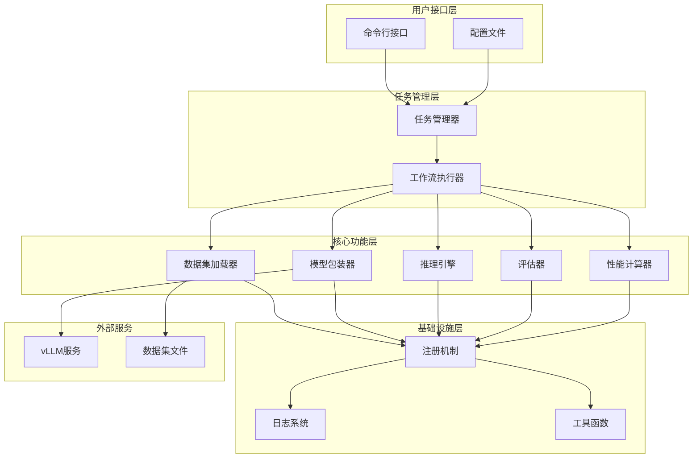
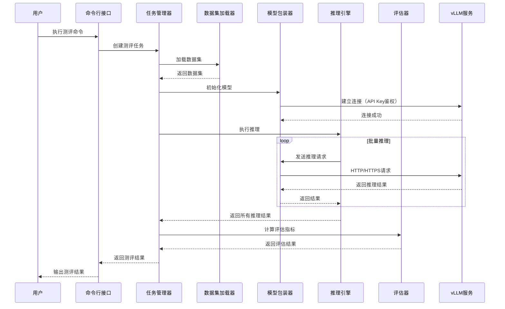
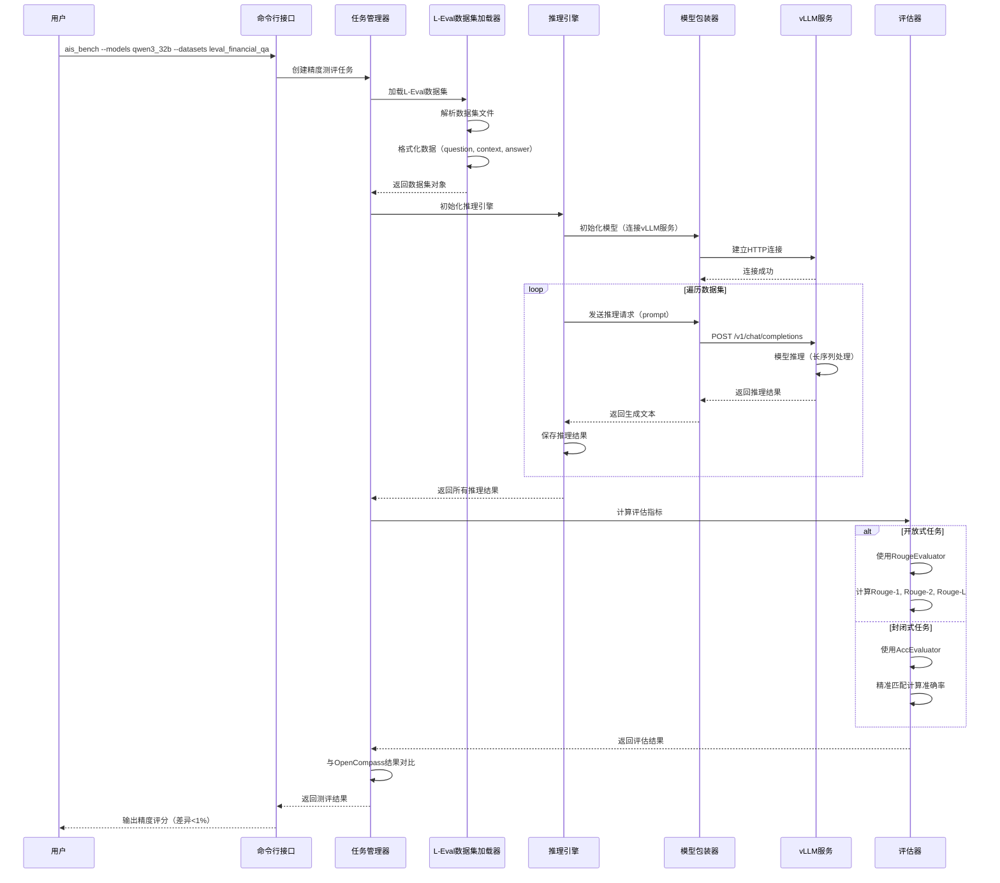
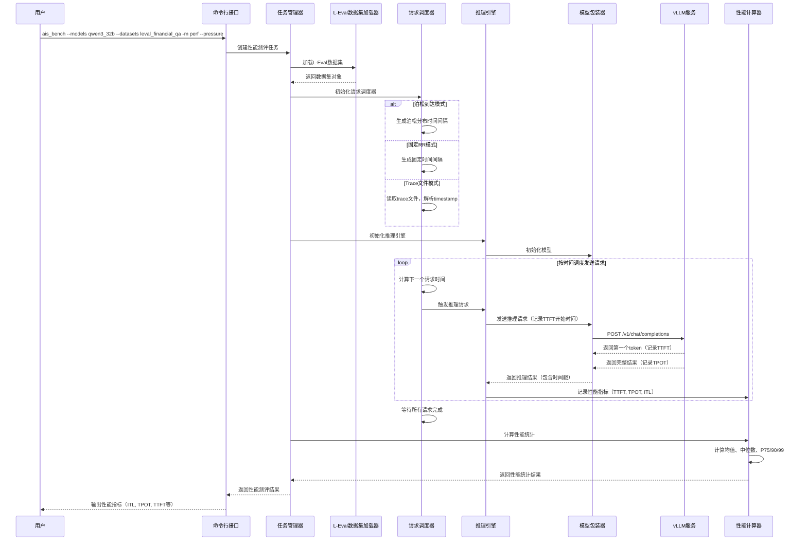
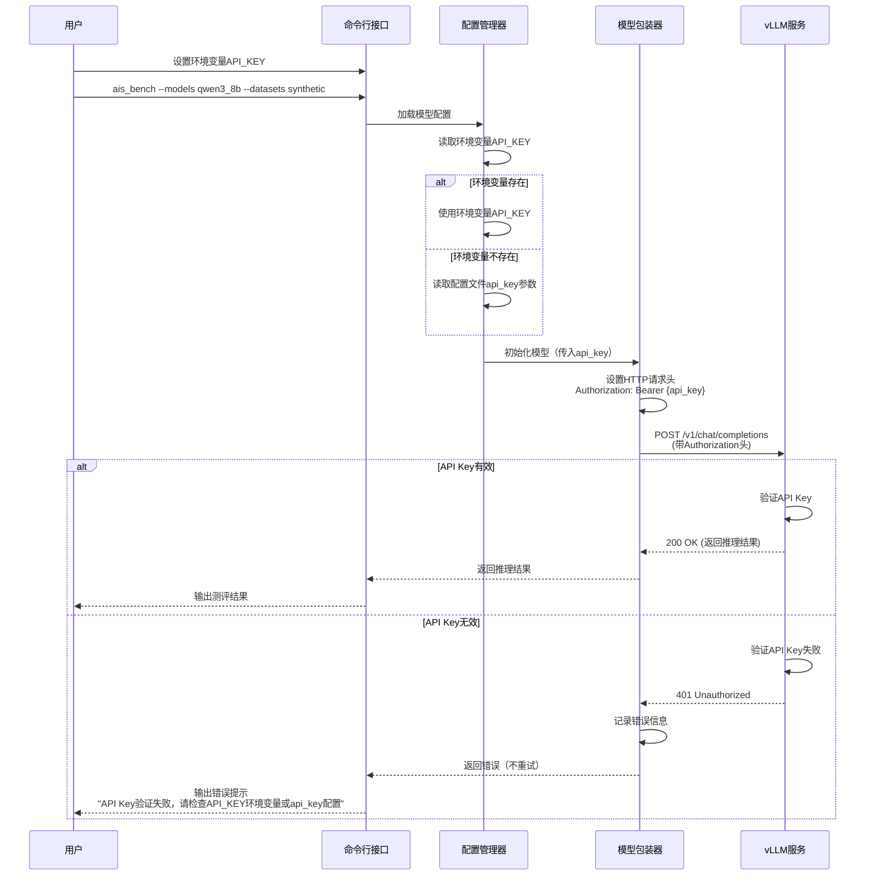
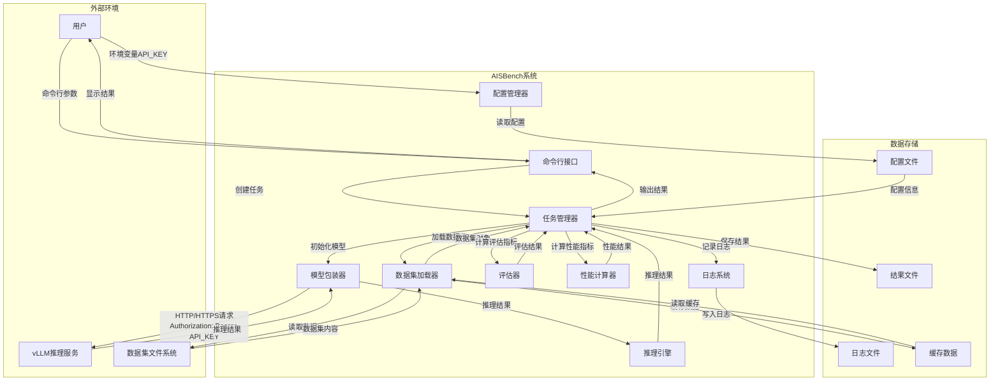

**AISBench 测评工具特性分析与设计说明书**

**目录**

1.特性概述

1.1范围

1.2特性需求列表

2.需求场景分析

2.1特性需求来源与价值概述

2.2特性场景分析

2.3特性影响分析

2.3.1硬件限制

2.3.2技术限制

2.3.3对License的影响分析

2.3.4对系统性能规格的影响分析

2.3.5对系统可靠性规格的影响分析

2.3.6对系统兼容性的影响分析

2.3.7与其他重大特性的交互性，冲突性的影响分析

3.特性/功能实现原理(可分解出来多个Use Case)

3.1目标

3.2总体方案

4.Use Case一实现

4.1设计思路

4.2约束条件

4.3详细实现(从用户入口的模块级别或进程级别消息序列图)

4.4子系统间接口(主要覆盖模块接口定义)

4.5子系统详细设计

4.6DFX属性设计

4.6.1性能设计

4.6.2升级与扩容设计

4.6.3异常处理设计

4.6.4资源管理相关设计

4.6.5小型化设计

4.6.6可测性设计

4.6.7安全设计

4.7系统外部接口

4.8自测用例设计

5.Use Case二实现

6.可靠性&amp;可用性设计

6.1冗余设计

6.2故障管理

6.3过载控制设计

6.4升级不中断业务

6.5人因差错设计

6.6故障预测预防设计

7.安全&amp;隐私&amp;韧性设计

7.1Low Level威胁分析及设计

7.1.12层数据流图

7.1.2业务场景及信任边界说明

7.1.3外部交互方分析

7.1.4数据流分析

7.1.5处理过程分析

7.1.6数据存储分析

7.1.7缺陷列表

7.2隐私风险分析与设计

7.2.1隐私风险预分析问卷

7.2.2隐私风险预分析总结

7.2.3个人数据列表

7.2.4XX需求设计

7.2.5YY需求设计

8.特性非功能性质量属性相关设计

8.1可测试性

8.2可服务性

8.3可演进性

8.4开放性

8.5兼容性

8.6可伸缩性/可扩展性

8.7 可维护性

8.8 资料

9.数据结构设计（可选）

10.参考资料清单

**表目录**

表1：特性需求列表

表2：资料修改清单

表3：外部交互方威胁分析表（用户）

表4：外部交互方威胁分析表（vLLM推理服务）

表5：数据流威胁分析表

表6：处理过程威胁分析表

表7：数据存储威胁分析表

表8：缺陷列表

表9：隐私风险预分析问卷

**图目录**

图1：AISBench系统架构图

图2：AISBench数据流时序图

图3：L-Eval数据集精度测评时序图

图4：L-Eval数据集性能测评时序图

图5：API Key鉴权认证时序图

图6：AISBench安全数据流图（2层）

**List of abbreviations**  **缩略语清单** ：

<table>
    <tr>
        <th>Abbreviations 缩略语</th>
        <th>Full spelling 英文全名</th>
        <th>Chinese explanation 中文解释</th>
    </tr>
    <tr>
        <td>xxx</td>
        <td>xxx</td>
        <td>xxx</td>
    </tr>
    <tr>
        <td>xxx</td>
        <td>xxx</td>
        <td>xxx</td>
    </tr>
</table>

# 1.特性概述

AISBench是MindStudio 26.0.0版本中的AI模型测评工具，旨在为AI模型提供全面的精度和性能评估能力。本版本在原有功能基础上，新增了长序列推理场景支持、多模态数据集覆盖、API Key鉴权认证、PPL评测能力、工具易用性优化、集群测评能力增强等多项特性，进一步提升了测评工具的完整性、易用性和专业性。

本版本的主要价值包括：

1. **长序列推理能力评估**：通过支持L-Eval数据集，提供对模型长文本理解能力的全面评估，支持Mooncake论文验证方式，满足长序列推理场景的测评需求。
2. **多模态模型全面覆盖**：新增MMStar、VideoMME、OCRBench、MMMU、OmniDocBench、VQA等多个多模态数据集支持，覆盖视觉问答、视频理解、文本理解、大学水平问题等多个维度。
3. **安全性增强**：支持API Key鉴权认证，增强服务化推理的安全性。
4. **评测能力扩展**：新增PPL（困惑度）评测能力，支持预训练模型的测评；新增DAPO-math数据集支持，覆盖强化学习场景。
5. **易用性提升**：通过命令行参数优化、配置参数优化等方式，提升工具的易用性和灵活性。
6. **集群测评能力**：支持EPD分离的encoding阶段耗时统计、基于timestamp的流量负载复现等高级功能。

本文档详细描述了上述特性的需求分析、架构设计、实现方案等内容，适用于AISBench测评工具的研发、测试和使用人员。

## 1.1范围

本版本特性主要包含以下功能点：

1. **L-Eval数据集支持**：支持L-Eval数据集的精度和性能测评，包括开放式任务（Rouge评估）和封闭式任务（准确率评估），支持泊松到达、固定RR等请求模式。
2. **API Key鉴权认证**：支持通过环境变量读取API Key并透传给推理服务，覆盖vLLM系列API接口。
3. **多模态数据集支持**：
   - MMStar数据集：视觉问答能力评估
   - VideoMME数据集：视频理解能力评估
   - OCRBench_v2数据集：OCR文本理解能力评估
   - MMMU/MMMU Pro数据集：大学水平问题评估
   - OmniDocBench数据集：文档理解能力评估
   - DocVQA/InfoVQA数据集：文档视觉问答能力评估
4. **DAPO-math数据集支持**：支持强化学习场景的数学能力推理评估。
5. **PPL评测能力**：支持基于困惑度的评测模式，覆盖多个通用数据集。
6. **工具易用性优化**：
   - 命令行参数优化：--merge-ds、--num-prompts、--max-num-workers、--pressure-time、--num-warmups等
   - 配置参数优化：stream、url、LOG_LEVEL等
7. **集群测评能力增强**：
   - EPD分离的encoding阶段耗时统计
   - 基于timestamp的流量负载复现
8. **GEdit数据集支持**：支持图片编辑能力的评估，包括语义一致性和感知质量等维度。

## 1.2特性需求列表

表1：特性需求列表

<table>
    <tr>
        <th>需求编号</th>
        <th>需求名称</th>
        <th>特性描述</th>
        <th>备注</th>
    </tr>
    <tr>
        <td>REQ-001</td>
        <td>L-Eval数据集精度测评（开放式任务）</td>
        <td>支持L-Eval数据集中15个子数据集的开放式任务精度测评，使用Rouge指标评估，与OpenCompass精度差异<1%</td>
        <td>子数据集包括：financial_qa、gov_report_summ、legal_contract_qa、meeting_summ、multidoc_qa、narrative_qa、natural_question、news_summ、paper_assistant、patent_summ、review_summ、scientific_qa、tv_show_summ、code_u、sci_fi</td>
    </tr>
    <tr>
        <td>REQ-002</td>
        <td>L-Eval数据集精度测评（封闭式任务）</td>
        <td>支持L-Eval数据集中5个子数据集的封闭式任务精度测评，使用AccEvaluator评估，与OpenCompass精度差异<1%</td>
        <td>子数据集包括：coursera、gsm100、quality、tpo、topic_retrieval</td>
    </tr>
    <tr>
        <td>REQ-003</td>
        <td>L-Eval数据集性能测评</td>
        <td>支持L-Eval数据集的性能测评，支持泊松到达、固定RR等请求模式，输出ITL、TPOT、TTFT等性能指标</td>
        <td>支持Mooncake论文验证方式</td>
    </tr>
    <tr>
        <td>REQ-004</td>
        <td>API Key鉴权认证（性能测评）</td>
        <td>vLLM相关接口支持API Key推理，完成性能测评，支持从环境变量读取API_KEY并透传给推理服务</td>
        <td>覆盖vLLM系列API</td>
    </tr>
    <tr>
        <td>REQ-005</td>
        <td>API Key鉴权认证（精度测评）</td>
        <td>vLLM相关接口支持API Key推理，完成精度测评，支持从环境变量读取API_KEY并透传给推理服务</td>
        <td>覆盖vLLM系列API</td>
    </tr>
    <tr>
        <td>REQ-006</td>
        <td>MMStar数据集支持</td>
        <td>支持MMStar数据集的精度测评，输出不同subject子数据的评分以及平均值，支持GPU/NPU硬件</td>
        <td>评估方式：精准匹配</td>
    </tr>
    <tr>
        <td>REQ-007</td>
        <td>VideoMME数据集支持</td>
        <td>支持VideoMME数据集的精度测评，基于正则表达式完成答案提取并与标准答案进行精准匹配</td>
        <td>支持GPU/NPU硬件</td>
    </tr>
    <tr>
        <td>REQ-008</td>
        <td>OCRBench_v2数据集支持</td>
        <td>支持OCRBench_v2数据集的精度测评，输出精度评分</td>
        <td>支持GPU/NPU硬件</td>
    </tr>
    <tr>
        <td>REQ-009</td>
        <td>MMMU数据集支持</td>
        <td>支持MMMU数据集的精度评估，评估模型的深层视觉理解能力，结合大学学科知识进行推理</td>
        <td>包括选择题和开放式问题</td>
    </tr>
    <tr>
        <td>REQ-010</td>
        <td>MMMU Pro数据集支持</td>
        <td>支持MMMU Pro数据集的精度评估，对MMMU数据集的强化版本</td>
        <td>增加选择题选项数目，引入纯视觉输入设置</td>
    </tr>
    <tr>
        <td>REQ-011</td>
        <td>OmniDocBench数据集支持</td>
        <td>支持OmniDocBench数据集的精度测评，适配Deepseek-ocr模型的推理测评</td>
        <td>支持transformer离线推理、vllm-ascend离线推理、vllm在线推理</td>
    </tr>
    <tr>
        <td>REQ-012</td>
        <td>DocVQA数据集支持</td>
        <td>支持DocVQA数据集的精度测评，使用ANLS评估方式，输出精度评分</td>
        <td>评估模型的文档视觉问答能力</td>
    </tr>
    <tr>
        <td>REQ-013</td>
        <td>InfoVQA数据集支持</td>
        <td>支持InfoVQA数据集的精度测评，使用ANLS评估方式，输出精度评分</td>
        <td>评估模型对布局、文本、图形、可视化等多模态进行关联推理能力</td>
    </tr>
    <tr>
        <td>REQ-014</td>
        <td>DAPO-math数据集支持</td>
        <td>支持DAPO-math-17k数据集完成RL推理测评，基于acc方式评估，输出pass/avg/cons@k指标</td>
        <td>支持RL场景的数学能力推理评估</td>
    </tr>
    <tr>
        <td>REQ-015</td>
        <td>PPL推理模式支持</td>
        <td>支持PPL推理模式的服务化精度测评，拓展ppl inferencer支持PPL推理方式</td>
        <td>与OpenCompass精度差异<1%</td>
    </tr>
    <tr>
        <td>REQ-016</td>
        <td>PPL通用数据集支持</td>
        <td>拓展PPL测评支撑的数据集，包括mmlu、ceval、cmmlu、piqa、race、siqa、hellaswag、gpqa等多个数据集</td>
        <td>支持服务化PPL精度测评</td>
    </tr>
    <tr>
        <td>REQ-017</td>
        <td>命令行指定推理case数目</td>
        <td>精度模式下支持通过--num-prompts n指定所有数据集前n条数据进行精度测评</td>
        <td>兼容精度和性能场景</td>
    </tr>
    <tr>
        <td>REQ-018</td>
        <td>合并数据集推理模式输出子数据集精度</td>
        <td>支持通过--merge-ds合并同类型数据集执行推理任务，输出各子数据集精度和加权精度</td>
        <td>支持ceval、mmlu等多子数据集</td>
    </tr>
    <tr>
        <td>REQ-019</td>
        <td>支持指定最大worker数执行多任务性能测评</td>
        <td>支持通过--max-num-workers指定并行worker数目，实现多性能任务并行</td>
        <td>支持性能场景，debug模式下不生效</td>
    </tr>
    <tr>
        <td>REQ-020</td>
        <td>压测模式下通过request_rate控制并发增长速率</td>
        <td>压测模式下request_rate定义为每秒创建并发的速率，统一为requestrate控制</td>
        <td>兼容老版本CONNECTION_ADD_RATE配置方式</td>
    </tr>
    <tr>
        <td>REQ-021</td>
        <td>支持通过命令行参数配置压测时间</td>
        <td>支持通过--pressure-time指定压测时长，兼容老版本global_consts.py配置方式</td>
        <td>时间到达后不再发送请求，等待已发送请求结束</td>
    </tr>
    <tr>
        <td>REQ-022</td>
        <td>支持指定warm-up次数进行预热</td>
        <td>支持通过--num-warmups指定预热case个数，根据当前任务的数据集选取数据进行warm up</td>
        <td>warm失败后续任务不会继续执行</td>
    </tr>
    <tr>
        <td>REQ-023</td>
        <td>支持指定日志等级</td>
        <td>支持通过global_consts.py配置全局日志等级，支持DEBUG、INFO、WARNING、ERROR、CRITICAL级别</td>
        <td>日志级别配置后生效</td>
    </tr>
    <tr>
        <td>REQ-024</td>
        <td>新增配置参数指定服务端url</td>
        <td>支持通过模型配置文件中的url参数指定ip和port，url优先级高于host_ip和host_port</td>
        <td>支持自定义url</td>
    </tr>
    <tr>
        <td>REQ-025</td>
        <td>支持通过stream参数指定模型后端</td>
        <td>支持通过模型配置参数stream指定调用服务端相同endpoint的流式和非流式接口</td>
        <td>兼容老版本配置model type的配置方式</td>
    </tr>
    <tr>
        <td>REQ-026</td>
        <td>支持EPD分离的encoding编码阶段耗时统计</td>
        <td>基于vLLM服务化接口的返回值，统计encoding编码阶段的耗时，支持稳态、全量两种统计方式</td>
        <td>输出均值、最小值、最大值、中位数、P75/90/99等指标</td>
    </tr>
    <tr>
        <td>REQ-027</td>
        <td>支持请求基于timestamp的流量负载复现</td>
        <td>支持识别trace_example.jsonl文件，按照timestamp精准发送请求，支持指定窗口范围</td>
        <td>支持Mooncake论文中的FAST25生成环境trace数据集</td>
    </tr>
    <tr>
        <td>REQ-028</td>
        <td>GEdit数据集支持</td>
        <td>支持GEdit数据集的精度测评，支持配置裁判模型URL，输出语义一致性、感知质量等维度的评估结果</td>
        <td>与Step1X-Edit的benchmark脚本精度对齐</td>
    </tr>
</table>

# 2.需求场景分析

## 2.1特性需求来源与价值概述

### 2.1.1 需求来源

本版本特性的需求主要来源于以下几个方面：

1. **长序列推理场景需求**：随着大语言模型的发展，模型处理长文本的能力成为重要评估指标。L-Eval数据集是专门用于评估长文本理解能力的基准测试，支持该数据集能够满足长序列推理场景的测评需求。同时，Mooncake论文提出的流量负载复现方式，为性能测评提供了更贴近真实场景的评估方法。

2. **多模态模型评估需求**：Qwen-VL、Deepseek-ocr等多模态模型的快速发展，需要全面的多模态评估能力。MMStar、VideoMME、OCRBench、MMMU、OmniDocBench、VQA等数据集覆盖了视觉问答、视频理解、文本理解、大学水平问题等多个维度，能够全面评估多模态模型的能力。

3. **安全性需求**：在生产环境中，API Key鉴权认证是保障服务安全的重要手段。支持API Key鉴权能够满足企业级部署的安全要求。

4. **评测能力扩展需求**：PPL（困惑度）评测是预训练模型评估的重要方式，支持PPL评测能够扩展工具的适用范围。DAPO-math数据集支持强化学习场景的评估，满足RL场景的测评需求。

5. **易用性提升需求**：用户反馈工具在使用过程中存在一些不便之处，如无法指定推理数据条数、合并数据集时无法查看子数据集精度等，需要通过参数优化提升易用性。

6. **集群测评能力需求**：在实际生产环境中，需要更细粒度的性能分析能力，如EPD分离的encoding阶段耗时统计、基于timestamp的流量负载复现等，以满足集群测评的需求。

### 2.1.2 价值概述

本版本特性对用户带来的具体价值包括：

1. **全面的评估能力**：通过支持L-Eval、多模态数据集、PPL评测等，提供了更全面的模型评估能力，能够满足不同场景下的评估需求。

2. **安全性提升**：通过API Key鉴权认证，提升了服务化推理的安全性，满足企业级部署的安全要求。

3. **易用性提升**：通过命令行参数和配置参数优化，提升了工具的易用性和灵活性，降低了使用门槛。

4. **专业性增强**：通过支持Mooncake论文验证方式、EPD分离统计、流量负载复现等高级功能，提升了工具的专业性和实用性。

如果没有该特性，用户将面临以下问题：

- 无法评估模型的长序列推理能力，无法满足长文本场景的评估需求
- 无法全面评估多模态模型的能力，评估维度不完整
- 服务化推理缺乏安全认证机制，存在安全风险
- 工具使用不够灵活，无法满足个性化需求
- 缺乏专业的集群测评能力，无法进行深入的性能分析

## 2.2特性场景分析

### 2.2.1 场景触发条件及对象

**场景触发条件**：

- 用户需要对AI模型进行精度或性能评估
- 用户需要评估模型的长序列推理能力
- 用户需要评估多模态模型的能力
- 用户需要在生产环境中进行安全认证
- 用户需要进行集群性能分析

**使用对象**：

- AI模型研发人员：需要评估模型性能，优化模型效果
- 测试人员：需要验证模型功能，确保模型质量
- 运维人员：需要进行性能分析，优化部署方案
- 研究人员：需要复现论文结果，进行学术研究

**使用对象技能要求**：

- 基本了解AI模型评估的基本概念
- 熟悉命令行操作
- 了解配置文件的基本格式
- 对于高级功能（如流量负载复现），需要了解相关论文和概念

### 2.2.2 主要应用场景

#### 场景1：长序列推理能力评估

**场景描述**：用户需要评估模型在处理长文本时的理解能力。

**子场景**：

1. **开放式任务评估**：使用L-Eval数据集的开放式任务（如financial_qa、gov_report_summ等），通过Rouge指标评估模型的生成质量。
2. **封闭式任务评估**：使用L-Eval数据集的封闭式任务（如coursera、gsm100等），通过准确率评估模型的选择能力。
3. **性能评估**：使用L-Eval数据集进行性能评估，支持泊松到达、固定RR等请求模式，评估模型在长序列场景下的性能表现。

**关键任务操作**：

1. 准备L-Eval数据集
2. 配置模型和数据集参数
3. 执行精度或性能测评
4. 查看评估结果，与OpenCompass结果对比

#### 场景2：多模态模型全面评估

**场景描述**：用户需要全面评估多模态模型在不同维度上的能力。

**子场景**：

1. **视觉问答评估**：使用MMStar数据集评估模型的视觉问答能力
2. **视频理解评估**：使用VideoMME数据集评估模型的视频理解能力
3. **OCR能力评估**：使用OCRBench_v2数据集评估模型的OCR文本理解能力
4. **大学水平问题评估**：使用MMMU/MMMU Pro数据集评估模型的深层视觉理解能力
5. **文档理解评估**：使用OmniDocBench、DocVQA、InfoVQA数据集评估模型的文档理解能力

**关键任务操作**：

1. 准备相应的多模态数据集（图片、视频等）
2. 配置多模态模型参数
3. 执行精度测评
4. 查看各子数据集的评估结果

#### 场景3：安全认证场景

**场景描述**：用户在生产环境中需要安全认证机制。

**子场景**：

1. **API Key配置**：通过环境变量配置API Key
2. **精度测评**：使用API Key进行精度测评
3. **性能测评**：使用API Key进行性能测评
4. **异常处理**：处理API Key错误的情况

**关键任务操作**：

1. 设置环境变量API_KEY
2. 配置模型参数（api_key参数）
3. 执行测评任务
4. 查看日志，确认认证状态

#### 场景4：PPL评测场景

**场景描述**：用户需要评估预训练模型的困惑度。

**子场景**：

1. **单数据集PPL评测**：使用arc_c_ppl等数据集进行PPL评测
2. **多数据集PPL评测**：使用mmlu、ceval、cmmlu等多个数据集进行PPL评测

**关键任务操作**：

1. 配置PPL inferencer
2. 选择支持PPL评测的数据集
3. 执行PPL评测
4. 查看困惑度结果

#### 场景5：工具易用性优化场景

**场景描述**：用户需要更灵活地使用工具进行测评。

**子场景**：

1. **指定推理数据条数**：使用--num-prompts参数指定推理数据条数
2. **合并数据集推理**：使用--merge-ds参数合并同类型数据集，查看子数据集精度
3. **并行任务执行**：使用--max-num-workers参数指定并行任务数
4. **压测配置**：使用--pressure-time参数配置压测时间
5. **预热配置**：使用--num-warmups参数配置预热次数
6. **日志级别配置**：通过global_consts.py配置日志级别
7. **URL配置**：通过模型配置文件配置自定义URL
8. **流式推理配置**：通过stream参数配置流式/非流式推理

**关键任务操作**：

1. 根据需求选择合适的命令行参数
2. 配置相应的参数值
3. 执行测评任务
4. 查看结果，验证参数效果

#### 场景6：集群测评场景

**场景描述**：用户需要进行深入的集群性能分析。

**子场景**：

1. **EPD分离统计**：统计encoding阶段的耗时，分析编码性能
2. **流量负载复现**：基于timestamp复现真实流量负载，评估性能收益

**关键任务操作**：

1. 准备trace文件（包含timestamp等信息）
2. 配置性能测评参数
3. 执行性能测评
4. 查看encoding阶段耗时统计或流量负载复现结果

## 2.3特性影响分析

### 2.3.1 系统位置及周边接口

本版本特性主要涉及以下系统模块：

1. **数据集加载模块**（`ais_bench/benchmark/datasets/`）：新增L-Eval、MMStar、VideoMME、OCRBench、MMMU、OmniDocBench、VQA、DAPO-math、GEdit等数据集的加载器。

2. **模型接口模块**（`ais_bench/benchmark/models/api_models/`）：扩展vLLM系列API接口，支持API Key鉴权认证、stream参数配置、url参数配置等。

3. **推理引擎模块**（`ais_bench/benchmark/openicl/icl_inferencer/`）：新增PPLInferencer，支持PPL推理模式。

4. **评估器模块**（`ais_bench/benchmark/openicl/icl_evaluator/`）：新增或扩展评估器，支持Rouge、ANLS、精准匹配等多种评估方式。

5. **命令行接口模块**（`ais_bench/benchmark/cli/`）：扩展命令行参数，支持--num-prompts、--merge-ds、--max-num-workers、--pressure-time、--num-warmups等参数。

6. **配置管理模块**（`ais_bench/benchmark/global_consts.py`）：新增LOG_LEVEL配置，移除PRESSURE_TIME、CONNECTION_ADD_RATE等配置。

7. **性能计算模块**（`ais_bench/benchmark/calculators/`）：扩展性能计算器，支持EPD分离的encoding阶段耗时统计、基于timestamp的流量负载复现等。

**周边接口**：

- 与vLLM推理服务的HTTP/HTTPS接口交互
- 与数据集文件的文件系统接口交互
- 与环境变量的系统接口交互
- 与日志系统的接口交互

### 2.3.2 关键约束及特性冲突

1. **PPL推理模式限制**：
   - PPL推理模式不支持流式推理（stream=True）
   - PPL推理模式不支持性能测评模式
   - 仅支持API模型，不支持本地模型

2. **多模态数据集限制**：
   - 需要支持多模态输入的模型（如Qwen2.5-VL-7B）
   - 需要准备相应的图片、视频等媒体文件
   - 不同数据集对模型后端的要求可能不同

3. **API Key鉴权限制**：
   - 需要推理服务支持API Key鉴权
   - API Key错误时会影响测评任务的执行

4. **命令行参数兼容性**：
   - 部分参数在debug模式下不生效（如--max-num-workers）
   - 部分参数需要特定模式支持（如--pressure-time需要--pressure模式）

### 2.3.3 与其他需求及特性的交互分析

1. **与现有数据集支持的交互**：新增数据集与现有数据集共享相同的数据加载框架和评估框架，不会产生冲突。

2. **与现有模型接口的交互**：API Key、stream、url等参数的扩展与现有模型接口兼容，通过参数优先级机制避免冲突。

3. **与性能测评的交互**：EPD分离统计、流量负载复现等功能扩展了性能测评的能力，与现有性能测评功能兼容。

4. **与易用性优化的交互**：命令行参数和配置参数的优化提升了工具的易用性，与现有功能兼容。

### 2.3.4 平台差异性分析

**硬件平台**：

- **NPU（昇腾）**：支持vLLM-ascend离线推理和vLLM在线推理，支持多模态数据集评估
- **GPU**：支持transformer离线推理、vLLM在线推理，支持多模态数据集评估
- **CPU**：主要用于开发和测试环境，性能测评能力有限

**操作系统**：

- **Linux**：主要支持平台，所有功能均支持
- **Windows/macOS**：部分功能可能受限，主要依赖Python环境和相关库的支持

### 2.3.5 兼容性分析

1. **向后兼容性**：
   - 保留老版本的配置方式（如global_consts.py中的PRESSURE_TIME、CONNECTION_ADD_RATE），通过兼容机制支持
   - 保留老版本的model type配置方式，通过stream参数统一
   - 新增参数均为可选参数，不影响现有功能

2. **向前兼容性**：
   - 新版本的数据集格式与老版本兼容
   - 新版本的配置文件格式与老版本兼容
   - 新版本的评估结果格式与老版本兼容

3. **跨版本兼容性**：
   - 支持不同版本的vLLM服务
   - 支持不同版本的数据集格式
   - 通过版本检测和适配机制保证兼容性

### 2.3.6 约束及限制

1. **数据集准备约束**：
   - 需要用户自行准备数据集文件
   - 多模态数据集需要准备相应的媒体文件
   - 数据集路径需要正确配置

2. **模型服务约束**：
   - 需要模型服务正常运行
   - 需要模型服务支持相应的接口
   - 需要网络连接正常

3. **资源约束**：
   - 长序列推理需要较大的内存和计算资源
   - 多模态数据集需要较大的存储空间
   - 并行任务数受CPU核心数限制

### 2.3.1硬件限制

**硬件约束**：

1. **内存要求**：
   - 长序列推理场景需要较大的内存（建议≥32GB）
   - 多模态数据集处理需要较大的内存（建议≥16GB）
   - 并行任务执行需要根据任务数分配内存

2. **存储要求**：
   - 数据集文件需要足够的存储空间（建议≥100GB）
   - 多模态数据集（图片、视频）需要更大的存储空间
   - 评估结果文件需要一定的存储空间

3. **计算资源要求**：
   - NPU/GPU需要支持相应的计算能力
   - 并行任务数受CPU核心数限制（建议不超过CPU核心数的80%）
   - 性能测评需要足够的网络带宽

4. **网络要求**：
   - 服务化推理需要稳定的网络连接
   - API Key鉴权需要网络连接正常
   - 流量负载复现需要精确的时间同步

**规避方案**：

- 对于内存不足的情况，可以通过减少并行任务数、减少数据集大小等方式降低内存需求
- 对于存储不足的情况，可以通过使用外部存储、数据压缩等方式解决
- 对于计算资源不足的情况，可以通过降低并发数、使用更高效的推理后端等方式优化
- 对于网络不稳定的情况，可以通过重试机制、超时设置等方式提高容错性

### 2.3.2技术限制

**操作系统**：

- **主要支持**：Linux（Ubuntu 18.04+, CentOS 7+等）
- **部分支持**：Windows 10+, macOS 10.14+（部分功能可能受限）
- **限制**：某些系统调用和文件系统特性可能在不同操作系统上表现不同

**编程语言**：

- **主要语言**：Python 3.8+
- **依赖库**：需要安装相应的Python库（如aiohttp、datasets、transformers等）
- **限制**：Python版本过低可能导致某些功能无法使用

**第三方依赖**：

- **vLLM**：需要vLLM服务正常运行，版本兼容性需要验证
- **数据集库**：需要huggingface datasets等库支持
- **评估库**：需要rouge-score、nltk等评估库支持

**规避方案**：

- 提供详细的安装文档和环境要求说明
- 提供Docker镜像，统一运行环境
- 提供版本检测和兼容性检查机制
- 对于不兼容的情况，提供明确的错误提示和解决方案

### 2.3.3对License的影响分析

本版本特性涉及的第三方开源软件及其License如下：

1. **L-Eval数据集**：
   - 来源：OpenLMLab/LEval (<https://github.com/OpenLMLab/LEval>)
   - License：需要查看具体License，通常为Apache 2.0或MIT
   - 影响：数据集使用需要遵循相应的License要求

2. **多模态数据集**：
   - MMStar、VideoMME、OCRBench、MMMU、OmniDocBench、VQA等数据集
   - 各数据集可能有不同的License要求
   - 影响：使用数据集需要遵循相应的License要求

3. **vLLM**：
   - 来源：vllm-project/vllm (<https://github.com/vllm-project/vllm>)
   - License：Apache 2.0
   - 影响：使用vLLM需要遵循Apache 2.0 License

4. **OpenCompass**：
   - 来源：open-compass/opencompass (<https://github.com/open-compass/opencompass>)
   - License：Apache 2.0
   - 影响：作为对比参考，不影响License合规性

5. **Python依赖库**：
   - aiohttp、datasets、transformers、rouge-score等
   - 各库有不同的License（Apache 2.0、MIT、BSD等）
   - 影响：需要确保所有依赖库的License兼容

**合规性分析**：

- 所有使用的第三方开源软件均为开源License，允许商业使用
- 需要在使用文档中明确标注使用的第三方软件及其License
- 需要遵循各License的要求（如保留版权声明等）

### 2.3.4对系统性能规格的影响分析

**内存要求**：

- **基础要求**：建议≥16GB内存
- **长序列推理场景**：建议≥32GB内存（处理长文本需要较大内存）
- **多模态数据集场景**：建议≥16GB内存（图片、视频处理需要内存）
- **并行任务场景**：根据并行任务数动态分配，建议每个任务≥4GB内存

**存储要求**：

- **数据集存储**：建议≥100GB可用空间
- **多模态数据集**：根据数据集大小，可能需要数百GB空间
- **结果存储**：根据测评规模，建议预留≥10GB空间

**CPU要求**：

- **基础要求**：建议≥4核CPU
- **并行任务场景**：建议CPU核心数≥并行任务数
- **性能测评场景**：建议≥8核CPU（高并发场景）

**网络要求**：

- **服务化推理**：建议网络带宽≥100Mbps
- **API Key鉴权**：需要稳定的网络连接
- **流量负载复现**：需要精确的时间同步（NTP同步）

**GPU/NPU要求**：

- **推理加速**：需要支持相应的GPU/NPU硬件
- **多模态处理**：需要支持多模态模型的GPU/NPU

### 2.3.5对系统可靠性规格的影响分析

**可靠性假设**：

- 模型服务可用性：假设模型服务的可用性≥99%
- 网络连接稳定性：假设网络连接的稳定性≥99%
- 数据集完整性：假设数据集文件的完整性为100%

**可靠性约束**：

- **重试机制**：对于网络请求失败，支持自动重试（默认2次）
- **超时控制**：对于长时间无响应的请求，支持超时控制
- **错误处理**：对于API Key错误、数据集加载失败等异常情况，提供明确的错误提示
- **数据一致性**：确保评估结果的数据一致性，避免因网络波动等原因导致的数据不一致

**可靠性目标**：

- 在正常网络和服务条件下，测评任务的成功率≥99%
- 对于单次请求失败，通过重试机制保证最终成功率
- 对于关键数据（评估结果），确保数据不丢失、不损坏

### 2.3.6对系统兼容性的影响分析

**前向兼容性**：

- 新版本支持老版本的配置文件格式
- 新版本支持老版本的数据集格式
- 新版本支持老版本的评估结果格式
- 老版本的用户可以平滑升级到新版本

**向后兼容性**：

- 保留老版本的配置方式（如global_consts.py中的配置）
- 保留老版本的命令行参数（如不冲突的参数）
- 保留老版本的模型接口（通过兼容机制）

**跨版本兼容性**：

- 支持不同版本的vLLM服务（通过版本检测和适配）
- 支持不同版本的数据集格式（通过格式转换）
- 支持不同版本的Python（3.8+）

**兼容性保证措施**：

- 提供版本检测机制，自动识别和适配不同版本
- 提供配置迁移工具，帮助用户迁移老版本配置
- 提供详细的升级文档，指导用户平滑升级

### 2.3.7与其他重大特性的交互性，冲突性的影响分析

**与现有数据集支持的交互**：

- 新增数据集与现有数据集共享相同的数据加载框架
- 不会产生冲突，通过注册机制统一管理

**与现有模型接口的交互**：

- API Key、stream、url等参数的扩展与现有模型接口兼容
- 通过参数优先级机制避免冲突（url > host_ip+host_port）

**与性能测评的交互**：

- EPD分离统计、流量负载复现等功能扩展了性能测评的能力
- 与现有性能测评功能兼容，可以同时使用

**与易用性优化的交互**：

- 命令行参数和配置参数的优化提升了工具的易用性
- 与现有功能兼容，不会产生冲突

**潜在冲突及解决方案**：

- **冲突1**：老版本的model type配置与新版本的stream参数配置可能冲突
  - **解决方案**：通过兼容机制，优先使用新版本配置，同时支持老版本配置
- **冲突2**：老版本的global_consts.py配置与新版本的命令行参数可能冲突
  - **解决方案**：命令行参数优先级高于配置文件，同时保留配置文件支持
- **冲突3**：并行任务数与系统资源可能冲突
  - **解决方案**：提供资源检测机制，自动调整并行任务数，避免资源耗尽

# 3.特性/功能实现原理(可分解出来多个Use Case)

## 3.1目标

### 3.1.1 功能目标

本版本特性在以下场景下需要实现的目标：

1. **长序列推理场景**：
   - 支持L-Eval数据集的精度和性能测评
   - 精度测评结果与OpenCompass差异<1%
   - 支持泊松到达、固定RR等请求模式
   - 支持Mooncake论文验证方式

2. **多模态评估场景**：
   - 支持MMStar、VideoMME、OCRBench、MMMU、OmniDocBench、VQA等多个多模态数据集
   - 精度测评结果与OpenCompass或官方脚本差异<1%
   - 支持GPU/NPU硬件平台
   - 支持transformer离线推理、vllm-ascend离线推理、vllm在线推理

3. **安全认证场景**：
   - 支持API Key鉴权认证
   - 支持从环境变量读取API Key
   - 支持API Key错误时的异常处理

4. **PPL评测场景**：
   - 支持PPL推理模式的服务化精度测评
   - 支持多个通用数据集的PPL评测
   - 精度测评结果与OpenCompass差异<1%

5. **易用性优化场景**：
   - 支持丰富的命令行参数配置
   - 支持灵活的配置参数设置
   - 提升工具的易用性和灵活性

6. **集群测评场景**：
   - 支持EPD分离的encoding阶段耗时统计
   - 支持基于timestamp的流量负载复现
   - 支持精准的性能分析

### 3.1.2 性能目标

1. **精度目标**：
   - 所有数据集的精度测评结果与OpenCompass或官方脚本差异<1%
   - 评估指标计算准确，结果可复现

2. **性能目标**：
   - 支持高并发性能测评（建议并发数≤CPU核心数）
   - 性能测评开销<5%（相对于实际推理时间）
   - 支持大规模数据集的测评（建议数据集大小≤100GB）

3. **可靠性目标**：
   - 测评任务成功率≥99%
   - 网络请求失败自动重试（默认2次）
   - 异常情况提供明确的错误提示

### 3.1.3 兼容性目标

1. **向后兼容**：支持老版本的配置文件和命令行参数
2. **向前兼容**：新版本的功能和配置方式向前兼容
3. **跨平台兼容**：支持Linux、Windows、macOS等操作系统
4. **跨版本兼容**：支持不同版本的vLLM服务和数据集格式

## 3.2总体方案

### 3.2.1 架构设计原则

1. **模块化设计**：采用注册机制（Registry），各模块独立，易于扩展和维护
2. **接口统一**：统一的数据集接口、模型接口、评估器接口，保证一致性
3. **配置驱动**：通过配置文件和命令行参数驱动，灵活可配置
4. **可扩展性**：支持插件机制，易于添加新功能
5. **可测试性**：模块独立，便于单元测试和集成测试

### 3.2.2 系统架构

AISBench采用分层架构设计，主要分为以下层次：

图1：AISBench系统架构图

### 3.2.3 模块划分

#### 3.2.3.1 数据集模块（datasets/）

**职责**：负责数据集的加载、预处理和格式化。

**主要组件**：

- `BaseDataset`：数据集基类，定义统一的数据集接口
- `LEvalDataset`：L-Eval数据集加载器，支持开放式和封闭式任务
- `MMStarDataset`：MMStar数据集加载器
- `VideoMMEDataset`：VideoMME数据集加载器
- `OCRBenchDataset`：OCRBench数据集加载器
- `MMMUDataset`：MMMU数据集加载器
- `OmniDocBenchDataset`：OmniDocBench数据集加载器
- `VQADataset`：VQA数据集加载器（DocVQA、InfoVQA）
- `DAPOMathDataset`：DAPO-math数据集加载器
- `GEditDataset`：GEdit数据集加载器

**设计要点**：

- 所有数据集继承自`BaseDataset`，实现统一的`load()`接口
- 通过注册机制（`LOAD_DATASET`）统一管理
- 支持本地数据集和远程数据集加载
- 支持数据集预处理和格式化

#### 3.2.3.2 模型模块（models/）

**职责**：负责模型接口的封装和调用。

**主要组件**：

- `BaseModel`：模型基类，定义统一的模型接口
- `BaseAPIModel`：API模型基类，支持API Key、url、stream等参数
- `VLLMCustomAPI`：vLLM通用API接口
- `VLLMCustomAPIChat`：vLLM Chat API接口
- `VLLMFunctionCallAPIChat`：vLLM Function Call API接口

**设计要点**：

- 支持API Key鉴权认证（通过环境变量或配置参数）
- 支持stream参数统一流式/非流式接口
- 支持url参数自定义服务端地址
- 支持重试机制和超时控制

#### 3.2.3.3 推理引擎模块（openicl/icl_inferencer/）

**职责**：负责推理任务的执行和管理。

**主要组件**：

- `BaseInferencer`：推理引擎基类
- `GenInferencer`：生成式推理引擎
- `PPLInferencer`：PPL推理引擎
- `MultiTurnGenInferencer`：多轮对话推理引擎

**设计要点**：

- 支持不同的推理模式（生成式、PPL、多轮对话等）
- 支持批量推理和并发控制
- 支持流式推理和非流式推理
- PPL推理引擎不支持流式和性能测评模式

#### 3.2.3.4 评估器模块（openicl/icl_evaluator/）

**职责**：负责评估指标的计算和结果输出。

**主要组件**：

- `BaseEvaluator`：评估器基类
- `RougeEvaluator`：Rouge指标评估器
- `AccEvaluator`：准确率评估器
- `ANLSEvaluator`：ANLS指标评估器
- `CodeUEvaluator`：Code U数据集专用评估器
- `SciFiEvaluator`：Sci-Fi数据集专用评估器

**设计要点**：

- 支持多种评估指标（Rouge、准确率、ANLS等）
- 支持自定义评估器
- 支持子数据集精度统计和加权平均

#### 3.2.3.5 性能计算模块（calculators/）

**职责**：负责性能指标的计算和统计。

**主要组件**：

- `PerfMetricCalculator`：性能指标计算器基类
- `EncodingTimeCalculator`：encoding阶段耗时计算器
- `TraceReplayCalculator`：流量负载复现计算器

**设计要点**：

- 支持EPD分离的encoding阶段耗时统计
- 支持基于timestamp的流量负载复现
- 支持稳态和全量两种统计方式
- 支持多种性能指标（TTFT、TPOT、ITL等）

#### 3.2.3.6 命令行接口模块（cli/）

**职责**：负责命令行参数的解析和管理。

**主要组件**：

- `ArgumentParser`：命令行参数解析器
- `TaskManager`：任务管理器
- `ConfigManager`：配置管理器

**设计要点**：

- 支持丰富的命令行参数（--num-prompts、--merge-ds、--max-num-workers等）
- 支持参数验证和默认值设置
- 支持debug模式和dry-run模式
- 支持参数优先级机制

### 3.2.4 数据流设计

图2：AISBench数据流时序图

### 3.2.5 Use Case分解

根据场景分析和系统分解，将特性实现分为以下关键场景（Use Case）：

1. **Use Case 1：L-Eval数据集精度与性能测评**
   - 支持L-Eval数据集的开放式和封闭式任务精度测评
   - 支持L-Eval数据集的性能测评
   - 支持Mooncake论文验证方式

2. **Use Case 2：API Key鉴权认证**
   - 支持API Key的环境变量读取和透传
   - 支持API Key错误时的异常处理

3. **Use Case 3：多模态数据集支持**
   - 支持多个多模态数据集的加载和评估
   - 支持多模态模型的推理接口

4. **Use Case 4：PPL评测能力**
   - 支持PPL推理模式
   - 支持多个通用数据集的PPL评测

5. **Use Case 5：工具易用性优化**
   - 支持丰富的命令行参数
   - 支持灵活的配置参数

6. **Use Case 6：集群测评能力增强**
   - 支持EPD分离的encoding阶段耗时统计
   - 支持基于timestamp的流量负载复现

### 3.2.6 对接原则

1. **接口统一原则**：所有数据集、模型、评估器都遵循统一的接口规范
2. **配置优先原则**：命令行参数优先级高于配置文件，新配置优先级高于老配置
3. **向后兼容原则**：新版本支持老版本的配置和接口
4. **错误处理原则**：所有异常情况都提供明确的错误提示和处理建议
5. **性能优化原则**：在保证功能正确的前提下，优化性能，减少开销

# 4.Use Case一实现：L-Eval数据集精度与性能测评

## 4.1设计思路

L-Eval数据集是专门用于评估大型语言模型长文本理解能力的基准测试数据集。本Use Case的设计思路如下：

1. **数据集分类处理**：
   - 开放式任务：使用Rouge指标评估，支持15个子数据集
   - 封闭式任务：使用准确率（AccEvaluator）评估，支持5个子数据集
   - 通过统一的接口加载不同子数据集，根据任务类型选择相应的评估器

2. **评估器扩展**：
   - 对于开放式任务，使用RougeEvaluator计算Rouge-1、Rouge-2、Rouge-L等指标
   - 对于封闭式任务，使用AccEvaluator进行精准匹配
   - 对于特殊数据集（如Code U、Sci-Fi），实现自定义评估器

3. **性能测评支持**：
   - 支持泊松到达（Poisson Arrival）请求模式
   - 支持固定RR（Round Robin）请求模式
   - 支持Mooncake论文中的trace文件格式，实现流量负载复现

4. **精度对齐保证**：
   - 与OpenCompass使用相同的评估指标和计算方法
   - 确保评估结果的一致性，精度差异<1%

## 4.2约束条件

1. **数据集准备**：
   - 需要用户自行准备L-Eval数据集文件
   - 数据集文件需要符合L-Eval数据格式要求
   - 数据集路径需要正确配置

2. **模型服务要求**：
   - 需要vLLM服务正常运行
   - 模型需要支持长序列推理（建议支持≥32K tokens）
   - 网络连接需要稳定

3. **硬件资源要求**：
   - 内存：建议≥32GB（长序列推理需要较大内存）
   - 存储：根据数据集大小，建议≥50GB可用空间
   - 网络：建议网络带宽≥100Mbps

4. **性能测评限制**：
   - 泊松到达模式需要指定lambda参数（到达率）
   - 固定RR模式需要指定请求间隔
   - trace文件需要包含timestamp、input_length、output_length等字段

## 4.3详细实现(从用户入口的模块级别或进程级别消息序列图)

### 4.3.1 精度测评流程

图3：L-Eval数据集精度测评时序图

### 4.3.2 性能测评流程

图4：L-Eval数据集性能测评时序图

### 4.3.3 模块职责说明

**命令行接口（CLI）**：

- 解析用户输入的命令行参数
- 创建测评任务并传递给任务管理器

**任务管理器（TaskManager）**：

- 协调各个模块的执行
- 管理测评任务的整个生命周期
- 处理任务级别的异常和错误

**L-Eval数据集加载器（LEvalDataset）**：

- 加载L-Eval数据集文件
- 解析数据集格式（JSON格式）
- 格式化数据为统一的接口格式
- 区分开放式和封闭式任务

**推理引擎（Inferencer）**：

- 管理推理任务的执行
- 支持批量推理和并发控制
- 记录推理结果和时间戳

**模型包装器（ModelWrapper）**：

- 封装vLLM服务接口
- 处理HTTP请求和响应
- 支持API Key鉴权
- 处理重试和超时

**评估器（Evaluator）**：

- 根据任务类型选择相应的评估器
- 计算评估指标（Rouge或准确率）
- 与OpenCompass结果对比

**性能计算器（PerfCalculator）**：

- 统计性能指标（TTFT、TPOT、ITL等）
- 计算统计值（均值、中位数、分位数等）
- 支持稳态和全量统计

## 4.4子系统间接口(主要覆盖模块接口定义)

### 4.4.1 数据集接口

**文件位置**：`ais_bench/benchmark/datasets/leval/`

**主要接口**：

- `LEvalDataset.load(**kwargs)`: 加载L-Eval数据集
  - 输入：数据集路径、split等参数
  - 输出：Dataset对象，包含question、context、answer等字段

**修改内容**：

- 新增L-Eval各子数据集的加载器类
- 实现统一的数据格式转换
- 支持开放式和封闭式任务的区分

### 4.4.2 评估器接口

**文件位置**：`ais_bench/benchmark/openicl/icl_evaluator/`

**主要接口**：

- `RougeEvaluator.score(predictions, references)`: 计算Rouge指标
- `AccEvaluator.score(predictions, references)`: 计算准确率
- `CodeUEvaluator.score(predictions, references)`: Code U数据集专用评估
- `SciFiEvaluator.score(predictions, references)`: Sci-Fi数据集专用评估

**修改内容**：

- 扩展RougeEvaluator支持L-Eval开放式任务
- 扩展AccEvaluator支持L-Eval封闭式任务
- 新增CodeUEvaluator和SciFiEvaluator

### 4.4.3 性能计算接口

**文件位置**：`ais_bench/benchmark/calculators/`

**主要接口**：

- `TraceReplayCalculator.calculate(trace_file, model, dataset)`: 基于trace文件进行流量负载复现
- `RequestScheduler.schedule(mode, params)`: 请求调度，支持泊松到达、固定RR等模式

**修改内容**：

- 新增TraceReplayCalculator支持Mooncake论文验证方式
- 扩展RequestScheduler支持多种请求模式

## 4.5子系统详细设计

### 4.5.1 数据集加载器设计

**LEvalDataset基类**：

- 提供统一的数据加载接口
- 处理数据集文件的解析和格式化
- 支持子数据集的自动识别

**子数据集加载器**：

- `LEvalFinancialQADataset`: 金融领域问答数据集
- `LEvalGovReportSummDataset`: 政府报告摘要数据集
- `LEvalCourseraDataset`: 在线课程考试数据集
- 等等...

**设计要点**：

- 所有子数据集继承自`LEvalDataset`基类
- 通过注册机制统一管理
- 支持数据集缓存，避免重复加载

### 4.5.2 评估器设计

**RougeEvaluator扩展**：

- 支持Rouge-1、Rouge-2、Rouge-L指标计算
- 与OpenCompass使用相同的Rouge计算库
- 支持N-Gram评估方式

**AccEvaluator扩展**：

- 支持精准匹配评估
- 支持多选题评估（提取选项字母）
- 与OpenCompass使用相同的匹配逻辑

**自定义评估器**：

- `CodeUEvaluator`: 代码理解和输出推断的专用评估器
- `SciFiEvaluator`: 科幻小说事实判断的专用评估器

### 4.5.3 性能测评设计

**请求调度器设计**：

- 支持泊松到达模式：根据lambda参数生成泊松分布的时间间隔
- 支持固定RR模式：根据固定间隔发送请求
- 支持Trace文件模式：根据trace文件中的timestamp精准发送请求

**性能指标统计**：

- TTFT（Time To First Token）：从请求发送到收到第一个token的时间
- TPOT（Time Per Output Token）：每个输出token的平均时间
- ITL（Inter-Token Latency）：token之间的延迟
- 支持稳态统计（去除warmup阶段）和全量统计

## 4.6DFX属性设计

### 4.6.1性能设计

**性能影响分析**：

- 长序列推理会增加单次请求的处理时间
- 批量推理可以通过并发控制优化性能
- 性能测评的请求调度开销<5%

**性能优化措施**：

- 支持批量推理，减少网络开销
- 支持并发控制，避免资源耗尽
- 支持数据集缓存，避免重复加载
- 支持结果缓存，避免重复计算

**性能目标**：

- 精度测评：单条数据推理时间<10s（取决于模型和序列长度）
- 性能测评：请求调度开销<5%
- 评估计算：评估指标计算时间<1s（1000条数据）

### 4.6.2升级与扩容设计

**升级设计**：

- 新版本支持老版本的L-Eval数据集格式
- 新版本支持老版本的评估结果格式
- 提供数据集格式迁移工具（如需要）

**扩容设计**：

- 支持大规模数据集的测评（通过分批处理）
- 支持分布式测评（通过多进程/多线程）
- 支持结果聚合（多个测评任务的结果合并）

### 4.6.3异常处理设计

**异常场景**：

1. 数据集文件不存在或格式错误
2. 模型服务连接失败
3. 网络请求超时
4. 评估指标计算错误
5. 内存不足

**规避方案**：

- 数据集文件检查：在加载前检查文件是否存在和格式是否正确
- 连接重试：模型服务连接失败时自动重试（默认2次）
- 超时控制：网络请求设置超时时间（默认30s）
- 错误提示：所有异常情况都提供明确的错误提示和处理建议
- 资源监控：监控内存使用，避免内存溢出

### 4.6.4资源管理相关设计

**内存占用**：

- 数据集加载：根据数据集大小，建议预留≥数据集大小×2的内存
- 推理结果缓存：根据数据集大小和结果大小，建议预留≥数据集大小×3的内存
- 总内存需求：建议≥32GB（长序列推理场景）

**磁盘I/O**：

- 数据集文件读取：一次性加载，后续使用内存缓存
- 结果文件写入：批量写入，减少I/O次数
- 建议使用SSD存储，提升I/O性能

**网络I/O**：

- 推理请求：根据并发数和请求大小，建议网络带宽≥100Mbps
- 支持HTTP/HTTPS协议
- 支持连接池，减少连接开销

**资源超出处理**：

- 内存不足：提示用户减少并发数或数据集大小
- 磁盘空间不足：提示用户清理磁盘空间
- 网络不稳定：自动重试，记录失败请求

### 4.6.5小型化设计

**影响分析**：

- 新增数据集加载器会增加代码量（约10KB）
- 新增评估器会增加代码量（约5KB）
- 对安装包大小影响较小（<1MB）

**优化措施**：

- 数据集加载器采用懒加载，按需加载
- 评估器采用插件机制，按需加载
- 不影响小型化版本的规格

### 4.6.6可测性设计

**功能测试**：

- 单元测试：测试数据集加载、评估器计算等核心功能
- 集成测试：测试完整的精度测评流程
- 性能测试：测试性能测评的准确性和开销

**边界值测试**：

- 空数据集测试
- 单条数据测试
- 大规模数据集测试（10000+条）
- 超长序列测试（32K+ tokens）

**异常场景测试**：

- 数据集文件不存在
- 模型服务连接失败
- 网络请求超时
- 评估指标计算错误

**精度对齐测试**：

- 与OpenCompass结果对比，确保精度差异<1%
- 使用相同的数据集和模型配置
- 多次运行验证结果一致性

### 4.6.7安全设计

**安全考虑**：

- 数据集文件访问：仅读取用户指定的数据集文件，不访问其他文件
- 网络请求：支持HTTPS协议，保护数据传输安全
- API Key管理：API Key通过环境变量传递，不在日志中打印
- 结果文件：评估结果文件仅包含评估指标，不包含敏感信息

**安全措施**：

- 文件路径验证：验证数据集文件路径，防止路径遍历攻击
- 网络请求验证：验证服务端URL，防止SSRF攻击
- 日志脱敏：不在日志中打印API Key等敏感信息
- 权限控制：结果文件设置适当的文件权限

## 4.7系统外部接口

### 4.7.1 命令行接口

**新增参数**：

- 无新增参数（使用现有参数）

**参数使用**：

- `--models`: 指定模型配置
- `--datasets`: 指定L-Eval数据集（如leval_financial_qa）
- `--mode`: 指定测评模式（accuracy或perf）
- `--pressure`: 启用压测模式（性能测评）
- `--num-prompts`: 指定推理数据条数

### 4.7.2 配置文件接口

**数据集配置**：

- 在`configs/datasets/leval/`目录下添加各子数据集的配置文件
- 配置文件指定数据集路径、评估器类型等

**模型配置**：

- 使用现有的模型配置格式
- 支持vLLM系列API配置

### 4.7.3 网络协议接口

**HTTP/HTTPS协议**：

- 与vLLM服务通过HTTP/HTTPS协议通信
- 支持RESTful API接口
- 支持流式和非流式接口

### 4.7.4 文件系统接口

**数据集文件**：

- 支持本地文件系统
- 支持JSON格式的数据集文件
- 支持数据集文件的批量读取

**结果文件**：

- 评估结果保存为JSON格式
- 支持结果文件的批量写入
- 支持结果文件的追加写入

## 4.8自测用例设计

### 4.8.1 精度测评自测用例

**用例1：L-Eval开放式任务精度测评**

- 数据集：leval_financial_qa（前100条数据）
- 模型：qwen3-32b + vLLM服务化
- 预期结果：Rouge指标与OpenCompass差异<1%

**用例2：L-Eval封闭式任务精度测评**

- 数据集：leval_coursera（前100条数据）
- 模型：qwen3-32b + vLLM服务化
- 预期结果：准确率与OpenCompass差异<1%

**用例3：特殊数据集评估**

- 数据集：leval_code_u、leval_sci_fi
- 模型：qwen3-32b + vLLM服务化
- 预期结果：使用自定义评估器，评估结果正确

### 4.8.2 性能测评自测用例

**用例4：泊松到达模式性能测评**

- 数据集：leval_financial_qa
- 模型：qwen3-32b + vLLM服务化
- 请求模式：泊松到达（lambda=1.0）
- 预期结果：输出TTFT、TPOT、ITL等性能指标

**用例5：固定RR模式性能测评**

- 数据集：leval_financial_qa
- 模型：qwen3-32b + vLLM服务化
- 请求模式：固定RR（间隔1s）
- 预期结果：输出性能指标，请求发送间隔准确

**用例6：Trace文件模式性能测评**

- 数据集：Mooncake论文trace文件
- 模型：qwen3-32b + vLLM服务化
- 请求模式：基于timestamp
- 预期结果：请求发送时间与timestamp差异<100ms

### 4.8.3 异常场景自测用例

**用例7：数据集文件不存在**

- 操作：指定不存在的数据集文件
- 预期结果：提示明确的错误信息，建议检查文件路径

**用例8：模型服务连接失败**

- 操作：指定错误的模型服务地址
- 预期结果：自动重试，最终提示连接失败，建议检查服务地址

**用例9：网络请求超时**

- 操作：模拟网络延迟，导致请求超时
- 预期结果：记录超时请求，继续处理其他请求，最终提示超时统计

### 4.8.4 边界值自测用例

**用例10：空数据集**

- 操作：使用空的数据集文件
- 预期结果：提示数据集为空，不执行推理

**用例11：单条数据**

- 操作：使用仅包含1条数据的数据集
- 预期结果：正常执行，输出评估结果

**用例12：超长序列**

- 操作：使用包含32K+ tokens的长序列数据
- 预期结果：正常执行，但可能处理时间较长

# 5.Use Case二实现：API Key鉴权认证

## 5.1设计思路

API Key鉴权认证是保障服务化推理安全的重要手段。本Use Case的设计思路如下：

1. **API Key获取**：
   - 优先从环境变量`API_KEY`读取
   - 支持从模型配置文件的`api_key`参数读取
   - 环境变量优先级高于配置文件

2. **API Key透传**：
   - 在HTTP请求头中添加`Authorization: Bearer {api_key}`
   - 支持所有vLLM系列API接口
   - 支持精度测评和性能测评两种模式

3. **异常处理**：
   - API Key错误时，记录错误信息并提示用户
   - 支持重试机制，但API Key错误不重试
   - 提供明确的错误提示和处理建议

## 5.2约束条件

1. **环境要求**：
   - 需要设置环境变量`API_KEY`或配置`api_key`参数
   - 需要vLLM服务支持API Key鉴权

2. **服务要求**：
   - vLLM服务需要启用API Key鉴权功能
   - 服务端需要验证API Key的有效性

3. **安全要求**：
   - API Key不在日志中打印
   - API Key通过安全的方式传递（环境变量或配置文件）

## 5.3详细实现

图5：API Key鉴权认证时序图

## 5.4子系统间接口

**文件位置**：`ais_bench/benchmark/models/api_models/base_api.py`

**主要接口修改**：

- `BaseAPIModel.__init__(api_key="")`: 支持api_key参数
- `BaseAPIModel._set_headers()`: 在HTTP请求头中添加Authorization字段

## 5.5子系统详细设计

**API Key获取逻辑**：

1. 优先从环境变量`API_KEY`读取
2. 如果环境变量不存在，从模型配置文件的`api_key`参数读取
3. 如果都不存在，api_key为空字符串（不使用鉴权）

**HTTP请求头设置**：

- 如果api_key不为空，在HTTP请求头中添加：`Authorization: Bearer {api_key}`
- 支持所有HTTP请求（推理请求、健康检查等）

**异常处理**：

- API Key错误（401 Unauthorized）：不重试，直接返回错误
- 其他错误（网络错误等）：按照原有重试机制处理

## 5.6DFX属性设计

### 5.6.1性能设计

- API Key验证在服务端进行，对客户端性能无影响
- HTTP请求头添加Authorization字段，开销可忽略不计

### 5.6.2异常处理设计

- API Key错误：不重试，直接返回错误，提示用户检查API Key
- 网络错误：按照原有重试机制处理

### 5.6.3安全设计

- API Key不在日志中打印
- API Key通过环境变量或配置文件传递，不在命令行参数中暴露
- 支持HTTPS协议，保护API Key传输安全

## 5.7系统外部接口

**环境变量接口**：

- `API_KEY`: API Key环境变量

**配置文件接口**：

- `api_key`: 模型配置文件中的API Key参数

**HTTP协议接口**：

- `Authorization: Bearer {api_key}`: HTTP请求头中的鉴权字段

## 5.8自测用例设计

**用例1：环境变量API Key鉴权**

- 设置环境变量`API_KEY=test_key`
- 执行精度测评
- 预期结果：正常执行，HTTP请求头包含Authorization字段

**用例2：配置文件API Key鉴权**

- 在模型配置文件中设置`api_key="test_key"`
- 执行精度测评
- 预期结果：正常执行，HTTP请求头包含Authorization字段

**用例3：API Key错误处理**

- 设置错误的API Key
- 执行精度测评
- 预期结果：返回401错误，提示API Key验证失败

**用例4：API Key优先级**

- 同时设置环境变量和配置文件API Key
- 执行精度测评
- 预期结果：使用环境变量的API Key（优先级更高）

# 6.Use Case三至六实现

## 6.1 Use Case三：多模态数据集支持

**设计思路**：支持MMStar、VideoMME、OCRBench、MMMU、OmniDocBench、VQA等多个多模态数据集的加载和评估，支持图片、视频等多模态输入。

**关键实现**：

- 扩展数据集加载器支持多模态数据（图片、视频路径等）
- 扩展模型接口支持多模态输入格式
- 实现ANLS评估器（DocVQA、InfoVQA）和精准匹配评估器（MMStar、VideoMME等）
- 支持transformer离线推理、vllm-ascend离线推理、vllm在线推理

**主要接口**：

- `MMStarDataset.load()`: 加载MMStar数据集
- `ANLSEvaluator.score()`: 计算ANLS指标
- `MultiModalModelWrapper.infer()`: 多模态推理接口

## 6.2 Use Case四：PPL评测能力

**设计思路**：支持基于困惑度（Perplexity）的评测模式，通过计算每个选项的困惑度来选择答案。

**关键实现**：

- 实现PPLInferencer，支持PPL推理模式
- 扩展BaseAPIModel支持PPL请求接口
- 实现PPL评估器，选择困惑度最低的选项作为答案
- 不支持流式推理和性能测评模式

**主要接口**：

- `PPLInferencer.infer()`: PPL推理接口
- `BaseAPIModel.get_ppl()`: 获取困惑度接口

## 6.3 Use Case五：工具易用性优化

**设计思路**：通过命令行参数和配置参数优化，提升工具的易用性和灵活性。

**关键实现**：

- 扩展ArgumentParser支持新参数（--num-prompts、--merge-ds、--max-num-workers等）
- 实现参数验证和默认值设置
- 支持参数优先级机制（命令行参数 > 配置文件）
- 实现合并数据集推理时的子数据集精度输出

**主要接口**：

- `ArgumentParser.add_argument()`: 添加命令行参数
- `TaskManager.merge_datasets()`: 合并数据集推理
- `Evaluator.calculate_subset_scores()`: 计算子数据集精度

## 6.4 Use Case六：集群测评能力增强

**设计思路**：支持EPD分离的encoding阶段耗时统计和基于timestamp的流量负载复现。

**关键实现**：

- 实现EncodingTimeCalculator，从vLLM响应中提取encoding耗时
- 实现TraceReplayCalculator，基于trace文件进行流量负载复现
- 支持稳态和全量两种统计方式
- 支持多种性能指标统计（均值、中位数、P75/90/99）

**主要接口**：

- `EncodingTimeCalculator.calculate()`: 计算encoding阶段耗时
- `TraceReplayCalculator.replay()`: 流量负载复现

# 7.可靠性&amp;可用性设计

## 7.1冗余设计

**配置参数备份**：

- 关键配置参数（模型配置、数据集配置等）支持配置文件备份
- 支持配置文件的版本管理，便于回滚

**数据备份**：

- 评估结果自动保存，支持结果文件的备份和恢复
- 支持评估结果的版本管理，便于对比分析

**恢复策略**：

- 配置文件损坏时，使用默认配置或提示用户修复
- 评估结果丢失时，支持重新执行测评任务
- 支持从检查点恢复，避免重复计算

## 7.2故障管理

**故障检测**：

- 网络连接故障：自动检测vLLM服务连接状态，连接失败时自动重试
- 数据集加载故障：检测数据集文件是否存在和格式是否正确
- 评估计算故障：检测评估指标计算过程中的异常，记录错误信息

**故障隔离**：

- 单条数据推理失败不影响其他数据的处理
- 单个数据集加载失败不影响其他数据集的处理
- 单个评估器计算失败不影响其他评估器的执行

**故障定位**：

- 详细的错误日志记录，包括错误类型、错误位置、错误原因
- 支持debug模式，输出更详细的调试信息
- 支持错误堆栈跟踪，便于定位问题

**故障恢复**：

- 网络请求失败：自动重试（默认2次），重试失败后记录错误
- 数据集加载失败：提示用户检查数据集文件，不继续执行
- 评估计算失败：记录失败的数据，继续处理其他数据

**告警设计**：

- 关键错误（如服务连接失败）记录ERROR级别日志
- 一般错误（如单条数据推理失败）记录WARNING级别日志
- 支持日志级别配置，控制日志输出

## 7.3过载控制设计

**流量检测**：

- 监控并发请求数，避免超过系统承载能力
- 监控内存使用，避免内存溢出
- 监控CPU使用，避免CPU过载

**限速机制**：

- 支持通过`--max-num-workers`参数限制并行任务数
- 支持通过`request_rate`参数控制请求发送速率
- 支持通过`batch_size`参数控制批量大小

**过载处理**：

- 当并发数过高时，自动排队等待
- 当内存不足时，提示用户减少并发数或数据集大小
- 当CPU过载时，自动降低并发数

**优雅降级**：

- 非关键功能（如详细日志）可以降级
- 核心功能（如推理和评估）优先保障
- 支持部分结果输出，即使部分数据失败也能输出已处理的结果

## 7.4升级不中断业务

**版本兼容**：

- 新版本支持老版本的配置文件和命令行参数
- 新版本支持老版本的数据集格式
- 新版本支持老版本的评估结果格式

**升级策略**：

- 支持平滑升级，不需要停止现有任务
- 支持配置迁移，自动将老版本配置转换为新版本格式
- 支持回滚，升级失败时可以回滚到老版本

**数据兼容**：

- 评估结果格式向前兼容，新版本可以读取老版本结果
- 配置文件格式向前兼容，新版本可以读取老版本配置
- 数据集格式向前兼容，新版本可以读取老版本数据集

## 7.5人因差错设计

**配置错误防护**：

- 参数验证：所有命令行参数和配置参数都进行验证
- 默认值设置：提供合理的默认值，减少配置错误
- 错误提示：配置错误时提供明确的错误提示和处理建议

**操作错误防护**：

- 高危操作提示：对于可能影响数据的操作，提供确认提示
- 操作日志：所有操作都记录日志，便于追溯
- 快速回退：支持操作回退，配置错误时可以快速恢复

**数据保护**：

- 评估结果自动保存，避免数据丢失
- 支持结果文件备份，防止意外删除
- 支持结果文件版本管理，便于对比分析

## 7.6故障预测预防设计

**资源监控**：

- 监控内存使用，提前预警内存不足
- 监控磁盘空间，提前预警磁盘空间不足
- 监控网络连接，提前预警网络问题

**健康检查**：

- 定期检查vLLM服务健康状态
- 定期检查数据集文件完整性
- 定期检查配置文件有效性

**预防措施**：

- 支持资源使用限制，防止资源耗尽
- 支持自动清理临时文件，防止磁盘空间不足
- 支持连接池管理，防止连接泄漏

# 7.安全&amp;隐私&amp;韧性设计

## 7.1Low Level威胁分析及设计

### 7.1.1 2层数据流图

Low level数据流图（2层数据流图）主要绘制具体的业务特性中数据的交互过程，该层数据流图需要能够描述清楚整个业务的交互过程。AISBench测评工具的数据流图如下：

图6：AISBench安全数据流图（2层）

**数据流图说明**：

1. **外部交互方**：
   - **用户**：通过命令行接口使用AISBench工具，提供命令行参数和环境变量
   - **vLLM推理服务**：提供模型推理服务，接收HTTP/HTTPS请求并返回推理结果
   - **数据集文件系统**：存储数据集文件，供数据集加载器读取

2. **处理过程**：
   - **命令行接口（CLI）**：解析用户输入的命令行参数
   - **任务管理器（TaskManager）**：协调各个模块的执行，管理测评任务的整个生命周期
   - **配置管理器（ConfigManager）**：读取和管理配置文件、环境变量
   - **数据集加载器（DatasetLoader）**：加载和预处理数据集
   - **模型包装器（ModelWrapper）**：封装vLLM服务接口，处理HTTP请求和响应
   - **推理引擎（Inferencer）**：管理推理任务的执行
   - **评估器（Evaluator）**：计算评估指标
   - **性能计算器（PerfCalculator）**：计算性能指标
   - **日志系统（Logger）**：记录系统日志

3. **数据存储**：
   - **配置文件**：存储模型配置、数据集配置等
   - **结果文件**：存储评估结果和性能结果
   - **日志文件**：存储系统日志
   - **缓存数据**：缓存数据集，避免重复加载

4. **数据流**：
   - 命令行参数、环境变量、配置文件、数据集文件等数据在系统中的流动
   - HTTP/HTTPS请求和响应在网络中的传输
   - 推理结果、评估结果、性能结果在模块间的传递

5. **信任边界**：
   - **用户与AISBench系统之间**：用户通过命令行接口与系统交互，需要验证用户输入
   - **AISBench系统与vLLM服务之间**：通过网络协议通信，需要API Key鉴权和HTTPS加密
   - **AISBench系统与文件系统之间**：文件访问需要路径验证，防止路径遍历攻击

### 7.1.2业务场景及信任边界说明

**业务场景描述**：

AISBench测评工具的主要业务场景是用户通过命令行接口执行AI模型的精度或性能测评任务。业务流程包括：

1. **用户输入**：用户通过命令行提供测评参数（模型、数据集、测评模式等），通过环境变量提供API Key（如需要）
2. **配置加载**：系统读取配置文件和环境变量，初始化测评任务
3. **数据集加载**：系统从文件系统加载数据集文件，进行预处理和格式化
4. **模型推理**：系统通过HTTP/HTTPS协议向vLLM服务发送推理请求（包含API Key鉴权），获取推理结果
5. **评估计算**：系统根据推理结果和标准答案计算评估指标（精度或性能）
6. **结果输出**：系统将评估结果保存到文件，并通过命令行接口输出给用户

**数据流图中主要元素的作用**：

- **用户**：业务发起者，提供测评参数和API Key
- **命令行接口（CLI）**：用户与系统的交互入口，解析和验证用户输入
- **任务管理器（TaskManager）**：业务流程的核心协调者，管理整个测评流程
- **模型包装器（ModelWrapper）**：与外部vLLM服务交互的接口，负责API Key鉴权和HTTP请求处理
- **vLLM推理服务**：外部服务，提供模型推理能力
- **数据集文件系统**：外部存储，提供数据集文件

**信任边界说明**：

1. **用户与AISBench系统之间的信任边界**：
   - 用户通过命令行接口与系统交互，系统需要验证用户输入的有效性
   - 用户提供的API Key通过环境变量传递，不在命令行参数中暴露
   - 系统对用户输入进行验证，防止恶意输入

2. **AISBench系统与vLLM服务之间的信任边界**：
   - 通过网络协议（HTTP/HTTPS）通信，需要API Key鉴权
   - 使用HTTPS协议加密数据传输，防止数据泄露
   - 验证服务端URL，防止SSRF攻击

3. **AISBench系统与文件系统之间的信任边界**：
   - 文件访问需要路径验证，防止路径遍历攻击
   - 限制文件访问范围，仅访问用户指定的文件
   - 验证文件格式，防止恶意文件

### 7.1.3外部交互方分析

针对数据流图中外部交互方进行威胁分析，外部交互方需要分析仿冒和抵赖两种威胁。

表3：外部交互方威胁分析表（用户）

<table>
    <tr>
        <td>元素名称</td>
        <td colspan="3">用户</td>
    </tr>
    <tr>
        <td>元素概述</td>
        <td colspan="3">用户通过命令行接口使用AISBench工具，提供测评参数、环境变量等输入。用户不受系统控制，是业务发起者。
             
            高影响个人数据：无
             
            中影响个人数据：无
             
            低影响个人数据：无（本工具不收集个人数据）
        </td>
    </tr>
    <tr>
        <td rowspan="7">仿冒（S）</td>
        <td>风险级别</td>
        <td colspan="2">
            低
        </td>
    </tr>
    <tr>
        <td>影响等级</td>
        <td colspan="2">
            影响等级: 低
             
            影响描述:
             
            如果用户被仿冒，攻击者可以执行测评任务，但无法获取敏感信息（如API Key），因为API Key通过环境变量传递，不在命令行参数中暴露。攻击者可能消耗系统资源或发送恶意请求到vLLM服务。
        </td>
    </tr>
    <tr>
        <td>已有消减措施</td>
        <td colspan="2">
            1、API Key通过环境变量传递，不在命令行参数中暴露，降低泄露风险
             
            2、系统对用户输入进行验证，防止恶意输入
             
            3、支持HTTPS协议，保护数据传输安全
        </td>
    </tr>
    <tr>
        <td>可能性(Exploitability)</td>
        <td colspan="2">
            当前设计无缺陷，风险低。用户仿冒主要发生在用户本地环境，系统无法直接控制。通过API Key鉴权和输入验证等措施，可以有效降低风险。
        </td>
    </tr>
    <tr>
        <td rowspan="3">建议消减措施 (Recommendations)</td>
        <td>措施</td>
        <td>落地计划</td>
    </tr>
    <tr>
        <td>无额外措施需要，当前设计已足够</td>
        <td>当前版本</td>
    </tr>
    <tr>
        <td>-</td>
        <td>-</td>
    </tr>
    <tr>
        <td rowspan="7">抵赖（R）</td>
        <td>风险级别</td>
        <td colspan="2">
            低
        </td>
    </tr>
    <tr>
        <td>影响等级</td>
        <td colspan="2">
            影响等级: 低
             
            影响描述:
             
            如果用户抵赖其操作，可能影响操作审计和问题追溯。但由于测评工具主要在用户本地环境运行，抵赖风险较低。
        </td>
    </tr>
    <tr>
        <td>已有消减措施</td>
        <td colspan="2">
            1、系统记录详细的操作日志，包括用户输入、操作时间、操作结果等
             
            2、评估结果文件包含时间戳和配置信息，便于追溯
        </td>
    </tr>
    <tr>
        <td>可能性(Exploitability)</td>
        <td colspan="2">
            当前设计无缺陷，风险低。通过日志记录和结果文件，可以有效追溯用户操作。
        </td>
    </tr>
    <tr>
        <td rowspan="3">建议消减措施 (Recommendations)</td>
        <td>措施</td>
        <td>落地计划</td>
    </tr>
    <tr>
        <td>无额外措施需要，当前设计已足够</td>
        <td>当前版本</td>
    </tr>
    <tr>
        <td>-</td>
        <td>-</td>
    </tr>
</table>

表4：外部交互方威胁分析表（vLLM推理服务）

<table>
    <tr>
        <td>元素名称</td>
        <td colspan="3">vLLM推理服务</td>
    </tr>
    <tr>
        <td>元素概述</td>
        <td colspan="3">外部vLLM推理服务，提供模型推理能力。通过HTTP/HTTPS协议与AISBench系统通信。
             
            高影响个人数据：无
             
            中影响个人数据：无
             
            低影响个人数据：无（本工具不收集个人数据）
        </td>
    </tr>
    <tr>
        <td rowspan="7">仿冒（S）</td>
        <td>风险级别</td>
        <td colspan="2">
            中
        </td>
    </tr>
    <tr>
        <td>影响等级</td>
        <td colspan="2">
            影响等级: 中
             
            影响描述:
             
            如果vLLM服务被仿冒，攻击者可以获取推理请求中的API Key和数据，可能导致未授权访问和数据泄露。
        </td>
    </tr>
    <tr>
        <td>已有消减措施</td>
        <td colspan="2">
            1、支持HTTPS协议，加密数据传输，防止中间人攻击
             
            2、支持SSL证书验证，验证服务端身份
             
            3、API Key错误时提供明确的错误提示，便于用户发现异常
        </td>
    </tr>
    <tr>
        <td>可能性(Exploitability)</td>
        <td colspan="2">
            当前设计无缺陷，风险中。通过HTTPS协议和SSL证书验证，可以有效防止服务端仿冒。用户需要确保使用正确的服务端URL和有效的SSL证书。
        </td>
    </tr>
    <tr>
        <td rowspan="3">建议消减措施 (Recommendations)</td>
        <td>措施</td>
        <td>落地计划</td>
    </tr>
    <tr>
        <td>无额外措施需要，当前设计已足够</td>
        <td>当前版本</td>
    </tr>
    <tr>
        <td>-</td>
        <td>-</td>
    </tr>
    <tr>
        <td rowspan="7">抵赖（R）</td>
        <td>风险级别</td>
        <td colspan="2">
            低
        </td>
    </tr>
    <tr>
        <td>影响等级</td>
        <td colspan="2">
            影响等级: 低
             
            影响描述:
             
            如果vLLM服务抵赖其响应，可能影响测评结果的准确性，但不会造成安全风险。
        </td>
    </tr>
    <tr>
        <td>已有消减措施</td>
        <td colspan="2">
            1、系统记录所有请求和响应，便于问题追溯
             
            2、支持重试机制，提高请求成功率
        </td>
    </tr>
    <tr>
        <td>可能性(Exploitability)</td>
        <td colspan="2">
            当前设计无缺陷，风险低。通过日志记录和重试机制，可以有效处理服务端异常。
        </td>
    </tr>
    <tr>
        <td rowspan="3">建议消减措施 (Recommendations)</td>
        <td>措施</td>
        <td>落地计划</td>
    </tr>
    <tr>
        <td>无额外措施需要，当前设计已足够</td>
        <td>当前版本</td>
    </tr>
    <tr>
        <td>-</td>
        <td>-</td>
    </tr>
</table>

### 7.1.4数据流分析

针对数据流图中的数据流元素进行威胁分析，数据流需要分析篡改、消息泄漏、拒绝服务三种威胁。

表5：数据流威胁分析表

<table>
    <tr>
        <td>元素名称</td>
        <td colspan="3">HTTP/HTTPS请求和响应数据流</td>
    </tr>
    <tr>
        <td>元素概述</td>
        <td colspan="3">AISBench系统与vLLM服务之间的HTTP/HTTPS请求和响应数据流，包含推理请求、API Key、推理结果等数据。
             
            高影响个人数据：无
             
            中影响个人数据：无
             
            低影响个人数据：无（本工具不收集个人数据）
        </td>
    </tr>
    <tr>
        <td>威胁</td>
        <td colspan="3">
            TID（对于篡改、消息泄露的威胁，需分析到算法级别）
             
            协议：HTTPS (TLS 1.2+)
             
            加密算法：AES-256-GCM（推荐）
             
            密钥交换：ECDHE（推荐）
        </td>
    </tr>
    <tr>
        <td rowspan="7">篡改（T）</td>
        <td>风险级别</td>
        <td colspan="2">
            中
        </td>
    </tr>
    <tr>
        <td>影响等级</td>
        <td colspan="2">
            影响等级: 中
             
            影响描述:
             
            如果HTTP/HTTPS请求或响应被篡改，可能导致推理结果错误、API Key泄露、测评结果不准确等问题。
        </td>
    </tr>
    <tr>
        <td>已有消减措施</td>
        <td colspan="2">
            1、使用HTTPS协议，通过TLS加密保护数据传输，防止数据篡改
             
            2、支持SSL证书验证，验证服务端身份，防止中间人攻击
             
            3、使用TLS 1.2+协议，采用AES-256-GCM加密算法和ECDHE密钥交换
        </td>
    </tr>
    <tr>
        <td>可能性(Exploitability)</td>
        <td colspan="2">
            当前设计无缺陷，风险中。通过HTTPS协议和SSL证书验证，可以有效防止数据篡改。用户需要确保使用HTTPS协议和有效的SSL证书。
        </td>
    </tr>
    <tr>
        <td rowspan="3">建议消减措施 (Recommendations)</td>
        <td>措施</td>
        <td>落地计划</td>
    </tr>
    <tr>
        <td>无额外措施需要，当前设计已足够</td>
        <td>当前版本</td>
    </tr>
    <tr>
        <td>-</td>
        <td>-</td>
    </tr>
    <tr>
        <td rowspan="7">信息泄露（I）</td>
        <td>风险级别</td>
        <td colspan="2">
            中
        </td>
    </tr>
    <tr>
        <td>影响等级</td>
        <td colspan="2">
            影响等级: 中
             
            影响描述:
             
            如果HTTP/HTTPS请求或响应被窃听，可能导致API Key泄露、推理数据泄露等问题。
        </td>
    </tr>
    <tr>
        <td>已有消减措施</td>
        <td colspan="2">
            1、使用HTTPS协议，通过TLS加密保护数据传输，防止数据泄露
             
            2、API Key不在日志中打印，避免泄露
             
            3、支持SSL证书验证，防止中间人攻击
        </td>
    </tr>
    <tr>
        <td>可能性(Exploitability)</td>
        <td colspan="2">
            当前设计无缺陷，风险中。通过HTTPS协议和日志脱敏，可以有效防止信息泄露。用户需要确保使用HTTPS协议。
        </td>
    </tr>
    <tr>
        <td rowspan="3">建议消减措施 (Recommendations)</td>
        <td>措施</td>
        <td>落地计划</td>
    </tr>
    <tr>
        <td>无额外措施需要，当前设计已足够</td>
        <td>当前版本</td>
    </tr>
    <tr>
        <td>-</td>
        <td>-</td>
    </tr>
    <tr>
        <td rowspan="7">拒绝服务(D)</td>
        <td>风险级别</td>
        <td colspan="2">
            低
        </td>
    </tr>
    <tr>
        <td>影响等级</td>
        <td colspan="2">
            影响等级: 低
             
            影响描述:
             
            如果vLLM服务拒绝服务，可能导致测评任务失败，但不会造成安全风险。
        </td>
    </tr>
    <tr>
        <td>已有消减措施</td>
        <td colspan="2">
            1、支持重试机制，自动重试失败的请求（默认2次）
             
            2、支持超时控制，防止长时间等待
             
            3、单条数据推理失败不影响其他数据的处理
        </td>
    </tr>
    <tr>
        <td>可能性(Exploitability)</td>
        <td colspan="2">
            当前设计无缺陷，风险低。通过重试机制和超时控制，可以有效处理服务拒绝的情况。
        </td>
    </tr>
    <tr>
        <td rowspan="3">建议消减措施 (Recommendations)</td>
        <td>措施</td>
        <td>落地计划</td>
    </tr>
    <tr>
        <td>无额外措施需要，当前设计已足够</td>
        <td>当前版本</td>
    </tr>
    <tr>
        <td>-</td>
        <td>-</td>
    </tr>
</table>

根据威胁分析结果，筛选出安全方面的不可接受的风险，风险对应的规避措施应作为需求进行分析。

**不可接受的风险**：无。所有识别的风险级别均为低或中，已有消减措施足够，当前设计无缺陷。

### 7.1.5处理过程分析

针对数据流图中的处理过程进行威胁分析，处理过程需要分析仿冒、抵赖、篡改、消息泄漏、拒绝服务、权限提升六种威胁。

表6：处理过程威胁分析表

<table>
    <tr>
        <td>元素名称</td>
        <td colspan="3">模型包装器（ModelWrapper）</td>
    </tr>
    <tr>
        <td>元素概述</td>
        <td colspan="3">
            模型包装器负责封装vLLM服务接口，处理HTTP请求和响应，支持API Key鉴权。是系统与外部服务交互的关键组件。
        </td>
    </tr>
    <tr>
        <td>威胁</td>
        <td colspan="3">
            STRIDE
        </td>
    </tr>
    <tr>
        <td rowspan="7">仿冒（S）</td>
        <td>风险级别</td>
        <td colspan="2">
            低
        </td>
    </tr>
    <tr>
        <td>影响等级</td>
        <td colspan="2">
            影响等级: 低
             
            影响描述:
             
            如果模型包装器被仿冒，可能导致请求被重定向到恶意服务，但由于模型包装器是系统内部组件，仿冒风险较低。
        </td>
    </tr>
    <tr>
        <td>已有消减措施</td>
        <td colspan="2">
            1、模型包装器是系统内部组件，代码受版本控制
             
            2、支持URL验证，防止SSRF攻击
             
            3、支持SSL证书验证，验证服务端身份
        </td>
    </tr>
    <tr>
        <td>可能性(Exploitability)</td>
        <td colspan="2">
            当前设计无缺陷，风险低。模型包装器是系统内部组件，通过代码审查和版本控制可以保证其安全性。
        </td>
    </tr>
    <tr>
        <td rowspan="3">建议消减措施 (Recommendations)</td>
        <td>措施</td>
        <td>落地计划</td>
    </tr>
    <tr>
        <td>无额外措施需要，当前设计已足够</td>
        <td>当前版本</td>
    </tr>
    <tr>
        <td>-</td>
        <td>-</td>
    </tr>
    <tr>
        <td rowspan="7">篡改（T）</td>
        <td>风险级别</td>
        <td colspan="2">
            低
        </td>
    </tr>
    <tr>
        <td>影响等级</td>
        <td colspan="2">
            影响等级: 低
             
            影响描述:
             
            如果模型包装器的请求或响应被篡改，可能导致推理结果错误，但不会造成安全风险。
        </td>
    </tr>
    <tr>
        <td>已有消减措施</td>
        <td colspan="2">
            1、使用HTTPS协议，通过TLS加密保护数据传输
             
            2、支持SSL证书验证，防止中间人攻击
             
            3、支持请求和响应验证，确保数据完整性
        </td>
    </tr>
    <tr>
        <td>可能性(Exploitability)</td>
        <td colspan="2">
            当前设计无缺陷，风险低。通过HTTPS协议和SSL证书验证，可以有效防止数据篡改。
        </td>
    </tr>
    <tr>
        <td rowspan="3">建议消减措施 (Recommendations)</td>
        <td>措施</td>
        <td>落地计划</td>
    </tr>
    <tr>
        <td>无额外措施需要，当前设计已足够</td>
        <td>当前版本</td>
    </tr>
    <tr>
        <td>-</td>
        <td>-</td>
    </tr>
    <tr>
        <td rowspan="7">抵赖（R）</td>
        <td>风险级别</td>
        <td colspan="2">
            低
        </td>
    </tr>
    <tr>
        <td>影响等级</td>
        <td colspan="2">
            影响等级: 低
             
            影响描述:
             
            如果模型包装器抵赖其操作，可能影响问题追溯，但不会造成安全风险。
        </td>
    </tr>
    <tr>
        <td>已有消减措施</td>
        <td colspan="2">
            1、系统记录详细的操作日志，包括请求和响应信息
             
            2、支持日志级别配置，控制日志详细程度
        </td>
    </tr>
    <tr>
        <td>可能性(Exploitability)</td>
        <td colspan="2">
            当前设计无缺陷，风险低。通过日志记录，可以有效追溯操作。
        </td>
    </tr>
    <tr>
        <td rowspan="3">建议消减措施 (Recommendations)</td>
        <td>措施</td>
        <td>落地计划</td>
    </tr>
    <tr>
        <td>无额外措施需要，当前设计已足够</td>
        <td>当前版本</td>
    </tr>
    <tr>
        <td>-</td>
        <td>-</td>
    </tr>
    <tr>
        <td rowspan="7">信息泄露（I）</td>
        <td>风险级别</td>
        <td colspan="2">
            中
        </td>
    </tr>
    <tr>
        <td>影响等级</td>
        <td colspan="2">
            影响等级: 中
             
            影响描述:
             
            如果模型包装器的日志中泄露API Key或其他敏感信息，可能导致未授权访问。
        </td>
    </tr>
    <tr>
        <td>已有消减措施</td>
        <td colspan="2">
            1、API Key不在日志中打印，避免泄露
             
            2、支持日志级别配置，控制日志详细程度
             
            3、敏感信息（如API Key）通过环境变量传递，不在日志中记录
        </td>
    </tr>
    <tr>
        <td>可能性(Exploitability)</td>
        <td colspan="2">
            当前设计无缺陷，风险中。通过日志脱敏和日志级别配置，可以有效防止信息泄露。
        </td>
    </tr>
    <tr>
        <td rowspan="3">建议消减措施 (Recommendations)</td>
        <td>措施</td>
        <td>落地计划</td>
    </tr>
    <tr>
        <td>无额外措施需要，当前设计已足够</td>
        <td>当前版本</td>
    </tr>
    <tr>
        <td>-</td>
        <td>-</td>
    </tr>
    <tr>
        <td rowspan="7">拒绝服务(D)</td>
        <td>风险级别</td>
        <td colspan="2">
            低
        </td>
    </tr>
    <tr>
        <td>影响等级</td>
        <td colspan="2">
            影响等级: 低
             
            影响描述:
             
            如果模型包装器拒绝服务，可能导致测评任务失败，但不会造成安全风险。
        </td>
    </tr>
    <tr>
        <td>已有消减措施</td>
        <td colspan="2">
            1、支持重试机制，自动重试失败的请求
             
            2、支持超时控制，防止长时间等待
             
            3、单条数据推理失败不影响其他数据的处理
        </td>
    </tr>
    <tr>
        <td>可能性(Exploitability)</td>
        <td colspan="2">
            当前设计无缺陷，风险低。通过重试机制和超时控制，可以有效处理服务拒绝的情况。
        </td>
    </tr>
    <tr>
        <td rowspan="3">建议消减措施 (Recommendations)</td>
        <td>措施</td>
        <td>落地计划</td>
    </tr>
    <tr>
        <td>无额外措施需要，当前设计已足够</td>
        <td>当前版本</td>
    </tr>
    <tr>
        <td>-</td>
        <td>-</td>
    </tr>
    <tr>
        <td rowspan="7">权限提升(E)</td>
        <td>风险级别</td>
        <td colspan="2">
            低
        </td>
    </tr>
    <tr>
        <td>影响等级</td>
        <td colspan="2">
            影响等级: 低
             
            影响描述:
             
            模型包装器是系统内部组件，不涉及权限提升问题。
        </td>
    </tr>
    <tr>
        <td>已有消减措施</td>
        <td colspan="2">
            1、模型包装器是系统内部组件，运行在用户权限下
             
            2、不涉及系统权限操作
        </td>
    </tr>
    <tr>
        <td>可能性(Exploitability)</td>
        <td colspan="2">
            当前设计无缺陷，风险低。模型包装器不涉及权限提升问题。
        </td>
    </tr>
    <tr>
        <td rowspan="3">建议消减措施 (Recommendations)</td>
        <td>措施</td>
        <td>落地计划</td>
    </tr>
    <tr>
        <td>无额外措施需要，当前设计已足够</td>
        <td>当前版本</td>
    </tr>
    <tr>
        <td>-</td>
        <td>-</td>
    </tr>
</table>

### 7.1.6数据存储分析

针对数据流图中的数据存储进行威胁分析，数据存储需要分析抵赖(特定情况下分析)、篡改、消息泄漏、拒绝服务四种威胁。

表7：数据存储威胁分析表

<table>
    <tr>
        <td>元素名称</td>
        <td colspan="3">结果文件（ResultFiles）</td>
    </tr>
    <tr>
        <td>元素概述</td>
        <td colspan="3">
            结果文件存储评估结果和性能结果，包含评估指标、时间戳、配置信息等。文件格式为JSON。
             
            高影响个人数据：无
             
            中影响个人数据：无
             
            低影响个人数据：无（本工具不收集个人数据）
        </td>
    </tr>
    <tr>
        <td>威胁</td>
        <td colspan="3">
            STRIDE
        </td>
    </tr>
    <tr>
        <td rowspan="7">篡改（T）</td>
        <td>风险级别</td>
        <td colspan="2">
            低
        </td>
    </tr>
    <tr>
        <td>影响等级</td>
        <td colspan="2">
            影响等级: 低
             
            影响描述:
             
            如果结果文件被篡改，可能导致评估结果不准确，但不会造成安全风险。结果文件存储在用户本地，由用户控制。
        </td>
    </tr>
    <tr>
        <td>已有消减措施</td>
        <td colspan="2">
            1、结果文件包含时间戳和配置信息，便于验证
             
            2、支持结果文件的备份和恢复
             
            3、结果文件仅包含评估指标，不包含敏感信息
        </td>
    </tr>
    <tr>
        <td>可能性(Exploitability)</td>
        <td colspan="2">
            当前设计无缺陷，风险低。结果文件存储在用户本地，由用户控制，篡改风险较低。
        </td>
    </tr>
    <tr>
        <td rowspan="3">建议消减措施 (Recommendations)</td>
        <td>措施</td>
        <td>落地计划</td>
    </tr>
    <tr>
        <td>无额外措施需要，当前设计已足够</td>
        <td>当前版本</td>
    </tr>
    <tr>
        <td>-</td>
        <td>-</td>
    </tr>
    <tr>
        <td rowspan="7">抵赖（R）</td>
        <td>风险级别</td>
        <td colspan="2">
            低
        </td>
    </tr>
    <tr>
        <td>影响等级</td>
        <td colspan="2">
            影响等级: 低
             
            影响描述:
             
            如果结果文件被抵赖，可能影响问题追溯，但不会造成安全风险。
        </td>
    </tr>
    <tr>
        <td>已有消减措施</td>
        <td colspan="2">
            1、结果文件包含时间戳和配置信息，便于追溯
             
            2、支持结果文件的版本管理
        </td>
    </tr>
    <tr>
        <td>可能性(Exploitability)</td>
        <td colspan="2">
            当前设计无缺陷，风险低。通过时间戳和配置信息，可以有效追溯结果文件。
        </td>
    </tr>
    <tr>
        <td rowspan="3">建议消减措施 (Recommendations)</td>
        <td>措施</td>
        <td>落地计划</td>
    </tr>
    <tr>
        <td>无额外措施需要，当前设计已足够</td>
        <td>当前版本</td>
    </tr>
    <tr>
        <td>-</td>
        <td>-</td>
    </tr>
    <tr>
        <td rowspan="7">信息泄露（I）</td>
        <td>风险级别</td>
        <td colspan="2">
            低
        </td>
    </tr>
    <tr>
        <td>影响等级</td>
        <td colspan="2">
            影响等级: 低
             
            影响描述:
             
            如果结果文件被泄露，可能导致评估结果泄露，但结果文件仅包含评估指标，不包含敏感信息，泄露风险较低。
        </td>
    </tr>
    <tr>
        <td>已有消减措施</td>
        <td colspan="2">
            1、结果文件仅包含评估指标，不包含敏感信息
             
            2、结果文件存储在用户本地，由用户控制访问权限
             
            3、支持结果文件的备份和恢复
        </td>
    </tr>
    <tr>
        <td>可能性(Exploitability)</td>
        <td colspan="2">
            当前设计无缺陷，风险低。结果文件仅包含评估指标，不包含敏感信息，泄露风险较低。
        </td>
    </tr>
    <tr>
        <td rowspan="3">建议消减措施 (Recommendations)</td>
        <td>措施</td>
        <td>落地计划</td>
    </tr>
    <tr>
        <td>无额外措施需要，当前设计已足够</td>
        <td>当前版本</td>
    </tr>
    <tr>
        <td>-</td>
        <td>-</td>
    </tr>
    <tr>
        <td rowspan="7">拒绝服务(D)</td>
        <td>风险级别</td>
        <td colspan="2">
            低
        </td>
    </tr>
    <tr>
        <td>影响等级</td>
        <td colspan="2">
            影响等级: 低
             
            影响描述:
             
            如果结果文件存储空间不足，可能导致测评任务失败，但不会造成安全风险。
        </td>
    </tr>
    <tr>
        <td>已有消减措施</td>
        <td colspan="2">
            1、支持磁盘空间检测，提前预警
             
            2、支持结果文件的备份和恢复
             
            3、支持结果文件的压缩，减少存储空间
        </td>
    </tr>
    <tr>
        <td>可能性(Exploitability)</td>
        <td colspan="2">
            当前设计无缺陷，风险低。通过磁盘空间检测和文件压缩，可以有效处理存储空间不足的情况。
        </td>
    </tr>
    <tr>
        <td rowspan="3">建议消减措施 (Recommendations)</td>
        <td>措施</td>
        <td>落地计划</td>
    </tr>
    <tr>
        <td>无额外措施需要，当前设计已足够</td>
        <td>当前版本</td>
    </tr>
    <tr>
        <td>-</td>
        <td>-</td>
    </tr>
</table>

### 7.1.7缺陷列表

表8：缺陷列表

<table>
    <tr>
        <th>组件/数据流</th>
        <th>威胁</th>
        <th>整改模块</th>
        <th>安全/隐私问题（缺陷）</th>
        <th>安全等级</th>
        <th>建议消减措施</th>
        <th>是否接纳</th>
    </tr>
    <tr>
        <td>处理过程-模型包装器</td>
        <td>I</td>
        <td>ModelWrapper</td>
        <td>日志中可能打印API Key等敏感信息</td>
        <td>中</td>
        <td>1、日志不再打印API Key等敏感信息 2、支持日志级别配置，控制日志详细程度</td>
        <td>接纳(当前版本落地)</td>
    </tr>
    <tr>
        <td>数据流-HTTP/HTTPS请求</td>
        <td>T</td>
        <td>ModelWrapper</td>
        <td>如果使用HTTP协议，数据传输可能被篡改</td>
        <td>中</td>
        <td>1、推荐使用HTTPS协议 2、支持SSL证书验证</td>
        <td>接纳(当前版本落地)</td>
    </tr>
    <tr>
        <td>数据流-HTTP/HTTPS请求</td>
        <td>I</td>
        <td>ModelWrapper</td>
        <td>如果使用HTTP协议，数据传输可能被窃听</td>
        <td>中</td>
        <td>1、推荐使用HTTPS协议 2、支持SSL证书验证</td>
        <td>接纳(当前版本落地)</td>
    </tr>
    <tr>
        <td>处理过程-数据集加载器</td>
        <td>T</td>
        <td>DatasetLoader</td>
        <td>文件路径验证不足，可能存在路径遍历攻击风险</td>
        <td>低</td>
        <td>1、验证文件路径，防止路径遍历攻击 2、限制文件访问范围</td>
        <td>接纳(当前版本落地)</td>
    </tr>
</table>

## 7.2隐私风险分析与设计

### 7.2.1隐私风险预分析问卷

表9：隐私风险预分析问卷

<table>
    <tr>
        <th>序号</th>
        <th>问题</th>
        <th>是否满足</th>
        <th>填写指导</th>
    </tr>
    <tr>
        <td>1</td>
        <td>该产品是否收集或处理个人数据</td>
        <td>否</td>
        <td>
            AISBench测评工具不收集或处理个人数据。工具仅处理用户提供的数据集文件和模型推理结果，不涉及个人数据的收集、存储或处理。
        </td>
    </tr>
    <tr>
        <td>2</td>
        <td>上一版本是否做过隐私风险分析</td>
        <td>是</td>
        <td>
            如果选择是，同时跳到问题3。
             
            如果选择否，需在Low Level威胁分析中对隐私元素进行分析。余下问题无需回答。
        </td>
    </tr>
    <tr>
        <td>3</td>
        <td>当前版本是否有新增特性收集或处理个人数据</td>
        <td>否</td>
        <td>
            当前版本无新增特性收集或处理个人数据。
        </td>
    </tr>
    <tr>
        <td>4</td>
        <td>当前版本是否存在个人数据收集范围发生变化</td>
        <td>否</td>
        <td>
            当前版本个人数据收集范围无变化。
        </td>
    </tr>
    <tr>
        <td>5</td>
        <td>当前版本是否存在个人数据处理方式发生变化</td>
        <td>否</td>
        <td>
            当前版本个人数据处理方式无变化。
        </td>
    </tr>
</table>

### 7.2.2隐私风险预分析总结

**总结**：当前版本不涉及个人数据收集，因此该版本无需做隐私风险分析。

AISBench测评工具的主要功能是评估AI模型的精度和性能，处理的数据包括：

- 数据集文件：用户提供的数据集文件，用于模型测评
- 推理结果：模型推理生成的结果
- 评估指标：计算得出的评估指标（如准确率、Rouge分数等）

以上数据均不涉及个人数据，工具不收集、不存储、不处理任何个人数据。

### 7.2.3个人数据列表

**个人数据列表**：无

AISBench测评工具不收集或处理个人数据，因此无需列出个人数据列表。

### 7.2.4隐私保护需求设计

由于本工具不涉及个人数据收集，因此无需进行隐私保护需求设计。

### 7.2.5隐私保护措施

虽然本工具不涉及个人数据收集，但为了保障用户数据安全，采取了以下措施：

1. **数据最小化原则**：工具仅处理测评所需的数据，不收集额外信息
2. **数据脱敏**：日志中不打印敏感信息（如API Key）
3. **数据本地化**：评估结果存储在用户本地，由用户控制访问权限
4. **数据安全传输**：支持HTTPS协议，保护数据传输安全

# 8.安全&amp;隐私&amp;韧性设计

## 8.1安全设计概述

本版本特性主要涉及以下安全方面：

1. **API Key安全管理**：API Key通过环境变量或配置文件传递，不在日志中打印
2. **网络传输安全**：支持HTTPS协议，保护数据传输安全
3. **文件访问安全**：验证文件路径，防止路径遍历攻击
4. **服务端安全**：验证服务端URL，防止SSRF攻击

## 8.2API Key安全管理

**安全措施**：

- API Key不在日志中打印，避免泄露
- API Key通过环境变量传递，不在命令行参数中暴露
- 支持HTTPS协议，保护API Key传输安全
- API Key错误时，提供明确的错误提示，但不泄露API Key信息

**风险分析**：

- 风险级别：中
- 影响：API Key泄露可能导致未授权访问
- 消减措施：使用环境变量、HTTPS协议、日志脱敏

## 8.3网络传输安全

**安全措施**：

- 支持HTTPS协议，加密数据传输
- 支持SSL证书验证，防止中间人攻击
- 支持超时控制，防止长时间连接

**风险分析**：

- 风险级别：中
- 影响：网络传输被窃听可能导致数据泄露
- 消减措施：使用HTTPS协议、SSL证书验证

## 8.4文件访问安全

**安全措施**：

- 验证文件路径，防止路径遍历攻击
- 限制文件访问范围，仅访问用户指定的文件
- 验证文件格式，防止恶意文件

**风险分析**：

- 风险级别：低
- 影响：路径遍历攻击可能导致未授权文件访问
- 消减措施：路径验证、访问范围限制

## 8.5隐私保护

**隐私数据**：

- 本工具不收集个人数据
- 评估结果仅包含评估指标，不包含原始数据
- 日志中不包含敏感信息

**隐私保护措施**：

- 不收集、不存储个人数据
- 评估结果文件仅包含评估指标
- 日志脱敏，不打印敏感信息

## 8.6韧性设计

**容错机制**：

- 网络请求失败自动重试
- 单条数据推理失败不影响其他数据
- 部分功能失败不影响核心功能

**恢复机制**：

- 支持从检查点恢复
- 支持结果文件备份和恢复
- 支持配置文件的备份和恢复

# 9.特性非功能性质量属性相关设计

## 9.1可测试性

**功能测试**：

- 单元测试：测试数据集加载、评估器计算等核心功能
- 集成测试：测试完整的测评流程
- 性能测试：测试性能测评的准确性和开销

**测试覆盖**：

- 功能测试：覆盖所有新增功能
- 边界值测试：测试空数据集、单条数据、大规模数据集等边界情况
- 异常场景测试：测试各种异常情况
- 精度对齐测试：与OpenCompass结果对比，确保精度差异<1%

## 9.2可服务性

**日志设计**：

- 支持多级别日志（DEBUG、INFO、WARNING、ERROR、CRITICAL）
- 支持日志级别配置
- 支持日志文件输出和控制台输出

**错误处理**：

- 所有异常情况都提供明确的错误提示
- 支持错误堆栈跟踪
- 支持debug模式，输出详细调试信息

**文档支持**：

- 提供详细的使用文档
- 提供配置示例
- 提供常见问题解答

## 9.3可演进性

**架构设计**：

- 采用注册机制，易于扩展新功能
- 模块化设计，各模块独立
- 接口统一，保证一致性

**扩展性**：

- 支持插件机制，易于添加新数据集、新评估器
- 支持自定义评估器
- 支持自定义数据集格式

## 9.4开放性

**接口开放**：

- 提供统一的命令行接口
- 支持配置文件驱动
- 支持Python API（如需要）

**标准兼容**：

- 支持标准的数据集格式（JSON等）
- 支持标准的HTTP/HTTPS协议
- 支持标准的评估指标（Rouge、准确率等）

## 9.5兼容性

**向后兼容**：

- 新版本支持老版本的配置文件和命令行参数
- 新版本支持老版本的数据集格式
- 新版本支持老版本的评估结果格式

**向前兼容**：

- 新版本的功能和配置方式向前兼容
- 新版本的数据格式向前兼容

**跨平台兼容**：

- 支持Linux、Windows、macOS等操作系统
- 支持不同版本的Python（3.8+）
- 支持不同版本的vLLM服务

## 9.6可伸缩性/可扩展性

**水平扩展**：

- 支持多进程/多线程并行处理
- 支持分布式测评（通过多进程）
- 支持大规模数据集的测评（通过分批处理）

**垂直扩展**：

- 支持更大内存的服务器
- 支持更多CPU核心的服务器
- 支持更强大的GPU/NPU

## 9.7可维护性

**代码组织**：

- 模块化设计，代码结构清晰
- 统一的代码风格和命名规范
- 完善的代码注释和文档

**维护支持**：

- 支持版本管理
- 支持配置迁移
- 支持问题诊断和调试

## 9.8资料

表2：资料修改清单

<table>
    <tr>
        <th>类别</th>
        <th>手册名称</th>
        <th>是否涉及（Y/N)</th>
        <th>具体修改或新增内容简述</th>
    </tr>
    <tr>
        <td>产品文档</td>
        <td>用户指南</td>
        <td>Y</td>
        <td>新增L-Eval数据集使用说明、多模态数据集使用说明、API Key配置说明、PPL评测使用说明、命令行参数说明等</td>
    </tr>
    <tr>
        <td>产品文档</td>
        <td>开发者指南</td>
        <td>Y</td>
        <td>新增数据集扩展指南、评估器扩展指南、性能计算器扩展指南等</td>
    </tr>
    <tr>
        <td>产品文档</td>
        <td>API参考</td>
        <td>Y</td>
        <td>更新数据集接口、模型接口、评估器接口、性能计算器接口等API文档</td>
    </tr>
    <tr>
        <td>产品文档</td>
        <td>配置参考</td>
        <td>Y</td>
        <td>新增L-Eval数据集配置示例、多模态数据集配置示例、API Key配置示例等</td>
    </tr>
    <tr>
        <td>产品文档</td>
        <td>常见问题</td>
        <td>Y</td>
        <td>新增L-Eval数据集相关问题、多模态数据集相关问题、API Key相关问题等</td>
    </tr>
</table>

# 10.参考资料清单

## 10.1数据集参考资料

1. **L-Eval数据集**：
   - 官网：<https://github.com/OpenLMLab/LEval>
   - 论文：LongEval: Guidelines for Human Evaluation of Faithfulness in Long-form Summarization (如适用)

2. **MMStar数据集**：
   - 官网：<https://github.com/lustrec/MMStar> (如适用)
   - 论文：相关论文链接（如适用）

3. **VideoMME数据集**：
   - 官网：相关官网链接（如适用）
   - 论文：相关论文链接（如适用）

4. **OCRBench数据集**：
   - 官网：相关官网链接（如适用）
   - 论文：相关论文链接（如适用）

5. **MMMU数据集**：
   - 官网：<https://github.com/MMMU-Benchmark/MMMU> (如适用)
   - 论文：MMMU: A Massive Multi-discipline Multimodal Understanding and Reasoning Benchmark for Expert AGI (如适用)

6. **OmniDocBench数据集**：
   - 官网：相关官网链接（如适用）
   - 论文：相关论文链接（如适用）

7. **DocVQA/InfoVQA数据集**：
   - 官网：相关官网链接（如适用）
   - 论文：相关论文链接（如适用）

8. **DAPO-math数据集**：
   - 官网：相关官网链接（如适用）
   - 论文：相关论文链接（如适用）

9. **GEdit数据集**：
   - 官网：<https://github.com/stepfun-ai/Step1X-Edit>
   - 论文：相关论文链接（如适用）

## 10.2工具参考资料

1. **OpenCompass**：
   - 官网：<https://github.com/open-compass/opencompass>
   - 文档：<https://opencompass.readthedocs.io/>

2. **vLLM**：
   - 官网：<https://github.com/vllm-project/vllm>
   - 文档：<https://docs.vllm.ai/>

3. **Mooncake论文**：
   - 论文：Mooncake: A KV Cache Compression Framework for Scalable LLM Serving
   - Trace数据集：<https://raw.githubusercontent.com/kvcache-ai/Mooncake/refs/heads/main/FAST25-release/arxiv-trace/mooncake_trace.jsonl>

## 10.3技术参考资料

1. **Rouge评估指标**：
   - 论文：ROUGE: A Package for Automatic Evaluation of Summaries
   - 实现：<https://github.com/google-research/google-research/tree/master/rouge>

2. **ANLS评估指标**：
   - 论文：相关论文链接（如适用）

3. **PPL（困惑度）评估**：
   - 论文：相关论文链接（如适用）

## 10.4标准规范

1. **HTTP/HTTPS协议**：RFC 7230-7237, RFC 2818
2. **JSON数据格式**：RFC 8259
3. **Python编程规范**：PEP 8

---

**List of abbreviations**  **缩略语清单** ：

<table>
    <tr>
        <th>Abbreviations 缩略语</th>
        <th>Full spelling 英文全名</th>
        <th>Chinese explanation 中文解释</th>
    </tr>
    <tr>
        <td>API</td>
        <td>Application Programming Interface</td>
        <td>应用程序编程接口</td>
    </tr>
    <tr>
        <td>PPL</td>
        <td>Perplexity</td>
        <td>困惑度</td>
    </tr>
    <tr>
        <td>Rouge</td>
        <td>Recall-Oriented Understudy for Gisting Evaluation</td>
        <td>面向召回率的摘要评估指标</td>
    </tr>
    <tr>
        <td>ANLS</td>
        <td>Average Normalized Levenshtein Similarity</td>
        <td>平均归一化编辑距离相似度</td>
    </tr>
    <tr>
        <td>TTFT</td>
        <td>Time To First Token</td>
        <td>首token时间</td>
    </tr>
    <tr>
        <td>TPOT</td>
        <td>Time Per Output Token</td>
        <td>每个输出token的时间</td>
    </tr>
    <tr>
        <td>ITL</td>
        <td>Inter-Token Latency</td>
        <td>Token间延迟</td>
    </tr>
    <tr>
        <td>EPD</td>
        <td>Encode-Prefill-Decode</td>
        <td>编码-预填充-解码</td>
    </tr>
    <tr>
        <td>vLLM</td>
        <td>Very Large Language Model</td>
        <td>大语言模型推理服务</td>
    </tr>
    <tr>
        <td>NPU</td>
        <td>Neural Processing Unit</td>
        <td>神经网络处理单元</td>
    </tr>
    <tr>
        <td>GPU</td>
        <td>Graphics Processing Unit</td>
        <td>图形处理单元</td>
    </tr>
    <tr>
        <td>RR</td>
        <td>Round Robin</td>
        <td>轮询调度</td>
    </tr>
</table>
